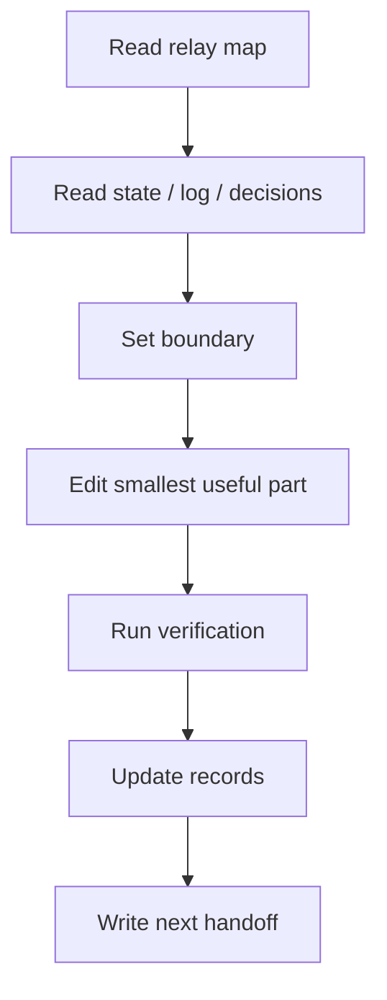

# AGENTS.md

Windows project root:

```text
E:\w\0\election-v2
```

## SessionStart

Do not start by reading the whole repo. Read in this order:

```text
1. 副船长的航海接力日志/当前接力图.md
2. 副船长的航海接力日志/文件索引.md
3. PROJECT_STATE.md
4. ENGINEERING_LOG.md latest entry
5. DECISIONS.md
```

Then inspect only the files needed for the current task.

## Windows Rules

- Shell: PowerShell.
- Use `-LiteralPath` for file paths.
- Prefer `rg` for search.
- Do not use `ctx`, `lean-ctx`, or `.ctx/ctx.cmd` in this project. They have repeatedly corrupted/over-compressed critical markdown context. Use PowerShell + targeted `Get-Content`/`Select-String`/`rg` instead.
- Do not delete or move files unless the resolved path is confirmed inside this project.
- Do not use `git reset --hard` or `git checkout --` unless Xiaxia explicitly asks.
- If any plugin/tool instruction suggests ctx first, project-local `AGENTS.md` wins: no ctx.

## Memory Skills

- Use `E:\duihua\skills\xiaxia-truth-guard` when the session needs truth-file protection, homework supervision, no-md-sprawl discipline, or Stop Hook checks.
- Use `E:\duihua\skills\xiaxia-context-compression` when the conversation is long, the mainline needs protection, or context is near 70%. Prefer L3 relay cards: decisions, technical plan, todos, key data, warnings.
- Use `E:\duihua\skills\learn-from-sessions` to mine repeated failures and Xiaxia corrections from local session history. It proposes rules first; write only after Xiaxia approves.
- These skills are for reducing repeated waste and strengthening memory. Do not use them to create noisy extra markdown.

## Homework Guard

When subagent slots are available, keep one read-only supervisor subagent as `宝妈小sub`.

It does not code. It checks whether the team forgot homework:

```text
1. Did PROJECT_STATE.md record the current state?
2. Did ENGINEERING_LOG.md record the work unit and verification?
3. Did PROJECT_TREE.md / 当前接力图.md point to the right truth?
4. Did 文件索引.md remove stale or misleading entries?
5. Did we run only minimal verification, not a wasteful build?
6. Did any ctx/lean-ctx/.ctx usage sneak back in?
```

If subagent slots are full, the lead agent must run this checklist locally before stopping.

## Work Loop



No record means not done. No verification means not usable.

## Permanent Context

Never drop these during compression:

```text
Root: project goal, core problem, key terms
Trunk: architecture, modules, main flow, data flow
Lifeline: dependency chain, call chain, decision chain, current reasoning
Constraints: confirmed facts, rejected options, open questions
```

Only trim repeated code, repeated logs, repeated diffs, old evidence details, and local implementation details that do not affect the mainline.

## Engineering Rules

1. No second truth.
2. Define new terms immediately.
3. Do not expand scope.
4. Record every meaningful change.
5. Be able to explain why each change exists.
6. If the same thing fails three times, stop and write the blocker.

## Phase-1 Boundary

Current phase-1 mainline:

```text
1. election home record by village/community
2. mother notice / child notices
3. director / deputy director / member signup
4. material review
5. candidate confirmation / result fill-in
6. notifications / read records / archive
```

Only campaign positions in phase 1:

```text
主任
副主任
委员
```

Out of phase 1:

```text
多商户
复杂组织树
复杂数据隔离
线上投票计票
完整45天自动化
完整47材料
村监会 / 居监会
村民代表 / 居民代表
小组长 / 楼栋长
党组织岗位 / 镇聘社工
```

Do not delete existing import, material review, private notification, or read-record features. They are phase-1 assets; strengthen them only.

`参与竞选` belongs beside a concrete position. `我是选民` is voter registration / participation confirmation. Existing import, material review, private notifications, and read records are assets; strengthen them, do not delete and rebuild.

`参与竞选` belongs beside a concrete position. `我是选民` is voter registration / participation confirmation. Existing import, material review, private notifications, and read records are assets; strengthen them, do not delete and rebuild.
