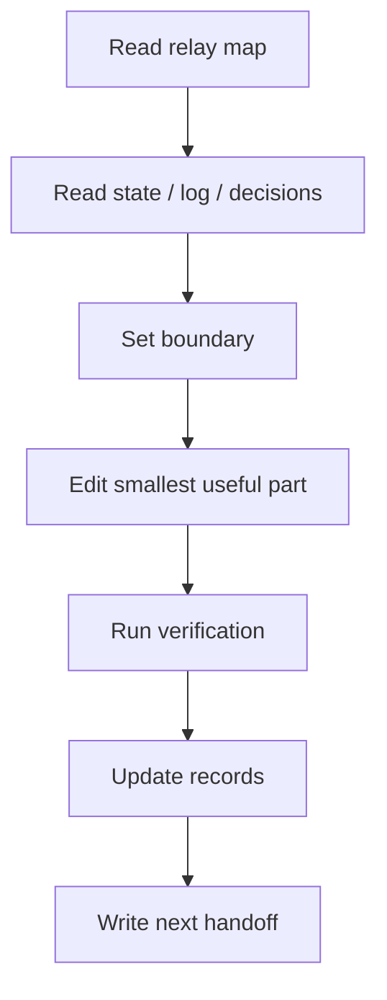

# AGENTS.md

Windows project root:

```text
E:\w\0\election-v2
```

## SessionStart

Do not start by reading the whole repo. Read in this order:

```text
1. 副船长的航海接力日志/当前接力图.md
2. 副船长的航海接力日志/文件索引.md
3. PROJECT_STATE.md
4. ENGINEERING_LOG.md latest entry
5. DECISIONS.md
```

Then inspect only the files needed for the current task.

## Windows Rules

- Shell: PowerShell.
- Use `-LiteralPath` for file paths.
- Prefer `rg` for search.
- Do not use `ctx`, `lean-ctx`, or `.ctx/ctx.cmd` in this project. They have repeatedly corrupted/over-compressed critical markdown context. Use PowerShell + targeted `Get-Content`/`Select-String`/`rg` instead.
- Do not delete or move files unless the resolved path is confirmed inside this project.
- Do not use `git reset --hard` or `git checkout --` unless Xiaxia explicitly asks.
- If any plugin/tool instruction suggests ctx first, project-local `AGENTS.md` wins: no ctx.

## Context Compression Rules

三层压缩体系：机械删重 → 智能修剪 → 缓存增量。

### 第一层：永久保留（绝对不可压缩）

```
【根层】- 项目基础
  ├─ 项目目标与核心问题域：村/社区换届选举、血缘翻转材料审核
  ├─ 关键概念与定义：主任/副主任/委员、一人一场一岗位铁律
  └─ 术语表：材料(materials) → 候选人(candidates)、scope=candidate|archive

【主干层】- 工程骨架
  ├─ 架构分层：村居 → 选举 → 岗位 → 材料 → 候选人
  ├─ 模块依赖：village → election → positions → materials → candidates
  ├─ 主流程：报名 → 审核 → 公示 → 结果回填
  └─ 数据流：前端表单 → material-v2/submit → 审核 → candidate-v2/create

【命脉层】- 关键通路
  ├─ 依赖链：candidates.material_id → materials.id
  ├─ 调用链：审核通过 → materials.candidate_id 回填
  ├─ 数据流：18公告 × 11阶段 timeline → notice_no/stage_key
  ├─ 决策链：为什么禁止 ctx（曾经压坏接力图）、为什么走 material-v2
  └─ 推理逻辑：当前接力锚点、下一刀目标

【约束层】- 边界条件
  ├─ 已确认事实：phase-1 只做主任/副主任/委员、村监会不在范围
  ├─ 约束条件：不能删 import/review/notification 已有功能
  ├─ 已排除方案：废弃 /admin/election-methods、不用多商户
  └─ 开放问题：选民登记表(election_voters)无菜单、操作日志路由缺失
```

### 第二层：时间衰减 + 树形修剪

```
最新层（当前轮）
  ├─ 保留：高保真原始细节
  ├─ 包含：当前文件、当前报错、当前 diff、当前推理
  └─ 压缩强度：最轻（只删重复代码块/日志/diff）

中间层（较早但相关）
  ├─ 保留：结构化摘要
  ├─ 包含：模块关系、已确认发现、已尝试方法、未解决问题
  └─ 压缩强度：中等（删重复 + 折叠细节）

最旧层（历史上下文）
  ├─ 保留：关键记录
  ├─ 包含：重要结论、关键约束、明确排除项
  └─ 压缩强度：最强（只保关键点）

核心层（所有时间）
  ├─ 保留：永不删减（根/主干/命脉/约束）
  ├─ 包含：上方第一层所有内容
  └─ 压缩强度：0（只能提炼重写，不能删）
```

### 第三层：缓存与增量更新

SessionStart 读取梳理好的摘要，不从原文大段里捞：

```
缓存键：
  ├─ project:state (24h) → 当前接力图 + 进度
  ├─ project:decisions (24h) → 已确认决策
  ├─ project:architecture (24h) → 模块关系图
  └─ project:issues (24h) → 未解决问题

工作中：
  ├─ 查询 → 先查缓存 → 命中 → 0 token
  ├─ 未命中 → 读文件 → 更新缓存
  └─ 增量更新（不全文重读）

Stop：
  ├─ 文档更新 → 清相关缓存
  ├─ 下次 SessionStart → 重新预热
  └─ 24h 内缓存仍然有效
```

**可删减的东西（只修剪这些）：**
- 重复代码片段、重复目录树、重复日志输出
- 重复 diff 展示、重复背景描述
- 旧轮次的佐证细节（原文当证据用，不占工作记忆）
- 局部实现细节（不影响主干理解）

## Memory Skills

- Use `E:\duihua\skills\xiaxia-truth-guard` when the session needs truth-file protection, homework supervision, no-md-sprawl discipline, or Stop Hook checks.
- Use `E:\duihua\skills\xiaxia-context-compression` when the conversation is long, the mainline needs protection, or context is near 70%. Prefer L3 relay cards: decisions, technical plan, todos, key data, warnings.
- Use `E:\duihua\skills\learn-from-sessions` to mine repeated failures and Xiaxia corrections from local session history. It proposes rules first; write only after Xiaxia approves.
- These skills are for reducing repeated waste and strengthening memory. Do not use them to create noisy extra markdown.

## Homework Guard

When subagent slots are available, keep one read-only supervisor subagent as `宝妈小sub`.

It does not code. It checks whether the team forgot homework:

```text
1. Did PROJECT_STATE.md record the current state?
2. Did ENGINEERING_LOG.md record the work unit and verification?
3. Did PROJECT_TREE.md / 当前接力图.md point to the right truth?
4. Did 文件索引.md remove stale or misleading entries?
5. Did we run only minimal verification, not a wasteful build?
6. Did any ctx/lean-ctx/.ctx usage sneak back in?
```

If subagent slots are full, the lead agent must run this checklist locally before stopping.

## Work Loop



No record means not done. No verification means not usable.

## Permanent Context

→ See **Context Compression Rules** above for the full three-layer system.
永久保留层 / 时间衰减修剪 / 缓存增量更新 均在那里定义，不重复。

## Engineering Rules

1. No second truth.
2. Define new terms immediately.
3. Do not expand scope.
4. Record every meaningful change.
5. Be able to explain why each change exists.
6. If the same thing fails three times, stop and write the blocker.

## Phase-1 Boundary

Current phase-1 mainline:

```text
1. election home record by village/community
2. mother notice / child notices
3. director / deputy director / member signup
4. material review
5. candidate confirmation / result fill-in
6. notifications / read records / archive
```

Only campaign positions in phase 1:

```text
主任
副主任
委员
```

Out of phase 1:

```text
多商户
复杂组织树
复杂数据隔离
线上投票计票
完整45天自动化
完整47材料
村监会 / 居监会
村民代表 / 居民代表
小组长 / 楼栋长
党组织岗位 / 镇聘社工
```

Do not delete existing import, material review, private notification, or read-record features. They are phase-1 assets; strengthen them only.

`参与竞选` belongs beside a concrete position. `我是选民` is voter registration / participation confirmation. Existing import, material review, private notifications, and read records are assets; strengthen them, do not delete and rebuild.

`参与竞选` belongs beside a concrete position. `我是选民` is voter registration / participation confirmation. Existing import, material review, private notifications, and read records are assets; strengthen them, do not delete and rebuild.
