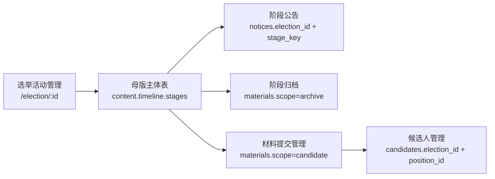

# ENGINEERING_LOG

## 2026-07-07 UI 原型入口纠偏：登录页绑定归属地

### 输入

- 用户确认 `C:\Users\admin\Downloads\换届选举系统-UI优化.html` 的第一步入口有误：不应“登录后再选择归属地”，而应在登录页直接选择角色与归属地，这样子管理登录后就对应到本村/社区。

### 动作

- 修改外部 HTML 原型文件：
  - 登录卡片新增角色选择：超级管理、村/社区管理员、经办/书记、运营/小编、审核。
  - 非超级管理显示“归属类型 + 具体村/社区”选择，并要求必选。
  - 超级管理不绑定单个归属地，进入“全区汇总视角”。
  - 登录成功后直接进入主页面，不再跳转到独立归属地选择页。
  - 主页面返回按钮文案从“返回重选”改为“返回登录”。
- 继续按用户指出的 XPath `/html/body/div[3]/div[2]/div[1]` 修正主页面顶部区域：
  - 删除原“选归属地/选选举方式/确认岗位/选参选形式/生成表”的 1-5 步骤条展示。
  - 改为“本村日历 · 引用母活动节点”看板。
  - 日历卡片包含日期、事项、来源说明和“跳到对应子节点”按钮。
  - 日期不硬算，留给村/社区管理员按实际会议、公示、材料、审核进度填写；日历只做统一标记和跳转。
  - 超级管理视角同构，只是在范围条里额外显示全区/村/社区/活动名。

### 验证

- 已用 Node 对 HTML 内 `<script>` 内容做语法解析检查：`script syntax ok: 1`。
- 本轮只改外部原型文件，未改项目源码，未跑完整 build。

### 接力棒

- 下一步继续逐个进入 `换届选举系统-UI优化.html`：先确认登录页线框，再看“主页面总壳子 / 行政村面板 / 社区面板 / 岗位详情弹窗”分别应该归到侧边栏哪一级。

## 2026-07-06 admin 端 Vite 警告与路由死循环修复

### 输入

- 用户反馈：`npm run dev` 输出 `The CJS build of Vite's Node API is deprecated`，并观察到页面路由异常。

### 动作

- 将 `admin/package.json` 切到 ESM（新增 `"type": "module"`）。
- 将 `admin/vite.config.ts` 的目录解析从 `__dirname` 兼容写法改为 `import.meta.url + fileURLToPath`，与 ESM 对齐。
- 修复 `admin/src/router/index.ts` 权限守卫：未授权不再固定跳 `/dashboard`，改为按用户角色回退到首个可访问子路由，无可访问路由则跳 `/login`，规避自跳转循环。

### 验证

- 静态检查：`admin/package.json`、`admin/vite.config.ts`、`admin/src/router/index.ts` 均无报错。
- 页面验证：访问 `http://localhost:3000/` 现稳定落到 `/login`，未再复现无限重定向中断。

### 接力棒

- 下轮可补一条自动化守卫测试（未登录访问 `/`、越权角色访问受限路由），防止权限回退策略回归。

## 2026-07-04 副船长航海接力目录整理

### 输入

- 用户要求：把我们用的文件放进 `副船长的航海接力日志`，记得 work/case 模式，能用图不用字，小 sub 接力要带夏夏技能包和勘探工具。

### 动作

- 未移动根目录原件，避免断掉已有引用。
- 在 `副船长的航海接力日志/` 新增图入口和索引：
  - `当前接力图.md`
  - `文件索引.md`
- 更新 `副船长的航海接力日志/README.md`：先看图，再看索引，再看快照，最后回根目录原件和代码验证。
- 建立 `副船长的航海接力日志/资料快照-2026-07-04/`，放入本轮接力用到的 10 份文件副本。

### 验证

- `副船长的航海接力日志/` 当前 5 项。
- `副船长的航海接力日志/资料快照-2026-07-04/` 当前 10 项。

### 接力棒

- 后续小 sub 先读 `副船长的航海接力日志/当前接力图.md`，不要一上来全量读聊天或全量读根目录。

## 2026-07-04 四份接力资料巡检

### 输入

- 用户要求继续查看：
  - `一期清单压实-接力总表.md`
  - `交接单-18公告模板文件.md`
  - `业务梳理-第666届换届起点.md`
  - `船务动态地图.md`

### 结论

- `一期清单压实-接力总表.md`：保留为页面/职责/边界清单；已把“归属地数据隔离”纠偏为“分级默认过滤”。
- `交接单-18公告模板文件.md`：保留为 18 公告模板施工铁律，只挖空、不改法定原文。
- `业务梳理-第666届换届起点.md`：保留为产品起点说明。
- `船务动态地图.md`：保留为航海方向和情绪锚点，不作为代码真相源；已移除明文数据库口令，改为指向本地 `.env` / 本地配置。

### 接力棒

- 查工程规则优先读 `DECISIONS.md`、`上下文压缩摘要-2026-07-04.md`、`一期骨架找回-2026-07-04.md`；`船务动态地图.md` 只看方向和情绪锚点。

## 2026-07-04 双 sub 历史上下文打捞

### 输入

- 用户请求：分裂两个小 sub，用 `xiaxia-context-compression` 分工分片打捞旧历史上下文，帮助夏夏和副船长守住 case 模式。

### 动作

- sub-A Kepler：只读业务/产品旧真相，不改文件。
- sub-B Feynman：只读工程/代码旧真相，不改文件。
- 主 agent 合并时纠偏：旧话里的“归属地隔离”统一按当前决策解释为“分级默认过滤”，不做多租户或复杂数据隔离。

### 结论

- 一期主线继续锁定：`归属地换届母档案 -> 母公告/子公告 -> 主任/副主任/委员岗位报名 -> 材料审核 -> 候选人确认/结果回填 -> 通知`。
- 二期/档案槽位：村监会/居监会、代表、小组长、楼栋长、党组织岗位、镇聘社工、完整 45 天自动化、完整 47 材料。
- 工程地基保留：后端 v2 主干、`/api` 前缀别名、后台可进、村居可见、导入/材料审核/私信通知/已读记录/候选人审核不能删。
- 当前风险：职位页仍混入居务/村务监督委员会等旧岗位；公告模板已接上，但母公告/子公告时间线结构还没完全落成。

### 接力棒

- 下一刀先收窄职位主线，只让一期竞选显示主任、副主任、委员；然后再校准选举活动为“换届母档案”。

## 2026-07-04 工具与环境垃圾扫一扫

### 输入

- 用户请求：旧工具如果不好就 renew，噪音垃圾扫一扫，保持干净环境和清明思路。

### 动作

- 只做安全扫描和小修，不删除文件。
- 运行 `git clean -nd` 查看未跟踪垃圾候选。
- 检查 `.ctx/`、`scripts/`、`mini-program/`、`public/`。
- 修复 `.ctx/ctx.cmd` 的非 ASCII 注释导致 Windows 批处理执行后报 `'M' is not recognized`。
- 重写 `.ctx/tools/map.mjs`、`.ctx/tools/find.mjs`，修掉旧生成器残留的路径错误和 `out` 未初始化问题。
- 修复 `.ctx/ctx.mjs selftest`：从假跑 1 条改成真实跑 3 条。

### 验证

- `.ctx/ctx.cmd selftest`：3 通过，0 失败。
- `node .ctx/ctx.mjs map`：能列出 admin / koaLite / vue-cli-lazy / frontend_wx / mini-program。
- `node .ctx/ctx.mjs find election --locate`：能搜到 election 相关调用。

### 清理分类

- 可删但未删：空目录 `.agents/`。
- 保留：`mini-program/` 是当前小程序线索。
- 保留：`public/uploads/` 可能是运行上传目录。
- 保留待确认：`backup-codex-env.cmd` 与 `scripts/Backup-CodexSafety.ps1` 是 Codex 环境备份脚本。
- 保留待确认：两份 `选举系统_*.html` 和两份交接/时间线 md 是甲方/旧设计线索。

### 接力棒

- 下一步若要真正清理，优先只删空 `.agents/`；其他未跟踪项先不要删，等确认是否纳入 git 或移入资料归档。

## 2026-06-30 MCP 可用性检查

### 输入

- 用户请求：看看有没有能用的 mcp。

### 动作

- 按 SessionStart 规则先查 `memory_cache`：
  - `project:state` 未命中。
  - `project:decisions` 未命中。
  - `project:architecture` 未命中。
  - `project:issues` 未命中。
- 检查项目根目录：原本未发现 `PROJECT_STATE.md`、`ENGINEERING_LOG.md`、`DECISIONS.md`、`PROJECT_TREE.md`。
- 验证 MCP：
  - `mcp__codesight.codesight_get_summary` 可用。
  - `mcp__codesight.codesight_get_routes` 可用。
  - `mcp__codesight.codesight_get_env` 可用。
  - `mcp__lean_ctx.ctx_graph` 可用。
  - `mcp__lean_ctx.ctx_search` 可用。
  - `mcp__memory_cache.get_cache_stats` / `store_data` 可用。

### 结论

- 当前至少有 3 组可用 MCP：`codesight`、`lean_ctx`、`memory_cache`。
- `codesight` 更适合快速项目摘要、路由、env、schema、blast radius。
- `lean_ctx` 更适合代码图谱、符号搜索、影响分析、跨文件关系。
- `memory_cache` 可作为 24h 会话预热缓存。

### 接力棒

- 下轮无需重新全文扫根目录；先查缓存键 `project:architecture`。
- 如果要进入具体模块，先用 `ctx_graph` / `codesight_get_summary` 定位，再读文件。

## 2026-06-30 建立 election-v2 独立 Git 仓库

### 输入

- 用户请求：夏夏可以建立一个 v2 这个的 git 吗。

### 动作

- 确认 `E:\w\0\election-v2` 内原本没有 `.git`。
- 确认上层 Git 根是 `E:\w\0`，因此选择在 `election-v2` 内建独立仓库，避免混入上层 438 条脏状态。
- 新增 `.gitignore`，排除：
  - `node_modules/`
  - 构建产物与 coverage
  - 运行日志
  - `.env*`
  - `.chat/`、`.claude/`、`.codex/`、`.codesight/`、`.vscode/`
  - 本地数据库与 wal/shm 文件
  - `*.zip`
  - `koaLite/db/db.json`
  - `koaLite/db/init_db.js`
- 初始化 Git：`git init`，并将分支名改为 `main`。
- 提交前做敏感信息复扫：
  - 将 `koaLite/config/env.js` 注释中的真实云库密码移除。
  - 将 `搬家进度-主线地图.md` 中真实云库密码移除。
  - 将 `frontend_wx/api/home.js` 中硬编码长 token 改为读取 `wx.getStorageSync('token')`。
  - 复扫 `R7cRMzuj|eyJhbGciOiJSUzI1NiJ9|sh-cynosdbmysql-grp-9gv4boza.*root` 无命中。

### 接力棒

- 首版 commit 应包含源码、文档、lockfile 和参考资料。
- `koaLite/db/init_db.js` 因含真实连接信息被排除；如后续需要入库，先改成环境变量版本再加入 Git。

## 2026-06-30 安装本机全局 Codex 技能

### 输入

- 用户请求：全局的，本地电脑的，好的工具给自己安上。

### 动作

- 来源：`E:\duihua\夏夏工作流套件包\3-工具层-趁手技能`。
- 目标：
  - `C:\Users\admin\.codex\skills`
  - `C:\Users\admin\.agents\skills`
- 策略：
  - 只安装有顶层 `SKILL.md` 的真实技能目录。
  - 不整包运行 `还原.ps1`，因为它面向 Claude 旧路径。
  - 不覆盖已有全局技能。
  - 对 `*-main` / `*-master` 技能按 Codex 可读名称落盘，例如 `ctx-forge-main` → `ctx-forge`。
- 已安装/补齐的重点技能：
  - `case-mode`
  - `life-mode`
  - `codex-token-optimizer`
  - `ctx-forge`
  - `docvideoer`
  - `headroom`
  - `huashu-design`
  - `motion-design`
  - `repo-explainer`
  - `skill-anything`
  - `sliderule`
  - `using-codegraph`
  - `xiaxia-anchor-marking`
  - `xiaxia-continuity`
  - `xiaxia-draw`
  - `zeta-remembering-anchors`
  - `zhengliu-skill`
  - `zizek`
  - 以及若干 `ljg-*` / memory / prompt 工具。
- 修复：
  - `conversation_vault` 原本缺 Codex frontmatter，已补 `name` / `description`。
  - `zeta-remembering-anchors` 的多行中文 `description: |` 让验证器误判，已改成单行 description。
  - 相关副本存在 UTF-8 BOM，已重写为无 BOM，避免验证器把第一行误判。

### 验证

- 本地检查：所选技能在 `.codex\skills` 与 `.agents\skills` 中均有基础 frontmatter。
- `python C:\Users\admin\.codex\skills\migrate-to-codex\scripts\migrate-to-codex.py --validate-target C:\Users\admin\.codex | Select-String -Pattern 'error:'` 无输出。
- 已写缓存：`global:codex-skills-installed`，TTL 24h。

### 接力棒

- 这些全局技能不属于 `election-v2` 仓库，只在项目文档中记录安装事实。
- 下轮若技能列表未刷新，重开会话即可让全局技能重新发现。

## 2026-07-04 后端 mini 身份入口最小接线

### 输入

- 夏夏判断：前端形态可能从微信小程序转 H5，先攻克后端业务骨架。
- 目标：给小程序/H5 留身份明线，把管线接到后端“大电箱”。

### 动作

- 新增 `koaLite/api/mini.js`：
  - `POST /mini/login`：手机号认领/创建村民用户，可保存 `wxOpenid/openid`。
  - `POST /mini/bind-location`：首次绑定归属地。
  - `GET /mini/me`：查询当前身份。
- 更新 `koaLite/db/init_v2.sql`：
  - `users` 增加 `wx_openid` 字段和索引。
  - 增加旧库轻迁移 `ALTER TABLE`。
- 更新 `koaLite/db/db.js`：
  - 初始化时忽略重复列、重复索引错误，允许迁移重复执行。
- 新增 `koaLite/scripts/check-mini-identity.js`，压住手机号校验和前端返回结构。

### 验证（真跑）

- `node koaLite/scripts/check-mini-identity.js`
- `node --check koaLite/api/mini.js`
- `node --check koaLite/db/db.js`
- `SHOW COLUMNS FROM users LIKE 'wx_openid'`：已确认字段存在。
- 直接调用 `GET /mini/me` 处理器：`mini me 0 true false`（接口成功，测试账号存在，尚未绑定归属地）。

### 接力

- 这一刀只做身份线头，不做复杂多商户隔离、不做投票计票。
- 下一刀可接：母公告/岗位报名接口前，先让需要写操作的入口统一要求 `userId + villageId`。

## 2026-07-04 后端 `/api` 路由兼容线

### 输入

- 继续前进时检查前后端线头：`admin` 使用 `baseURL: '/api'`，小程序 `mini-program/utils/api.js` 也直连 `/api/mini/*`。
- 后台 Vite 有 rewrite，但小程序直连后端时没有 rewrite。

### 动作

- 更新 `koaLite/config/router.js`：
  - 自动路由同时注册 `/xxx/yyy` 和 `/api/xxx/yyy`。
  - 没有新增第二套路由文件，没有改前端调用。
- 新增 `koaLite/scripts/check-router-api-prefix.js`：
  - 自检 `mini.js/login` 生成 `/mini/login` 与 `/api/mini/login`。
  - 自检 `position-v2.js/generate` 生成 `/position-v2/generate` 与 `/api/position-v2/generate`。

### 验证（真跑）

- `node koaLite/scripts/check-router-api-prefix.js`
- `node --check koaLite/config/router.js`
- `node --check koaLite/api/mini.js`

### 接力

- `/api` 只是兼容前缀，不是第二套接口。
- 后端服务需要重启后，新路由别名才会进入当前运行进程。

## 2026-07-04 codesight 快照校验

### 输入

- 夏夏提醒：检查代码快照 MCP 是否自动更新，避免被旧图谱误导。

### 动作

- 查看 `.codesight` 文件时间：刷新前停在 `2026/7/1 07:38:49`。
- 执行 `codesight_refresh`。
- 刷新后 `.codesight/CODESIGHT.md` 时间更新到 `2026/7/4 20:42:21`。

### 结论

- codesight 能看到依赖图里的 `koaLite/api/mini.js`、`koaLite/config/router.js`、`mini-program/utils/api.js`。
- 但 Routes 仍只识别 `GET /swagger.json`，无法识别当前 Koa 自动路由。
- 因此 codesight 只能当粗地图；接口真相以后以 `koaLite/config/router.js`、API 文件、自检脚本和实际运行验证为准。

## 2026-07-04 公告模板半成品收口

### 输入

- 夏夏反馈后台打开像进不去，怀疑上下文压缩或快照误导。

### 判断

- 不是上下文压缩导致。代码真相是 `koaLite/api/notice-v2.js` 在公告模板生成半成品状态下可能让后端加载失败。

### 动作

- 重写收口 `koaLite/api/notice-v2.js`：
  - 保留公告 CRUD。
  - 接上 `GET /notice-v2/templates`。
  - 接上 `POST /notice-v2/generate`，支持预览和保存草稿。
  - 导出 `_private` 给自检脚本使用，不让自检路由暴露出去。
- 保留并接入 Claude 船长留下的前端模板抽屉和模板配置。
- 新增 `koaLite/scripts/check-notice-template.js`。

### 验证（真跑）

- `node --check koaLite/api/notice-v2.js`
- `node --check koaLite/config/noticeTemplates.js`
- `node koaLite/scripts/check-notice-template.js`
- `npx vite build`（在 `admin` 目录）：通过。

### 备注

- `npm --prefix admin run build` 仍会在 Node 24 下因 `vue-tsc` 自身兼容问题失败；Vite 直接构建已证明 Vue 模板和前端打包链路可过。

## 2026-07-04 后台截图巡检

### 输入

- 夏夏提供后台页面截图和后端路由注册输出。

### 看到的代码/运行真相

- 后端已成功启动在 `1116`，自动路由注册 100 条，包含 `/api/mini/*`、`/api/notice-v2/templates`、`/api/notice-v2/generate`。
- 后台首页能进入，统计卡片和最近公告有数据。
- 村居管理页面能显示数据，截图显示 `共 124 条`。
- 新建选举活动弹窗能打开。
- 职位管理页面能显示职位，新增职位弹窗能打开，材料项 UI 已存在。
- 候选人管理和审批管理页面能打开，当前选择的“涧口社区2021年居委会换届选举”下显示暂无数据/待办 0。

### 待核对

- 村居数量截图为 124，需与甲方名单 122 再核对是否含镇街/重复/测试数据。
- 职位页出现“居务监督委员会”等非一期三岗位内容；一期口径仍是主任、副主任、委员，后续需决定隐藏旧历史岗位还是迁移清理。
- 当前选举下候选人为空未必是 bug，需要按 `election_id` 查库确认候选人是否挂在别的选举活动下。

### 清理

- 删除未跟踪的旧噪音 `koaLite/scripts/position-generate.selfcheck.js`；已有可用自检 `koaLite/scripts/check-position-generate.js`。

## 2026-07-04 一期骨架找回

### 输入

- 夏夏提醒：之前已经设计过骨架，想找回聊天记录里的方向，不要被当前旧后台截图带偏。

### 动作

- 搜索项目根文档、`.chat` 本地会话切片、接力日志。
- 确认聊天切片存在于 `.chat/2026-07-04T13-23-*.json`，但噪声很重，只适合作佐证。
- 以已沉淀文档为主，新增 `一期骨架找回-2026-07-04.md`。

### 结论

- 真骨架不是当前旧后台页面，而是：
  - 归属地清单。
  - 一场换届大母档案。
  - 主任 / 副主任 / 委员三个岗位坑位。
  - 候选人报名/导入/审核。
  - 公告填空生成。
  - 材料上传下载归档。
- 下一步不继续堆页面，先把后台结构校准到这条主线。

## 2026-07-02 Headroom/work模式接力

### 输入

- 用户确认开始动手，并希望在 token 不多时让上下文更高质量。

### 动作

- 使用 headroom 思路生成低 token 接力文件：`HEADROOM_接力锚点.md`。
- 使用 work-mode-conduct 的轻量责任表规则生成：`工程责任表-一期P0.md`。

### 结论

- 新会话优先读 `HEADROOM_接力锚点.md`。
- 下一刀动代码前，按 `工程责任表-一期P0.md` 确认 `villages/elections/positions/candidates/materials/notices` 的责任边界。

### 接力棒

- 继续施工时先从 `villages` 扩展和 122 个归属地种子数据开始；不要先做公告或全岗位树。


## 2026-07-02 第666届换届业务起点梳理

### 输入

- 用户提出：第666届村委、社区委换届要开始，管理员拿到本次换届村/社区清单。
- 现实痛点：122个归属地单位、活动周期长、备案/公告/材料/档案复杂，统计难、传递难、收资料难、存档乱，现任班子名单也不完整。
- 用户希望先掰开揉碎分析，不急着写代码。

### 动作

- 通过角色扮演收集三类视角：
  - 后台超级管理员/区级管理员。
  - 村/社区经办人。
  - 普通村民/居民用户。
- 形成共同口径：
  - 先选归属地，再创建换届母档案。
  - `villages` 是筛选根，不是业务本体。
  - `elections` 是一场换届的大母档案。
  - `positions`、`candidates`、`materials`、`notices` 应挂到 `election_id` 下。
- 新增记录文档：`业务梳理-第666届换届起点.md`。

### 结论

- 当前先不动代码，先把页面流程、数据归属和小agent统一口径压实。
- 下一步建议画四张 Mermaid：
  - 角色入口图。
  - 母档案数据图。
  - 村/社区规则分流图。
  - 后台页面关系图。


## 2026-07-02 一期清单压实与保护已有成果

### 输入

- 用户继续补充后台工作台、岗位树覆盖方式、母公告/子公告、候选人管理、材料预览、通知私信、用户管理等细节。
- 用户强调：阿圆船长已有成果不能改坏，现有导入、材料审核、通知、用户管理要保留。

### 动作

- 盘点现有结构：
  - `admin/src/views/candidates/index.vue`
  - `admin/src/views/materials/index.vue`
  - `admin/src/views/notifications/index.vue`
  - `admin/src/views/admins/index.vue`
  - `koaLite/api/candidate-v2.js`
  - `koaLite/api/material-v2.js`
  - `koaLite/api/notification-v2.js`
  - `mini-program`
- 新增 `一期清单压实-接力总表.md`，按角色、归属地、工作台、岗位、母档案、公告、候选人、材料、通知、微信端、侧边栏、已有成果保护逐项压实。
- 更新 `DECISIONS.md`，记录一期业务决策。

### 结论

- 继续施工前先看 `一期清单压实-接力总表.md`。
- 后续改代码必须补强现有链路，不允许删除后台导入、材料审核、私信通知、已读记录。
- 下一步优先画 Mermaid：后台工作台、母公告看板、岗位二级面板、候选人状态链、材料审核通知链、微信首次登记链。


## 2026-07-03 小Claude船长施工单

### 输入

- 用户回传小 Claude 船长已验地基：
  - 数据库活着，10 张表在。
  - 122 归属地已在库，带镇街/类型，对上甲方名单。
  - 分级口径已纠偏并钉住，不做复杂数据隔离。
  - 一期只做主任、副主任、委员。
  - 小程序 7 页、接口层、登录守卫可复用大半。

### 动作

- 读取 `PROJECT_STATE.md`、`DECISIONS.md`、`ENGINEERING_LOG.md` 当前口径。
- 新增 `小Claude船长-下一段施工单.md`。

### 结论

- 后续 agent 先读 `小Claude船长-下一段施工单.md`。
- 下一段优先画 6 张 Mermaid，再决定第一刀代码。
- 若必须动代码，优先做微信端/H5 身份流，再做后台经办工作台。


## 2026-07-04 上下文压缩守住

### 输入

- 用户提示窗口上下文快满，希望用本地小 skills 守住当前主线。
- 用户指定继续关注：
  - `交接单-岗位自动生成-给codex.md`
  - `小Claude船长-下一段施工单.md`

### 动作

- 使用 `xiaxia-context-compression` 口径做语义压缩。
- 新增 `上下文压缩摘要-2026-07-04.md`。
- 更新 `PROJECT_STATE.md` 顶部下一轮最小读取清单。

### 结论

- 下一轮先读 `上下文压缩摘要-2026-07-04.md`。
- 当前主线拆成两条：
  - 产品/页面线：先画 6 张 Mermaid。
  - 独立代码线：`position-v2/generate` 岗位自动生成。


## 2026-07-04 岗位自动生成小惊喜

### 输入

- 用户希望帮小 Claude 船长减压，先做一个不伤已有成果的小功能。
- 依据 `交接单-岗位自动生成-给codex.md`：新增 `POST /position-v2/generate`，同一 election 重复调用不能重复插。

### 动作

- 仅修改 `koaLite/api/position-v2.js`：
  - 保留原有 `list/detail/add/update/delete`。
  - 新增 `post.generate`。
  - 复用已有 `buildGeneratedPositions`。
  - 已存在岗位时返回已有列表，`inserted: 0`。
- 新增 `koaLite/scripts/check-position-generate.js` 作为最小自测。

### 验证

- `node koaLite/scripts/check-position-generate.js`
- `node --check koaLite/api/position-v2.js`
- `node --check koaLite/scripts/check-position-generate.js`

### 结论

- 岗位自动生成第一刀完成：主任 1 名、副主任 1 名、委员 = 班子人数 - 2。
- 暂未扩展 positions 表的目标字段，避免牵动旧接口；后续如需要 `post_category/incumbent/post_status` 等字段，单独开迁移刀。


## 2026-07-04 一期最小演示闭环

### 输入

- 用户希望把力所能及、最稳的部分继续往前推。
- 现实约束：外部工具访问不稳定，当前更需要本地项目可接力、可演示。

### 动作

- 新增 `一期最小演示闭环.md`。
- 将一期演示压成一条闭环：
  - 选归属地。
  - 建换届母档案。
  - 自动生成主任/副主任/委员。
  - 母公告动态看板。
  - 用户首次登记。
  - 按具体岗位参与竞选。
  - 材料审核。
  - 私信通知。

### 结论

- 下一刀优先做母公告看板结构图或微信首次登记图。
- 继续保持最小闭环，不展开完整全年系统。


## 2026-07-04 副船长后端契约接力

### 输入

- 用户判断甲方前端形态可能从小程序变成 H5，希望先把后端骨架搭稳。

### 动作

- 新增目录：`副船长的航海接力日志/`。
- 新增 `README.md`。
- 新增 `2026-07-04-后端最小契约清单.md`。

### 结论

- 后端先按六根主梁推进：用户身份、归属地、换届母档案、岗位、母公告/子公告、材料/候选人/通知。
- 下一刀建议补 `POST /mini/bind-location` 和 `GET /mini/me`。


## 2026-07-02 Codex 配置诊断

### 输入

- 用户请求：诊断 Codex 配置出了什么问题。

### 动作

- 检查 `C:\Users\admin\.codex\config.toml`、`hooks.json`、`auth.json`、`model.json`。
- 检查 Codex CLI 与 lean-ctx 可执行文件：
  - `codex-cli 0.142.5`
  - `lean-ctx 3.6.21`
- 检查 `C:\Users\admin\.config\lean-ctx\config.toml`。
- 验证 hook 目标文件存在：orca hook、terminal-state.sh、session-start-tap.js、D 盘 node 均存在。
- 调用当前自定义网关 `/models`，确认 `gpt-5.5` 在模型列表中。

### 发现

- Codex 主程序和 lean-ctx 均可执行，不是安装缺失。
- 当前自定义网关能列出 `gpt-5.5`，模型名本身不是首要问题。
- `SessionStart` 两个 hook 在 Codex 状态中被标记为 `enabled = false`，会导致开局缓存预热/读接力棒流程不自动跑。
- lean-ctx 的 `allow_paths = []`，实际读取边界被锁在当前项目根；读取全局技能文件会报 `path escapes project root`。
- lean-ctx 的 `shell_allowlist` 不适配 PowerShell，`Write-Output`、`foreach` 等正常诊断命令被拦截。
- 观察到 lean-ctx 读文件结果与 PowerShell 直接读文件结果不一致，可能存在旧缓存或索引状态未刷新。

### 接力棒

- 若继续修复，优先改 `C:\Users\admin\.config\lean-ctx\config.toml`：
  - 给 `allow_paths` 加 `C:\Users\admin\.codex\skills`、`C:\Users\admin\.agents\skills`、必要的 `.codex` 配置目录。
  - 将 `shell_allowlist` 调整为适配 PowerShell，或按 lean-ctx 提示置空以关闭 allowlist。
- 再处理 `C:\Users\admin\.codex\config.toml` 中 SessionStart hook 的 `enabled = false`。
- 修完后重启 Codex/lean-ctx，再验证：skill 文件可读、`ctx_shell` 可执行 PowerShell 诊断命令、SessionStart hook 生效。


## 2026-07-02 Codex 配置修复

### 输入

- 用户确认希望直接修复，强调本地环境累积较多、不敢自己动。

### 动作

- 修复前备份：
  - `C:\Users\admin\.codex\config.toml.bak-20260702-191706`
  - `C:\Users\admin\.config\lean-ctx\config.toml.bak-20260702-191706`
  - `C:\Users\admin\.codex\hooks.json.bak-20260702-192852`
- 修改 `C:\Users\admin\.codex\config.toml`：
  - `session_start:0:0` 改为 `enabled = true`。
  - `session_start:1:0` 改为 `enabled = true`。
- 修改 `C:\Users\admin\.codex\hooks.json`：
  - 三处裸 `bash` 改为 `C:\Users\admin\AppData\Local\hermes\git\bin\bash.exe`。
  - node hook 从嵌套引号命令改为 `D:\env\node.exe C:\Users\admin\.claude\.claude-manager\session-start-tap.js`。
- 修改 `C:\Users\admin\.config\lean-ctx\config.toml`：
  - `allow_paths` 增加本机全局技能/配置目录与 `E:\duihua`、`E:\w`。
  - `shell_allowlist = []`，避免 PowerShell 命令被旧白名单误拦截。
- 执行 `lean-ctx restart` 让新配置生效。

### 验证

- `lean-ctx read 'C:\Users\admin\.agents\skills\using-superpowers\SKILL.md' -m lines:1-8` 成功读取全局 skill。
- `lean-ctx -c "Write-Output 'lean-shell-ok'"` 成功输出 `lean-shell-ok`。
- `lean-ctx status --json` 显示 Codex CLI configured，`errors = []`。
- `C:\Users\admin\.codex\config.toml` 中两个 SessionStart hook 均为 `enabled = true`。
- 新版 `terminal-state.sh start/prompt/stop` 命令均可执行，exit code 为 0。
- 新版 `session-start-tap.js` 命令可执行，exit code 为 0。
- `codex doctor` 显示 config/auth/mcp/state 均 ok；reachability 因自定义网关请求超时仍失败。
- 单独请求 `https://newapi.prorisehub.com/v1/models` 约 2.6 秒返回，确认包含 `gpt-5.5`。
- 完成前 fresh verification：
  - Codex 两个 SessionStart 开关为 `enabled = true`。
  - `hooks.json` 可解析，且不再包含裸 `bash`。
  - `lean-ctx status --json` 返回 `errors = []`。
  - lean-ctx 可读取 `C:\Users\admin\.agents\skills\using-superpowers\SKILL.md`。
  - lean-ctx 可执行 `Write-Output 'lean-shell-ok'`。
  - terminal-state 与 session-start-tap hook 命令均 exit code 0。

### 接力棒

- 本轮 `lean-ctx restart` 会让当前聊天里的 MCP transport 断开；重开 Codex 会话后应重新连接并读取新配置。
- 下轮优先验证：SessionStart 是否自动读 `PROJECT_STATE.md` / `ENGINEERING_LOG.md` / `DECISIONS.md`，以及 `ctx_read` 能否直接读取全局 skill。
- 因为 `hooks.json` 内容已变，若 Codex 下次要求重新信任 hook，应确认本轮已验证过的新命令。


## 2026-07-02 Codex 环境安全备份工具

### 输入

- 用户担心自己手残，希望有办法把本地 Codex 环境备份起来。

### 动作

- 新增 `scripts/Backup-CodexSafety.ps1`：
  - 备份 Codex 主配置、hooks、AGENTS、model、历史配置、hooks 目录、skills 目录。
  - 备份 `.agents\skills`、`.codeg\skills`。
  - 备份 lean-ctx 关键配置。
  - 自动生成 `manifest.json`。
  - 自动生成 `Restore-CodexSafety.ps1`。
  - 自动压缩为 zip。
  - 默认跳过 `auth.json`、`.credentials.json` 等凭据文件。
- 新增 `backup-codex-env.cmd` 作为一键入口。
- 立即执行一次真实备份。

### 验证

- 生成备份目录：`C:\Users\admin\CodexSafetyBackups\codex-env-20260702-202029`。
- 生成备份包：`C:\Users\admin\CodexSafetyBackups\codex-env-20260702-202029.zip`。
- `manifest.json` 显示 13 项 copied，0 项 missing。
- 检查备份目录中无 `auth.json`、`.credentials.json`。
- `Restore-CodexSafety.ps1` 语法检查通过。
- zip 内确认存在 `manifest.json`、`Restore-CodexSafety.ps1`、`codex/config.toml`、`codex/hooks.json`、`lean-ctx/config.toml`。

### 接力棒

- 以后改 Codex/lean-ctx/skills 前，先运行 `backup-codex-env.cmd` 或：
  - `powershell -NoProfile -ExecutionPolicy Bypass -File .\scripts\Backup-CodexSafety.ps1`
- 只有明确需要备份密钥时，才手动追加 `-IncludeSecrets`。


## 2026-07-03 隔离口径纠偏：不做隔离，只做分级

### 输入

- 夏夏带回 headroom 接力锚点体系（`HEADROOM_接力锚点.md` / `工程责任表-一期P0.md` / `业务梳理-第666届换届起点.md`），用于省 token 接力。
- 船长发现新文档里冒出"归属地数据隔离"措辞，与夏夏此前反复钉死的"不做隔离就是不做"冲突。
- 夏夏确认：依旧不做隔离，只做分级。122 个村+社区各当一个小管理单元。

### 动作

- 改 `DECISIONS.md`：把"归属地数据隔离"改为"不做数据隔离，只做分级"，钉死"不做隔离就是不做"。
- 改 `PROJECT_STATE.md` 核心方向同步纠偏。
- 分级口径：超管看全部 122 个；经办登录后列表默认带自己归属地过滤；不写"看不到别村"的隔离逻辑，不做复杂权限树。

### 接力棒

- 后续任何文档若再出现"隔离"，一律按"分级"理解，不实现运行时隔离逻辑。
- demo 时间宝贵，隔离是最容易吃时间的坑，冻结不做。


## 2026-07-03 卖点①填空引擎盘点：磁盘无，需重建

### 输入

- 上一轮总结称"18公告填空后端已完工验证"。
- 船长本轮动手前全盘核实。

### 动作

- `find E:/w/0 -name noticeTemplates.js` → 无命中（新仓库、老仓库都没有）。
- `grep -rl renderTemplate` 业务代码 → 无命中（只在 .codex 无关套件里出现）。
- 现存 `koaLite/api/notice-v2.js` 是干净的 4 类公告 CRUD（村民组/议事会/村监会/村务通知），非 18 公告填空。

### 结论

- 卖点①填空引擎上一轮未落盘（疑似写到一半 token 耗尽）。
- **它属于"要补"，不属于"已有不能删"。重建安全，不碰候选人/材料/通知/用户/mini。**
- 料已齐：`C:\Users\admin\Downloads\2021年选举公告_18种.md`（18条原文）、`城厢区村社区名单一览表.md`（29社区+93村）。

### 甲方范围锁定（2026-07-03 夏夏与甲方确认）

- 本期只做村委会/居委会的**主任、副主任、委员**换届选举。甲方已同意。
- 监会/代表/小组长/选委会成员等一律不做（备案岗也不进一期竞选）。

### 接力棒

- 下一刀重建 `koaLite/config/noticeTemplates.js` + 接 `notice-v2.js` 填空端点，真跑 curl 验证后才报"好了"。


## 2026-07-03 卖点①填空引擎重建完成（后端）

### 动作

- 重建 `koaLite/config/noticeTemplates.js`：18条原文一字不改，`{{变量}}`挖空，`COMMON_FIELDS`（townName/villageName/termNo/issueDate）全局复用，村居自适应占位符 orgResident/orgUnit/orgCommittee/orgElectionCommittee。
- 接 `notice-v2.js`：新增 `renderTemplate`、`orgWords`、`get.templates`（列18条/取单条）、`post.generate`（填变量→渲染→可选存草稿）。generate 挂 `requireRole('超级管理','运营','经办')`。

### 验证（真跑）

- `node` 单测模板文件：模板数18、无结尾的只有seq11、文号从seq7起错位(6-1)、seq5两次特此公告、主线6条(1/8/9/10/11/17)。
- `node` 单测 render：村委会出"村民"、居委会自动出"居民/居民委员会/居民选举委员会"、届次填"十五"→"第十五届"、seq11无特此公告。全对。
- curl HTTP 层：`GET /notice-v2/templates` 返回18条✅、`?seq=1`取单条✅、`POST /notice-v2/generate` 无token返回1003(权限拦截正确)✅。
- generate 存库那步待验：MySQL 服务当时 STOPPED，夏夏手动 net start 后补验。

### 已知待打磨（不影响引擎，文案精度）

- seq1 村委会渲染"霞皋村民委员会"缺一个"村"字（villageName直接接orgCommittee，村委会时读不顺；居委会正常）。
- seq3 正文"本村"的"村"未做自适应（居委会应为"本社区"）。
- 这两处是村居自适应没做彻底，demo前若甲方盯字再补。

### 接力棒

- 下一刀：admin 前端18公告填空页（选模板→填空→预览→下载），或岗位自动生成端点。

## 2026-07-05 根目录 AGENTS.md 与职位主线修复

### 输入

- 用户要求：把 AGENTS/SessionStart/work 模式规则写在“最自己能看到的地方”，并明确是 Windows 环境。
- 接力棒提示：下一刀是收窄职位主线，只让一期竞选显示主任、副主任、委员。

### 动作

- 新增根目录 `AGENTS.md`，记录 Windows PowerShell 施工纪律、开工顺序、永久保留层、工作循环、工程铁律和一期业务边界。
- 修复 `koaLite/api/position-v2.js`：
  - `buildGeneratedPositions` 不再使用未定义 `label`。
  - 按 `orgType` 限制班子人数：村 3/5/7，社区 5/7/9。
  - 支持副主任 0/1/2 名；小村 3 人默认不设副主任。
  - 岗位列表默认只返回主任/副主任/委员；旧岗位不删，`includeAll=1` 可查全量。
- 更新 `koaLite/scripts/check-position-generate.js` 覆盖岗位生成边界。
- 在 `一期清单压实-接力总表.md` 增加职位主线责任表。

### 验证

- `node --check koaLite/api/position-v2.js`
- `node koaLite/scripts/check-position-generate.js`
- `node -e ...` 直接验证生成函数：P0 岗位名数量 3；村 5 人配额 1/1/3；小村 3 人配额 1/2；社区 9 人配额 1/1/7。

### 接力棒

- 下一步可继续前端职位/候选人页面巡检，确认所有下拉和详情页都消费默认三岗位列表；不要删除旧岗位数据，必要时用 `includeAll=1` 做历史查看入口。

## 2026-07-05 小 sub 边界 review：本期目标/不做/断点

### 输入

- 用户要求：请小 sub 一起 review 本期目标、本期不做，压实边界、巡逻断点，避免上下文溢出。

### 已回收结论

- 本期目标一致：城厢区统一系统 + 分级默认过滤 + 换届母档案主线。
- 业务主线一致：母档案、母公告/子公告、选民登记、主任/副主任/委员报名、材料审核、候选确认/结果、通知/已读/归档。
- 保留资产一致：后台导入、材料审核、私信通知、已读记录、候选人列表/筛选/结果登记不能删，只能补强。
- 不做边界一致：不做多租户/数据隔离/复杂权限树/线上投票计票/完整45天自动化/完整47材料/监会/代表/小组长/楼栋长/党组织岗位/镇聘社工。

### 巡逻断点

- `一期清单压实-接力总表.md` 里仍有部分空白占位，后续要补“业务主线/关键表意/活动流程/参与竞选入口”的细化。
- `副船长的航海接力日志/当前接力图.md` 过薄，仍需回根目录原件确认，不可单独当完整真相。
- `一期骨架材料优化标注.md` 在当前仓库未找到；若下轮需要它，先确认是否被移动到快照、旧目录或未提交文件。

## 2026-07-05 小 sub 检查：岗位自动生成与根目录 md 整理

### 输入

- 用户要求：找小 sub 检查 `交接单-岗位自动生成-给codex.md` 是否已经做了；另找小 sub 整理根目录一级 md，能合并的合并，存疑的写留言板。

### 结论

- 岗位自动生成：没完全做完。
  - 已做：后端 `POST /position-v2/generate`、路由双前缀、自检、默认三岗位过滤、`includeAll=1`。
  - 未做：前端 API 封装/按钮/自动调用；交接单扩展字段未全落到 `positions` 表。
  - 风险：旧交接单要求 3 人村也有副主任，但后续新决策允许小村不设副主任；应以新决策为准，同时标注旧交接单被覆盖。
- 根目录 md：已生成整理清单，不删原件；README、权限灵感图、前后端探索图、全局快照等进入存疑/历史快照处理。

### 动作

- 新增 `副船长的航海接力日志/岗位自动生成检查-2026-07-05.md`。
- 更新 `副船长的航海接力日志/文件索引.md`。
- 更新 `副船长的航海接力日志/根目录MD整理清单-2026-07-05.md`。
- 更新 `副船长的航海接力日志/留言板.md`。
- 更新 `PROJECT_STATE.md`。

### 验证

- 小 sub 只读检查已返回；下一步运行 `git diff --check` 和 `git status --short`。

### 接力棒

- 下一刀若继续岗位自动生成：先补前端 `generatePosition` API 与职位页/详情页入口；字段扩展另开责任表，不要混在按钮接线里。
- `PROJECT_TREE.md` 未完整列出当前多份一期文档，树记录落后于实际文件，需要补齐。

### 接力棒

- 下一步先做前端职位/候选人页面巡检，确认默认三岗位贯通；同时补厚接力图和 `PROJECT_TREE.md`，不要让下轮只看薄图误判。

## 2026-07-05 岗位自动生成前端接线

### 输入

- 用户要求：停止反复原地踏步，所有小 sub 带上 `xiaxia-context-compression`、`xiaxia-anchor-marking`、`xiaxia-draw`，按业务组件 cos 查清出入参字段流。

### 小 sub 结论

- 选举活动组件：`committeeSize`、`deputyCount` 当前没有持久字段；`orgType` 可从选举/村居类型语义推断，但生成入口仍需人工确认。
- 岗位生成 API：`POST /position-v2/generate` 接 `electionId/orgType/committeeSize/deputyCount`；后端负责生成规则和重复保护；`includeAll=1` 只用于历史岗位查看。
- 职位管理页面：已有 `currentElectionId`、`CrudPage` toolbar 插槽和刷新链路，适合放“一键生成岗位”按钮。
- 审核巡逻员：前端不能计算岗位名额，不能清空重建旧岗位，不能把字段扩展和按钮接线混做。

### 动作

- `admin/src/api/api.ts`：新增 `generatePositions()`，封装 `POST /position-v2/generate`。
- `admin/src/views/positions/index.vue`：新增“一键生成岗位”按钮和生成弹窗；前端只收集 `orgType/committeeSize/deputyCount`，提交给后端后刷新岗位列表。

### 验证

- `node --check koaLite/api/position-v2.js`：通过。
- `node koaLite/scripts/check-position-generate.js`：通过。
- `node koaLite/scripts/check-router-api-prefix.js`：通过。
- `npx vite build`：通过。
- `npm run build`：未通过，失败点是既有 `vue-tsc` 与 Node 24 的兼容错误 `Search str not found: /supportedTSExtensions = .*(?=;)/`，未跑到本次业务代码。

### 接力棒

- 下一刀可做浏览器实测：进入职位管理，选择活动，点“一键生成岗位”，确认成功后列表刷新；如已有三岗位，确认后端业务错误提示能展示。

### 补验完成（2026-07-03，MySQL80 起来后）

- MySQL 真实服务名 = `MySQL80`（不是 mysql）。夏夏手动 net start 后服务 RUNNING。
- 后端连库 host 用 env.MYSQL_HOST（localhost），node 单跑脚本要在 koaLite 目录下（根目录找不到 mysql2 模块）。
- 测试账号：13800000001/123456/超级管理，登录需带 role 字段。
- **generate save=true 真跑通**：登录拿token → POST generate → 落库 notices id=2「草稿·霞皋关于确定选举日的公告」，回查正文完整（第十五届、日期到位、法定文字未改、村委会自适应"村民"）。卖点①后端有据可查地夯实。

## 2026-07-04 卖点①前端填空页接通（船长）
- api.ts 加 getNoticeTemplates(seq?) / generateNotice(data)，对齐后端 notice-v2/templates·generate。
- 新建 admin/src/views/notices/NoticeTemplateDrawer.vue：左栏选归属类型(村委会/居委会)+选18公告之一+填空(通用字段+模板专属)，右栏实时预览(300ms防抖调 save=false)，底部「保存为草稿」(save=true 落 notices)。
- notices/index.vue：ctx-bar 加「📝 从模板生成公告」按钮，末尾挂抽屉，@saved 刷新列表。不新增路由，复用现有活动选择器。
- 验证：npx vite build ✓ built in 7.86s（SFC 编译通过）。vue-tsc 因 bin patch 与当前 TS 不兼容跑不了，改用 vite build 验证，非本次改动问题。
- 待补：seq1 村委会"村"字缺失、seq3"本村"未随居委会自适应——文案 polish，演示前若甲方在意再修。

## 2026-07-05 岗位生成真实接口验收

### 动作

- 启动后端 `koaLite`，监听 `1116`。
- 启动前端 `admin`，监听 `3000`。
- 通过原生 PowerShell 直接调用真实接口，不走 ctx 压缩层。

### 验证

- `POST http://127.0.0.1:1116/api/position-v2/generate`：对活动 `id=1`，按 `orgType=community`、`committeeSize=5`、`deputyCount=1` 生成成功。
- 返回岗位：主任 1、副主任 1、委员 3。
- `GET http://127.0.0.1:3000/api/position-v2/list?electionId=1`：前端代理返回 3 条岗位，说明代理链路可用。

### 接力棒

- 浏览器进入 `http://127.0.0.1:3000/`，职位管理页面应能看到当前活动 3 条岗位。
- 重复点击生成应走后端重复保护，不应清空或覆盖旧岗位。

## 2026-07-05 涧口社区 18 公告种子填实

- 动作：直接更新 `notices.election_id=1` 现有 18 条公告，使用涧口社区第十五届演示字段渲染模板，不改表结构、不新增 md。
- 验证：数据库检查 `total=18`、`LOCATE('____', content)=0`、`LOCATE('{{', content)=0`、`镇镇（街道）=0`；样例标题为“涧口社区关于确定选举日的公告”，状态为“已发布”。
- 边界：本轮未启动后端，`http://127.0.0.1:1116` 未开，所以 HTTP 接口验证未跑；页面连上服务后应读取已填实公告。

## 2026-07-05 表诊断与最小扩展

- 输入：`其他附件材料` 表格字段已转换/抽取，要求先诊断旧表能否承接；如无必要不新增表，旧字段不删，前台不用就隐藏。
- 结论：复用 `elections/positions/candidates/materials/notices/users`；代表/小组长/监会仅归档隐藏，不建 P0 结构表。
- 唯一新增表：`election_voters`，用于表达“用户/线下名册人员 × 某届选举”的选民登记关系；`users` 只管账号，不能替代。
- 字段扩展：
  - `elections`: `session_no/committee_size/deputy_count`
  - `candidates`: `gender`
  - `notices`: `notice_no/stage_key/template_key`
  - `materials`: `scope/stage_key/material_no/file_url`，并允许阶段归档材料不绑定岗位。
- API 兼容：
  - 候选人列表/导入接 `gender`。
  - 公告生成/新增/更新接公告号、阶段键、模板键。
  - 材料用 `scope=candidate/archive` 区分候选人材料和阶段归档材料；归档材料审核通过不生成候选人。
- 验证：
  - `node --check koaLite/api/election-v2.js`
  - `node --check koaLite/api/material-v2.js`
  - `node --check koaLite/api/notice-v2.js`
  - `node --check koaLite/api/candidate-v2.js`
  - live DB DDL 已执行并确认新增列/表存在。
  - mock ctx smoke 通过：选举增改查、公告增改查、候选人导入查、候选人材料审核生成候选人、阶段归档材料审核不生成候选人。
- 边界：未跑完整 build；本轮为后端字段承接与 DB 验证，不处理前端展示。

## 2026-07-05 树根参数下潜

### 输入

- 用户要求：继续下钻到每个参数都能说清“哪儿来、去哪儿、干嘛、关联谁”；用小 sub cos 关键模块，全员摸清板块家底。

### 动作

- 6 个小 sub 只读勘探：归属地/母档案、11阶段母表、公告、材料、岗位/候选人、用户/选民登记。
- 合并结果到唯一旧文件 `工程责任表-一期P0.md`，没有新增散文档。
- 重写 `副船长的航海接力日志/当前接力图.md`，压成树根主线、11阶段、下一刀三张图。
- 更新 `PROJECT_TREE.md` 与 `PROJECT_STATE.md`。

### 关键结论

- `elections.content.timeline` 是当前最重的运输枢纽：阶段挂公告 `notices.stage_key/notice_no`，也挂材料 `materials.stage_key/material_no/scope`。
- `materials.scope` 是材料道岔：`candidate` 通过审核才生成/绑定候选人；`archive` 只归档，不进候选人。
- `users` 只管账号身份；`election_voters` 才表达“这个人登记参加某一届”。
- `positions` live schema 比当前 API/页面厚：现任、自荐、票面、换届字段已有，后续可接，不要新造表。

### 验证

- 直接打印 live schema：`villages/elections/positions/candidates/materials/notices/election_voters` 当前列已确认。
- 本轮没有跑完整 build；符合 Windows 环境“未收口不 build”的规则。

### 接力棒

- 下一刀：按 `工程责任表-一期P0.md`，给 `election_id=1` 写入 `content.timeline` 的 11 阶段 JSON，再让公告和材料按 `stage_key` 接上母表。

## 2026-07-05 作业监督规则

### 输入

- 用户要求：找一个“宝妈小sub”监督我们和其他 sub 有没有忘记写作业，维护真相文件，保护不绕路。

### 动作

- 尝试 spawn 只读监督 sub，系统返回 `agent thread limit reached`。
- 未等待、未阻塞主线；改为把监督清单写进 `AGENTS.md`，作为本地 Stop Hook。
- 巡检 `副船长的航海接力日志/文件索引.md`，发现“岗位生成前端未接”已过期，已改为当前真实状态。

### 接力棒

- 后续若 subagent slots 可用，宝妈小sub只做只读检查：状态、日志、tree、接力图、文件索引、最小验证、ctx 禁用。
- 如果 slots 仍满，团队长本地执行 `AGENTS.md` 的 Homework Guard 清单。

## 2026-07-05 记忆技能试跑

### 输入

- 用户要求：对话要满了，试试 `learn-from-sessions` 和 `xiaxia-context-compression`，通过多用巩固记忆。

### 动作

- 只读确认两个技能路径：
  - `E:\duihua\skills\xiaxia-context-compression`
  - `E:\duihua\skills\learn-from-sessions`
- 运行 `learn-from-sessions` 扫描器：`python E:\duihua\skills\learn-from-sessions\skills\learn-from-sessions\scan.py --project E:\w\0\election-v2 --max-tokens 6000`。
- 按 `xiaxia-context-compression` L3 方式增量更新 `副船长的航海接力日志/上下文保护接力卡-2026-07-05.md`。

### 结论

- `learn-from-sessions` 发现旧 Claude 会话中存在 `.ctx` 相关轨迹；本轮没有写外部 memory，也没有执行 `--commit`。
- 当前项目规则仍以 `AGENTS.md` 为准：禁用 `ctx/lean-ctx/.ctx`，需要长上下文保护时用 L3 接力卡。

### 接力棒

- 后续若要把 learn-from-sessions 的规则写进外部 memory，必须先给夏夏看提案并得到批准。

## 2026-07-05 能力蒸馏：xiaxia-truth-guard

### 输入

- 用户触发 `/zhengliu-skill`，要求把我们用过的真相保护、上下文保护、作业监督等方式固化成一个能力。

### 动作

- 按 `zhengliu-skill` 归类为 `workflow` pack。
- 读取输出蓝图、质量标尺、抽取框架。
- 创建最小能力包：
  - `E:\duihua\skills\xiaxia-truth-guard\meta.json`
  - `E:\duihua\skills\xiaxia-truth-guard\SKILL.md`
- 更新 `AGENTS.md`，把该能力列入 Memory Skills。

### 结论

- 能力内容覆盖：真相文件顺序、L3 接力、Homework Guard、参数责任表、sub 喊麦、Stop Hook、no md sprawl、no build spam。
- 为避免两套真相，没有复制到项目 `.codex/skills`；当前 canonical source 是 `E:\duihua\skills\xiaxia-truth-guard`。

### 验证

- `meta.json` 已用 Node JSON.parse 验证可读。
- `SKILL.md` 已检查包含 `Homework Guard`、`Parameter Responsibility`、`Stop Hook`、`No second truth`、`No md sprawl`。

## 2026-07-05 母表时间线落库

### 输入

- 用户要求：数据先填充起来，母公告面板和子公告必须沿着法定流程下钻；不要只停在表面，按模板和时间线把字段扎下去。

### 动作

- 新增可重复 seed 脚本：`koaLite/scripts/seed-election-timeline.js`。
- 写入 `election_id=1` 的 `elections.content.timeline`：
  - 11 阶段：`S1-S11`；
  - 每阶段包含 `stageKey/stageName/dayRange/dateRange/startDate/endDate/days/work/noticeNos/materialNos/materials/visible/archiveOnly/stageStatus`；
  - `materials` 带材料号、名称、模板文件名、模板状态。
- 更新 `election_id=1` 的 18 条公告：
  - 补 `notice_no`；
  - 补 `stage_key`；
  - 补 `template_key`。

### 验证

- `node --check koaLite/scripts/seed-election-timeline.js`
- `node koaLite/scripts/seed-election-timeline.js 1`
  - 输出：`election_id=1 stages=11 notices=18 staged=18 numbered=18 templated=18`
- DB 回查：
  - `content.timeline` 长度为 11；
  - `timelineVersion = p0-2026-07-05`；
  - 第一阶段 `stageKey = S1`；
  - S6 提名阶段材料数为 5；
  - 18 条公告全部挂上 `notice_no/stage_key/template_key`。

### 接力棒

- 下一刀不是再造表：让仪表盘/母公告页面读取 `elections.content.timeline`，并让阶段材料上传使用 `scope=archive + stage_key + material_no` 挂回母表。
- 本轮未跑完整 build，符合 Windows 规则：开发未收口只跑最小验证。

## 2026-07-05 仪表盘读取母表时间线

### 输入

- 用户确认 DeepSeek/Archive Scout 只读任务已收尾，建议第一刀只做：`admin/src/views/dashboard/index.vue` 读取 `getElection(id).content.timeline`，把活动日历从硬编码 8 段改为 11 阶段。

### 动作

- `dashboard/index.vue` 导入 `getElection`。
- 列表拿到当前活动后，再调用详情接口获取完整 `content`。
- 活动日历优先解析 `currentElection.content.timeline`：
  - `stageName/stageKey` -> 阶段；
  - `dateRange/startDate/endDate` -> 日期；
  - `days` -> 天数；
  - `work` -> 核心工作；
  - `stageStatus/status` -> UI 状态。
- 保留旧 8 段 `fallbackStages()`，避免没有 `timeline` 的活动空屏。

### 验证

- 只跑最小静态检查：
  - 检查 `getElection/parseElectionContent/stageLinkMap/fallbackStages/detailRes` 均已落在 `dashboard/index.vue`。
  - `git diff --check` 无空白错误，仅有既有 LF/CRLF 警告。
- HTTP 详情接口验证未跑通：`127.0.0.1:1116` 当前拒绝连接，未启动后端服务。
- 未跑完整 build，遵守 Windows 规则：开发未收口不反复 build。

### 接力棒

- 下一刀：archive 材料上传页/材料入口读取 `content.timeline[].materials`，提交时带 `scope=archive + stageKey + materialNo + fileUrl`。

## 2026-07-05 超级管理侧栏菜单补齐

### 输入

- 用户截图反馈：用超级管理登录后侧边栏少菜单；路由允许访问 `admins/roles/settings/logs/archives/election-methods`，但菜单可见性缺 key。

### 动作

- 修改 `admin/src/layouts/Sidebar.vue`：
  - `roleMenuMap['超级管理']` 补齐 `election-methods/archives/admins/roles/settings/logs`；
  - 侧栏补 `选举提案审批` 和 `历史归档` 入口；
  - 菜单命名贴近业务稿：岗位管理、材料提交审核、子公告管理、通知管理、管理员、用户管理、系统配置。
- 未改接口、未改路由守卫、未改权限逻辑。

### 验证

- 静态覆盖检查通过：`Sidebar contains all expected admin menu keys.`
- 核对登录页、种子数据、后端登录接口，超级管理角色值均为 `超级管理`。
- 未跑完整 build；截图问题若浏览器仍复现，优先刷新前端 dev server/重新登录清 localStorage。

## 2026-07-05 四角色基础权限补齐

### 输入

- 用户要求：把之前没做完的待办与权限关联起来，不然后面会绕回来；拉小 sub 分别扮演超级管理、村级经办/运营、审核人员，检查他们少什么。

### 小 sub 结论

- 超级管理：菜单已基本齐；缺口集中在无后端 TODO 页面和 `position-v2` 写操作未设角色闸。
- 经办/运营：经办缺 `election-methods/archives/logs` 菜单，材料审核/通知发送后端没放经办；运营缺 `archives` 菜单，公告写接口没放运营。
- 审核：侧栏给过 `notices` 但路由不允许，属于菜单/守卫冲突；候选人页露出新增按钮但后端不允许。

### 动作

- `admin/src/layouts/Sidebar.vue`
  - 经办补 `election-methods/archives/logs`。
  - 运营补 `archives`。
  - 审核移除 `notices`。
- `admin/src/router/index.ts`
  - 菜单文案与路由 title 对齐：岗位管理、材料提交审核、子公告管理、通知管理、选举提案审批、管理员、用户管理、系统配置。
- `koaLite/api/position-v2.js`
  - `add/generate/update/delete` 补 `requireRole('超级管理','经办')`。
- `koaLite/api/material-v2.js`
  - `review` 补经办：`超级管理/经办/审核`。
- `koaLite/api/notice-v2.js`
  - `generate/add/update/publish/delete` 补运营：`超级管理/经办/运营`。
- `koaLite/api/notification-v2.js`
  - `send/delete` 补经办：`超级管理/经办/运营`。
- `admin/src/views/candidates/index.vue`
  - 审核角色隐藏 CrudPage 工具栏，避免“能看但不能新增”的假动作。
- `工程责任表-一期P0.md`
  - 追加“页面改动表达格式”，用于夏夏之后按“页面/组件/字段/现在/应该/来源/边界”直接指出页面细节。

### 验证

- `node --check koaLite/api/position-v2.js`
- `node --check koaLite/api/material-v2.js`
- `node --check koaLite/api/notice-v2.js`
- `node --check koaLite/api/notification-v2.js`
- 静态检查通过：
  - 经办菜单包含 `election-methods/archives/logs`；
  - 运营菜单包含 `archives`；
  - 审核菜单不再包含 `notices`；
  - 候选人页包含 `toolbar: userRole.value === '审核' ? false : undefined`。
- `git diff --check`：无空白错误，仅既有 LF/CRLF 警告。
- 未跑完整 build，遵守 Windows 规则：未收口不反复 build。

### 未完成待办

- `archives` 页面仍调用 `/admin/archives*` 假接口；下一刀应接 `material-v2/list?scope=archive` 与 `material-v2/submit scope=archive`。
- `logs` 页面调用 `/log-v2/list`，后端暂无 `log-v2.js`。
- `election-methods` 仍是“选举方式/提案审批”历史 TODO，需决定接 `elections` 字段还是补最小后端。
- `admins/roles/settings` 菜单已可见，但 API 仍是 `/admin/*` 无后端；本期若要演示，需补最小 users/roles/settings 接口或临时隐藏。
- `approvals` 页面还没接 `election-v2/approve` 的选举审批闭环。
- 候选人审批页使用 `待初审/待终审`，与后端当前候选人状态仍需对齐。

### 接力棒

- 下一刀建议不要再扩权限树；先修“归档页假接口”，把归档页接到 `materials.scope='archive'` 这条已确认主线。

## 2026-07-06 全局 Codex `node_repl` 启动报错清理

### 输入

- 用户反馈：会话启动持续出现 `MCP client for node_repl failed to start` / `MCP startup incomplete (failed: node_repl)`，想直接删掉。
- 用户补充：这轮不要再读取与本项目无关的 skills 介绍，只处理实际报错源。

### 动作

- 按项目 SessionStart 顺序先读 `副船长的航海接力日志/当前接力图.md`、`文件索引.md`、`PROJECT_STATE.md`、`ENGINEERING_LOG.md` 末条、`DECISIONS.md`，确认本轮边界是“修工具噪音，不动业务代码”。
- 先在项目内搜索 `node_repl|mcp`，确认项目代码与本地 `.codex/` 工作区副本都没有 `node_repl` 启动配置。
- 定位全局配置 `C:\Users\admin\.codex\config.toml`，确认其中存在失效的 `[mcp_servers.node_repl]` 配置，命令指向：
  - `C:\Users\admin\AppData\Local\OpenAI\Codex\bin\3c238e29bbc930ff\node_repl.exe`
- 备份全局配置为：
  - `C:\Users\admin\.codex\config.toml.bak-node-repl-20260706-034901`
- 从全局 `config.toml` 删除整段 `[mcp_servers.node_repl]` 与其 `.env` 配置，保留其他 MCP（如 `lean-ctx`、`memory-cache`）不动。

### 验证

- 读取 `C:\Users\admin\.codex\config.toml`，确认已不存在 `[mcp_servers.node_repl]` 段。
- 项目内搜索结果未发现 `node_repl` 本地配置残留；本轮无需改项目仓库代码。
- 备注：该报错源于全局 Codex 启动配置，需重开下一次 Codex 会话后彻底不再出现；本轮未强行重启当前会话。

### 接力棒

- 若下轮仍出现相同报错，优先检查 `C:\Users\admin\.codex\config.toml` 是否被外部程序重新写回 `node_repl` 段。
- 若后续想继续降噪，可再盘点全局 `.codex/skills` 与缺失软链接项，但不要在本项目工作流里主动展开无关 skills 说明。

## 2026-07-08 `node_repl` 反复删不掉复查

### 输入

- 用户追问：`node repl` 怎么老是删不掉。
- 已知上一轮只从 `C:\Users\admin\.codex\config.toml` 删除 `[mcp_servers.node_repl]`。

### 根因

- 当前 `C:\Users\admin\.codex\config.toml` 已无 `node_repl`。
- 另一个活动配置 `C:\Users\admin\.codex\confwg.toml` 仍保留 `[mcp_servers.node_repl]` 与 `[mcp_servers.node_repl.env]`。
- 该段指向旧路径：`C:\Users\admin\AppData\Local\OpenAI\Codex\bin\3c238e29bbc930ff\node_repl.exe`。
- 实测旧路径不存在，新版 `34ab3e1324cc55b5\node_repl.exe` 存在；所以如果 Codex 加载 `confwg.toml`，就会继续报 `node_repl` 启动失败。
- `chrome-native-hosts*.json` 里也有 `nodeReplPath`，但它们指向当前存在的新路径，不是这次 MCP 服务名 `node_repl` 失败的主因。

### 动作

- 备份 `C:\Users\admin\.codex\confwg.toml` 为 `confwg.toml.bak-node-repl-20260708-052339`。
- 删除 `confwg.toml` 中旧的 `[mcp_servers.node_repl]` 与 `[mcp_servers.node_repl.env]` 两段。
- 保留 `lean-ctx` 与 `memory-cache` MCP。

### 验证

- `Select-String` 复查 `C:\Users\admin\.codex\config.toml` 与 `C:\Users\admin\.codex\confwg.toml`：
  - 无 `node_repl`；
  - 无 `3c238e29bbc930ff`。
- `Get-Content` 抽查 `confwg.toml` 前 80 行，MCP 段结构正常。

### 接力棒

- 需要重开 Codex 会话验证启动时是否仍报 `MCP client for node_repl failed to start`。
- 若仍复现，下一刀查谁生成 `confwg.toml`：优先搜 `confwg.toml` 写入进程/同步脚本，而不是再删 `config.toml`。

## 2026-07-08 固定小 mini 与留言栏落地

### 输入

- 用户要求：固定 3-4 个可延续的小 mini 助手，给每个安排职责和 skills；告诉它们本项目是 Windows 系统；建立所有小 agent 可写悄悄话/建议的公用留言栏 `message.md`，不要捂嘴。

### 动作

- 更新 `AGENTS.md`：
  - 新增固定小 mini 机制；
  - 小 mini 1：结构官；
  - 小 mini 2：字段官；
  - 小 mini 3：UI 官；
  - 小 mini 4：接力官；
  - 写入 Windows/PowerShell/`-LiteralPath`/禁止破坏性命令/本项目不使用 ctx 的提醒；
  - 写入“有悄悄话、担心、建议、矛盾发现，写进 `message.md`，不要捂嘴”。
- 新增根目录 `message.md`：
  - 作为小 mini / 小 agent / 主 agent 公用留言栏；
  - 写入使用规则、留言格式、固定小 mini 名单和首条接力留言。
- 更新索引：
  - `PROJECT_TREE.md` 增加 `message.md`；
  - `副船长的航海接力日志/文件索引.md` 增加 `../message.md`。
- 更新 `PROJECT_STATE.md` 记录当前状态。

### 验证

- `Test-Path message.md` 初始为 `False`，本轮已新建。
- `AGENTS.md`、`PROJECT_TREE.md`、`PROJECT_STATE.md`、`ENGINEERING_LOG.md`、`副船长的航海接力日志/文件索引.md` 已成功写入。

### 接力棒

- 后续页面对齐时，固定按结构官/字段官/UI 官/接力官四路检查。
- 任何 agent 有担心或建议，先写 `message.md`，不要只留在聊天上下文。

## 2026-07-08 子管理仪表盘 UI 原型锚点继续压实

### 输入

- 用户继续按子管理视角讲解 `换届选举系统-UI优化.html`：仪表盘首屏、历史选举活动列表、岗位管理、岗位详情弹窗、花名册、表格下载、母版活动详情入口。
- 用户要求：慢一点同步，不先落正式代码；把 UI、程序结构、数据库字段、侧边栏模块关系一次性压实，避免后续重复返工。

### 动作

- 按 SessionStart 顺序读取 `当前接力图.md`、`文件索引.md`、`PROJECT_STATE.md`、`ENGINEERING_LOG.md` 末条、`DECISIONS.md`。
- 读取 `xiaxia-anchor-marking`、`xiaxia-draw`、`work-mode-conduct` 等本轮触发技能；`using-codegraph` 要求 codegraph 优先，但本轮没有可用 codegraph MCP 工具，退回 PowerShell + `rg`。
- 更新 `message.md`，追加结构官、字段官、UI 官、接力官四条本轮预检留言。
- 更新被 `.gitignore` 忽略的 `换届选举系统-UI优化.html`：
  - 岗位详情弹窗新增 `position-detail-election-context-001`，明确必须带当前 `elections.id/session_no`。
  - 岗位状态弹层路由补强 `position-status-modal-route-001`，把在岗、报名、提名、公示、竞选/投票、审核、结果分别接回花名册、材料提交、候选人、公告、审核、结果回填。
  - 新增报名模板、公示模板、竞选/投票进度锚点：`position-signup-template-download-001`、`position-nominate-template-download-001`、`candidate-campaign-progress-001`。
  - 本村/本社区活动列表新增母版详情最小单元锚点：`election-mother-detail-unit-001`、`election-community-mother-detail-unit-001`。
  - 岗位主按钮从打开岗位说明改为 `openJobDetail(...)`；岗位说明和表格下载仍保留独立按钮。

### 验证

- `Select-String` 验证新增锚点和 `openJobDetail` 入口均可搜索。
- `node -e` 解析 HTML 内 `<script>`，结果：`script syntax ok 1`。
- `git diff --check -- '换届选举系统-UI优化.html' 'message.md'` 无输出；注意这两个文件被 `.gitignore:5 *` 忽略，`git diff` 不显示内容变化。
- 未跑完整 build，符合 Windows 开发中只跑最小验证规则。

### 接力棒

- 下一步继续和夏夏对齐“母版活动详情页”：进入 `/election/:id` 后的时间轴表最小单元应包含阶段名称、开始/结束日期、天数、核心工作、关联材料、上传文件、公告编辑。
- 继续保持子管理视角先行；超级管理只作为外层列表/下钻，不混入子管理首屏。
- 花名册当前无正式表，仍是 TODO；不要在原型里写成已落库。

## 2026-07-08 全局结构计划与花名册决策

### 输入

- 用户要求从系统化全局视角深思结构和表关联，并制定下一步计划。
- 用户确认：花名册要进入一期。

### 结构判断

- 当前一期主链路仍是：`villages` 归属地 → `elections` 母活动 → `elections.content.timeline` 11 阶段 → `positions` 岗位 → `materials/candidates/notices/notifications/archive`。
- `materials` 必须继续分两条血缘：
  - `scope=candidate`：报名材料，挂 `election_id + position_id + applicant_phone`，审核通过后生成/关联候选人。
  - `scope=archive`：阶段归档材料，挂 `election_id + stage_key + material_no + file_url`，不生成候选人。
- 花名册不是 `users`，也不是 `election_voters`；它是村/社区在职干部名单，用来支撑岗位详情“在岗”状态。

### 决策

- 花名册进入一期，新增最小 roster 表。
- 边界：只做本村/社区在职干部花名册录入、列表、编辑，以及岗位详情“在岗”联动。
- 不做复杂干部履历系统，不做跨届统计，不做组织任免流程。
- 最小字段建议：`id/village_id/session_no/year_start/year_end/post/name/phone/intro/status/created_by/created_at/updated_at`。
- 读取规则：岗位状态为“在岗”时，按 `village_id + session_no + post=positions.name + status=active` 读取当前在任干部。

### 下一步计划

1. 先做结构施工图：把 `/election/:id` 母版详情页、`roster` 最小表、岗位详情弹窗三者的输入输出画清楚。
2. 再落数据库迁移和后端最小 API：`roster-v2/list/add/update/delete`，只支撑当前 UI，不扩复杂功能。
3. 再回到 HTML demo 补字段锚点：花名册区域从 TODO 改为 `roster` 表字段；岗位详情在岗卡片标 API 和字段。
4. 最后才接 Vue 页面和最小验证。

### 验证

- 本轮只做计划和真相文件更新，未改业务代码，未跑 build。
- 已更新 `DECISIONS.md`、`PROJECT_STATE.md`、`当前接力图.md`。

### 接力棒

- 下一刀从 roster 最小闭环开始时，先写 migration/API 的最小测试或脚本检查；不要先改 UI。

## 2026-07-08 UI 稿子补全局漏斗与侧边栏字段导览

### 输入

- 用户要求：同时把系统逻辑、侧边栏目录结构、数据库字段漏斗、谁在谁前面、谁决定谁，一起写在稿子里，做到没有上下文也能第一次上手。

### 动作

- 更新被 `.gitignore` 忽略的 `换届选举系统-UI优化.html`，在主页面顶部、日历前新增“系统施工导览：业务漏斗 × 侧边栏目录 × 数据库字段”。
- 新增三列导览：
  - 业务漏斗：`villages` → `elections` → `elections.content.timeline` → `positions` → `materials/candidates`。
  - 侧边栏目录：村居管理、选举活动管理、岗位管理、材料提交管理、候选人管理、审核/通知/归档分别吃哪层数据。
  - 字段决定链：`users.village_id`、`villages.type`、`elections.id`、`timeline[].stageKey`、`positions.id`、`roster.post`、`materials.candidate_id` 谁决定谁。
- 新增可搜索锚点：
  - `system-global-funnel-001`
  - `system-truth-order-001`
  - `system-sidebar-route-map-001`
  - `system-field-decision-chain-001`

### 验证

- `Select-String` 搜索新增锚点和“系统施工导览”，均存在。
- `node -e` 解析 HTML 内 `<script>`，结果：`script syntax ok 1`。
- `git diff --check -- '换届选举系统-UI优化.html'` 无输出；该 HTML 被 `.gitignore` 忽略，记录以 `PROJECT_STATE.md` 和本日志为准。

### 接力棒

- 下一位打开 HTML，先看 `systemBlueprint` 区，再看日历/岗位/母版详情，不要从碎页面猜业务结构。

## 2026-07-08 母版详情页时间轴表口径纠偏

### 输入

- 用户指出：参考 `E:\w\0\election-v2\选举系统_填空模板 (1).html` 时，不看弹层和上面的非主体部分，只看主体表；不同类型选举的步骤会有一些不一样。

### 发现

- 主体表表头固定：`#/阶段名称/开始日期/结束日期/天数/核心工作/关联材料/上传文件/公告编辑`。
- 参考稿内有 4 种模板：
  - `TEMPLATE_VILLAGE`：村民委员会 · 全民直选。
  - `TEMPLATE_COMMUNITY_DIRECT`：居民委员会 · 全民直选。
  - `TEMPLATE_COMMUNITY_HOUSEHOLD`：居民委员会 · 户代表选举。
  - `TEMPLATE_COMMUNITY_REPRESENTATIVE`：居民委员会 · 代表选举。
- 阶段行来自当前模板 `stages[]`，不同类型行数、阶段名、offset、材料文件可能不同，不能所有类型硬套 11 阶段。

### 动作

- 修正 `换届选举系统-UI优化.html` 中三个锚点：
  - `dashboard-calendar-stage-link-001`
  - `election-mother-detail-unit-001`
  - `election-community-mother-detail-unit-001`
- 新口径：`elections.content.timeline` 保存当前母活动实际采用的 `templateKey + stages[]`；日历、公告阶段、归档材料都跟这份 stages 对齐。
- 更新 `DECISIONS.md` 和 `PROJECT_STATE.md`。

### 验证

- `Select-String` 已确认三个锚点存在：`dashboard-calendar-stage-link-001`、`election-mother-detail-unit-001`、`election-community-mother-detail-unit-001`。
- `node -e` 已解析 HTML 内 `<script>`，结果：`script syntax ok 1`。
- `git diff --check` 对本轮相关文件无空白错误；仅有 Windows LF/CRLF 提示，不影响提交。

### 接力棒

- 下一步做母版详情页时，先落“模板选择/继承”再落阶段表；不能从旧 11 阶段 seed 直接推所有类型。

## 2026-07-08 母版主体表与侧边栏分流锚点

### 输入

- 用户确认先做 1、2：
  - 1. 母版活动详情页主体表。
  - 2. 侧边栏目录如何接这张母表。
- 边界：不看弹层和上方非主体区域；不做花名册/API 实装；不跑完整 build。

### 动作

- 更新 `换届选举系统-UI优化.html`：新增 `motherDetailBlueprint` 区块，放在系统施工导览后、日历前。
- 新增主体表施工锚点：
  - `election-mother-main-table-001`
  - `election-mother-table-truth-001`
  - `election-mother-table-api-001`
  - `election-mother-table-transform-001`
  - `sidebar-to-mother-table-flow-001`
- 主体表列固定：`#/阶段名称/开始日期/结束日期/天数/核心工作/关联材料/上传文件/公告编辑`。
- 字段链写入页面：
  - `elections.content.timeline.templateKey + stages[]` 是母表真相。
  - 阶段归档走 `materials.scope=archive + election_id + stage_key + material_no + file_url`。
  - 阶段公告走 `notices.election_id + stage_key + notice_no/template_key`。
  - 报名材料走 `materials.scope=candidate`，候选人走 `candidates.election_id + position_id`。
- 修正全局导览旧字眼：`elections.content.timeline` 不再写“决定 11 个阶段”，改为“决定当前模板阶段”。

### 侧边栏分流图



### 验证

- `node --check` 已解析 HTML 内 1 个 `<script>`，结果：`script syntax ok 1`。
- `Select-String` 已确认新增锚点存在：`motherDetailBlueprint`、`election-mother-main-table-001`、`election-mother-table-truth-001`、`election-mother-table-api-001`、`election-mother-table-transform-001`、`sidebar-to-mother-table-flow-001`。
- `git diff --check` 对本轮相关文件无空白错误；仅有 Windows LF/CRLF 提示。

### 接力棒

- 下一步继续按页面主体往下压：先把母版表每一列的字段/事件/失败态补全，再决定是否进入 Vue 页面施工；不要跳去弹层或花名册实现。

## 2026-07-08 母版阶段公告一对多口径

### 输入

- 用户截图说明：母版主体表每个阶段已经分类好；实际可能出现同一阶段要发布多个小公告，点击“编辑公告”进入弹窗列表，弹窗中可 `+新增` 关联公告。

### 代码事实

- `koaLite/api/notice-v2.js` 当前 `add/generate/update` 已能写入 `notice_no/stage_key/template_key`。
- `notice-v2/list` 当前筛选参数有 `electionId/type/status/title`，暂未直接支持 `stageKey` 查询。
- `admin/src/views/election/detail.vue` 现有逻辑已经按 `stage.noticeNos.includes(n.notice_no) || n.stage_key === stage.stageKey` 将本活动公告归入阶段。

### 动作

- 更新 `换届选举系统-UI优化.html`：
  - 把母版主体表“公告编辑”列从单按钮改成“阶段子公告集合入口”。
  - 表格示例中改为“查看列表 + `+新增`”。
  - 新增锚点 `election-stage-notice-list-001`。
- 更新 `DECISIONS.md`、`PROJECT_STATE.md`、`当前接力图.md`，记录“一个阶段可以挂多条子公告”。

### 规则

- 打开公告弹窗：带 `electionId + stageKey`。
- 弹窗列表：可先 `GET /notice-v2/list?electionId` 拉本活动公告，再按 `stage_key` 前端过滤。
- 弹窗新增：必须继承当前 `electionId + stageKey`；`notice_no/template_key` 在弹窗内选择或生成。
- 后续建议：给后端 `notice-v2/list` 补 `stageKey` 查询参数，避免前端拉全量再筛。

### 验证

- `node --check` 已解析 HTML 内 1 个 `<script>`，结果：`script syntax ok 1`。
- `Select-String` 已确认 `election-stage-notice-list-001`、`阶段子公告集合`、`多条子公告`、`查看列表` 等锚点/文字已落到 HTML 与接力记录。
- `git diff --check` 对本轮相关文件无空白错误；仅有 Windows LF/CRLF 提示。

## 2026-07-08 数据库立足点核对

### 输入

- 用户要求：从数据库出发，观察并对比当前设计的功能是否都能在数据库里找到立足之本；哪些已经对应，哪些还没找到家。

### 动作

- 使用 `xiaxia-anchor-marking` 的真相边界规则：不凭空编字段，缺失就标 TODO/缺口。
- `koaLite` 当前缺 `node_modules`，先执行 `npm ci --omit=dev --ignore-scripts` 恢复只读核对所需依赖；未启动服务，未写数据库。
- 跑 live schema 只读脚本：`SHOW TABLES`、`SHOW COLUMNS`、关键表 `COUNT(*)`、抽样解析 `elections.content`。
- 新增 `副船长的航海接力日志/数据库立足点核对-2026-07-08.md`，按“已对上/半对上/未找到家”收口。
- 更新 `PROJECT_STATE.md` 和 `副船长的航海接力日志/文件索引.md`。

### live schema 结论

- 已有主链表：`users/villages/elections/positions/materials/candidates/notices/notifications/message_reads/election_voters/logs`。
- 缺表：`roster`。
- live sample：`elections.content` 当前形状为 `selectionDay/totalDays/timeline/timelineVersion`，没有 `templateKey`，阶段数组叫 `timeline[]`。
- live `notices` 已支持阶段多公告数据：例如 `S1=3` 条、`S9=6` 条；另有 2 条 `stage_key=''`。
- live `villages=124`，与甲方 122 名单存在数量差，需另核名单源。

### 主要缺口

1. `roster` 花名册表还没有。
2. `notice-v2/list` 缺 `stageKey` 后端筛选。
3. `elections.content` 需要统一 JSON 合同：兼容旧 `timeline[]`，补 `templateKey` 或 `timelineTemplateKey`。
4. 短信通道配置 UI 有，DB 无配置表；不能宣称短信通道已落库。
5. 提案审批当前借 `materials.scope=proposal`，口径不够干净，需决定是否一期保留。

### 验证

- live DB 只读查询成功。
- 未跑完整 build；本轮是数据结构核对，不改业务代码。

### 接力棒

- 下一刀建议按缺口优先级走：先 `roster` 最小表/API，或先补 `notice-v2/list stageKey` 这种小而稳的接口承接。不要重建已有 `materials/notices/candidates` 主链。

## 2026-07-08 角色视角数据库盘点

### 输入

- 用户要求：小 sub 们一起核对、盘点，带入角色视角把 UI、侧边栏、数据库结构和业务流走一遍。

### 动作

- 新增 `副船长的航海接力日志/数据库角色视角盘点-2026-07-08.md`。
- 按固定四个小 mini 视角整理：
  - 结构官：子管理、超管、运营、审核、普通用户如何进入同一条主链。
  - 字段官：每个页面动作对应的表、字段、接口、缺口状态。
  - UI 官：仪表盘、母活动详情、岗位详情的页面承接规则。
  - 接力官：保留旧表、微调旧表/API、新增小表、暂缓不做的决策矩阵。
- 更新 `PROJECT_STATE.md`、`PROJECT_TREE.md`、`副船长的航海接力日志/当前接力图.md`、`副船长的航海接力日志/文件索引.md`。

### 结论

- 主链继续保留：`users/villages/elections/positions/materials/notices/candidates/notifications/message_reads/election_voters/logs`。
- 下一刀优先最小承接：`roster` 最小表/API、`notice-v2/list stageKey` 查询、`elections.content templateKey` 兼容合同、`position-v2` 输出字段补齐。
- 短信通道配置不能过度承诺为已落库；要么明确一期占位，要么补最小 `system_configs` 或 `sms_channels`。

### 验证

- 本轮是文档盘点和接力记录，未改业务代码，未跑完整 build。
- 已用 `rg` 检查新增盘点稿入口、关键缺口词和接力记录是否可搜索。
- 已用 `git diff --check` 做空白检查；仅保留既有 Windows LF/CRLF 提示。

### 接力棒

- 下一步不要泛泛“优化数据库”。按顺序做最小闭环：先 `roster`，再 `notice-v2/list stageKey`，再 `elections.content` 合同兼容，最后盘 `position-v2` 输出字段。

## 2026-07-08 阶段性离线主文档

### 输入

- 用户要求：先落一份重要的、离线无上下文也能看懂并接手的全面认知文档，细到每个地方都有备注，便于阶段性给甲方说明进度。

### 动作

- 新增根目录 `阶段性进度与全局认知说明-2026-07-08.md`。
- 文档上半部分按甲方可读口径整理：一句话结论、阶段性进度、已完成、未完成、下一阶段安排、可摘用进度表述。
- 文档下半部分按施工接手口径整理：总漏斗、谁决定谁、角色视角、页面/UI 单元、侧边栏目录、数据库现状、缺口、材料候选人铁律、验证事实、风险和接手清单。
- 更新 `PROJECT_STATE.md`、`PROJECT_TREE.md`、`副船长的航海接力日志/文件索引.md`，把该文档放到主入口。

### 验证

- 本轮只做文档和入口记录，不改业务代码，未跑完整 build。
- 已用 `rg` 检查主文档标题、甲方摘用段、`roster`、`stageKey`、`templateKey` 等关键入口可搜索。
- 已用 `git diff --check` 做空白检查；仅有 Windows LF/CRLF 提示。

### 接力棒

- 后续如果要给甲方口头或书面汇报，优先摘 `阶段性进度与全局认知说明-2026-07-08.md` 第 2 节、第 10 节、第 12 节。
- 下一刀仍按上一轮优先级：`roster` 最小闭环 -> `notice-v2/list stageKey` -> `elections.content templateKey` 合同 -> `position-v2` 输出字段。

## 2026-07-08 roster 花名册最小闭环第一刀

### 输入

- 用户要求：继续项目，小 mini 一起分工推进。根据上一份离线主文档，下一刀先补 `roster` 花名册最小闭环。

### 小 mini 分工结论

- 结构官：`roster` 不替代 `positions`，只承接本村/社区在职干部花名册和岗位详情“在岗”。
- 字段官：`positions.incumbent*` 只能当摘要，不能承接届次、任期、简介、历史在任名录；需要独立最小表。
- UI 官：本轮不大改页面，只先补后端和前端 API 包装，让后续岗位详情弹窗可接。
- 接力官：`delete` 不硬删历史记录，先置 `inactive`；未跑完整 build，只跑最小验证。

### 动作

- 更新 `koaLite/db/init_v2.sql`：新增 `roster` 表。
- 新增 `koaLite/api/roster-v2.js`：提供 `GET list/detail`、`POST add/update/delete`。
- 更新 `admin/src/api/api.ts`：新增 `getRosters/getRoster/createRoster/updateRoster/deleteRoster`。
- 新增 `koaLite/scripts/check-roster-v2.js`：验证 payload 归一化、字段校验和返回映射。
- 更新 `koaLite/db/db.js`：初始化日志去掉固定“10张业务表”数字，避免新增表后误导。

### roster 表边界

- 字段：`id/village_id/session_no/year_start/year_end/post/name/phone/intro/status/created_by/created_at/updated_at`。
- 状态：`active` 表示在任，`inactive` 表示离任/停用。
- 查询：支持 `villageId/sessionNo/post/status/name/page/pageSize`。
- 权限：非超管查询走 `villageWhere(ctx)`；写操作用 `checkVillageWrite(ctx, villageId)` 限定本村/社区。
- 不负责：不做复杂干部履历、不做附件、不做组织树、不做候选人结果。

### 验证

- `node --check koaLite/api/roster-v2.js` 通过。
- `node --check koaLite/db/db.js` 通过。
- `node koaLite/scripts/check-roster-v2.js` 通过。
- live schema 查询 `SHOW COLUMNS FROM roster` 返回完整字段。
- `node koaLite/scripts/check-router-api-prefix.js` 通过。
- roster 路由路径断言通过：`/roster-v2/list`、`/api/roster-v2/list`、`/roster-v2/add`、`/api/roster-v2/add`。

### 已知注意

- 一次验证中曾因 `koaLite/db/db.js` require 时会自动初始化，又手动调用 `initDatabase()`，导致并发初始化尾部打印 connection closed 噪音；已改用 `koaLite/config/mysql` 做干净 live schema 查询。
- 本轮不改岗位详情页面 UI；下一步可在岗位详情弹窗按 `village_id + session_no + post + status=active` 接 `roster-v2/list`。

### 接力棒

- 下一刀按顺序补 `notice-v2/list stageKey` 查询；然后再做 `elections.content templateKey` 兼容合同和 `position-v2` 输出字段补齐。

## 2026-07-08 Git 扫描目录屏蔽

### 输入

- 用户要求：目录做屏蔽，这些本机工具目录不要让 Git 扫入。

### 发现

- `.aionrs/skills/cron`、`.aionrs/skills/officecli`、`.aionrs/skills/skill-creator` 是 junction，指向 `C:\Users\admin\AppData\Roaming\AionUi\aionui\builtin-skills\auto-inject\...`。
- 这些目标目录不存在时，`git status` 会反复打印 `could not open directory` warning。
- `.gitignore` 当前是白名单模式，`!*/` 会让 Git 遍历目录，所以需要显式屏蔽 `.aionrs/`。

### 动作

- 更新 `.gitignore`：在工具缓存目录段新增 `.aionrs/`。

### 验证

- `git status --short` 不再打印 `.aionrs/skills/...` warning，只显示本轮 `.gitignore` 与记录文件改动。

## 2026-07-08 P0 后端闭环收口

### 输入

- 用户问：今天后端这个闭环可以搞定吗。
- 本轮将“后端闭环”限定为 P0 承接：`roster` 已落，继续补 `notice-v2/list stageKey`、`elections.content templateKey` 兼容合同、`position-v2` 输出字段。不含短信通道、完整模板库、前端大改。

### 动作

- `koaLite/api/notice-v2.js`：`list` 增加 `stageKey` 查询参数。
- `koaLite/api/election-v2.js`：新增 `inferTemplateKey/normalizeContent/serializeContent`，详情返回 JSON content 时补 `templateKey/timeline/stages`；写入对象 content 时规范化后 stringify；普通富文本字符串保持原样。
- `koaLite/db/init_v2.sql`：`positions` fresh schema 和轻迁移段补齐 `post_category/can_self_recommend/on_ballot/produce_way/post_status/incumbent/incumbent_phone/incumbent_duty/is_reelection`。
- `koaLite/api/position-v2.js`：列表输出岗位扩展字段；生成岗位写入 `post_category` 等默认字段；新增/更新支持扩展字段；更新时未传字段保留旧值，避免旧表单清空在任和岗位状态。
- `koaLite/scripts/check-position-generate.js`：补 `postCategory` 校验。
- 新增 `koaLite/scripts/check-election-content-contract.js`：校验模板 key 推断、`timeline/stages` 兼容和富文本保持原样。

### 验证

- `node --check koaLite/api/notice-v2.js` 通过。
- `node --check koaLite/api/election-v2.js` 通过。
- `node --check koaLite/api/position-v2.js` 通过。
- `node koaLite/scripts/check-position-generate.js` 通过。
- `node koaLite/scripts/check-election-content-contract.js` 通过。
- `node koaLite/scripts/check-roster-v2.js` 通过。
- live schema 查询确认 `positions` 扩展字段和 `roster` 字段存在。
- `node koaLite/scripts/check-router-api-prefix.js` 通过。

### 闭环边界

- 已闭：花名册、阶段公告筛选、母表 content 兼容合同、岗位字段后端承接。
- 未闭：短信通道配置、完整模板库表、岗位详情 UI 弹窗、母活动详情页前端大改。

### 接力棒

- 下一步转前端/接口联调时，优先让岗位详情按 `roster-v2/list?villageId&sessionNo&post&status=active` 接在岗详情；母表公告弹窗改用 `notice-v2/list?electionId&stageKey`。

## 2026-07-08 尾随小 mini 机制

### 输入

- 用户担心模块做完后字段和功能没有人从后面压实，要求带一个小 mini 跟在后面检查。

### 动作

- 更新 `AGENTS.md`，新增 `Tail Mini Guard`。
- 固定默认牵头：小 mini 2 字段官；辅助：小 mini 4 接力官。
- 固定检查维度：功能闭环、字段闭环、权限闭环、关联闭环、验证闭环、记录闭环。

### 规则

- 尾随小 mini 不写新功能，只查缺口、字段和记录。
- 每个模块完成后必须输出：模块、压实结果、功能缺口、字段缺口、权限/关联风险、最小验证、下一刀。
- 主 agent 不能用“感觉完成”跳过尾随小 mini。

### 接力棒

- 下一模块开始执行时，收尾阶段按 `AGENTS.md` 的 `Tail Mini Guard` 清单跑一遍，再写完成记录。

## 2026-07-08 Pearl mini 接力保护

### 输入

- 用户触发 `pearl-mini-trigger: due`，强调劳动成果不能丢，尤其不能丢从前已经压实过的主线。

### 动作

- 更新 `message.md`：新增 Pearl mini 接力留言，标记当前未提交劳动成果在 `admin/src/views/positions/index.vue`。
- 更新 `副船长的航海接力日志/上下文保护接力卡-2026-07-05.md`：新增 2026-07-08 当前断点，写清岗位页 roster 前端小闭环的已做、已验证、未验证和下一刀。
- 更新 `副船长的航海接力日志/当前接力图.md`：新增 Pearl mini 保护点，明确从前已压实成果不能重做或覆盖，当前前端改动不能丢。

### 当前断点

- 已有未提交前端改动：岗位页新增“在岗”入口、在岗花名册弹窗、active roster 列表、新增、停用。
- 后端 `roster-v2`、`notice-v2/list stageKey`、`elections.content templateKey/timeline/stages`、`position-v2` 扩展字段已完成最小验证。
- 页面 runtime 未验证，不能写“页面闭环已完成”。

### 接力棒

- 下一步只做 `/positions` 小闭环运行验证：点“在岗” -> 新增 active roster -> 停用 -> active 列表消失；再跑 Tail Mini Guard、更新记录、提交。

## 2026-07-08 子管理岗位页 roster 小闭环

### 输入

- 用户明确：当前是子管理视角，当然要创建一个子管理账号；同时要求把数据填充一些，方便页面真实可用。

### 动作

- `admin/src/views/positions/index.vue`：岗位行新增“在岗”入口；新增在岗花名册弹窗；按当前选举的 `village_id + session_no + positions.name + status=active` 读取 roster；支持新增 active 在岗人员和停用记录。
- `admin/src/api/api.ts`：补 `submitMaterial` 兼容导出，消除 Vite 依赖扫描时 `election-proposals` 旧导入断点。
- 新增 `koaLite/scripts/seed-subadmin-roster-demo.js`：幂等填充涧口子管理账号 `15000000000 / 123456 / 经办`，绑定 `village_id=28`；给涧口第十五届 `主任/副主任/委员` 填 3 条 active 在岗花名册，并同步 `positions.incumbent*` 摘要字段。

### 验证

- 后端 1116 启动成功；因本机缺 `koa2-swagger-ui`，本轮用 `NODE_ENV=production` 跳过 swagger 做最小验证。
- 前端 3000 启动成功；`http://127.0.0.1:3000/` 返回 200。
- Vite 编译通过：`/src/views/positions/index.vue` 返回 200；`/src/views/election-proposals/index.vue` 返回 200。
- 子管理登录通过：`15000000000 / 123456 / 经办`，返回 `villageId=28`。
- 子管理 `GET /api/election-v2/list` 只返回涧口活动。
- 子管理 `GET /api/position-v2/list?electionId=1` 可见一期岗位 `主任/副主任/委员`。
- 子管理 `GET /api/roster-v2/list?villageId=28&sessionNo=第十五届&post=主任&status=active` 返回陈建民。
- 子管理 `POST /api/roster-v2/add` 新增测试在岗成功；`POST /api/roster-v2/delete` 停用成功；再次查 active 列表该测试记录消失。
- `node --check koaLite/scripts/seed-subadmin-roster-demo.js` 通过。
- `node --check koaLite/api/roster-v2.js` 通过。
- `node koaLite/scripts/check-roster-v2.js` 通过。
- `git diff --check` 无空白错误，仅 Windows LF/CRLF 提示。

### Tail Mini Guard

```text
模块：岗位页 roster 页面小闭环
压实结果：通过
功能缺口：本轮只闭岗位页“在岗”读/新增/停用；未做复杂干部履历、附件、完整岗位详情大弹窗。
字段缺口：页面字段已对上 roster.village_id/session_no/post/name/phone/year_start/year_end/intro/status；positions.incumbent* 只作为摘要同步。
权限/关联风险：子管理在当前代码中对应 users.role='经办'；已绑定 village_id=28。不要另造“子管理”角色名。
最小验证：子管理账号登录、只看涧口活动、读一期岗位、读 active roster、新增、停用、active 消失均通过。
下一刀：提交本轮；后续转材料提交/审核/候选人闭环。
```
## 2026-07-08 子管理新建选举保存失败修复

### 输入

- 夏夏现场点击侧边栏进入选举管理，新建选举后保存失败，并提醒“这个字段以前有写过，谁漏了”。

### 根因

- 前端新建表单绑定的是 `editForm.villageId`，但保存前校验的是 `editForm.village` 文本；只要村名没回填，请求就不会发出。
- 子管理新建时没有自动带当前登录用户的 `villageId`，还要求用户自己再选归属地。
- 村居下拉调用 `village-v2/list` 默认分页 10 条，涧口 `id=28` 不在前 10 条，导致子管理很难选到自己的归属地。
- `electionType` 是隐藏字段，默认值为“村委会选举”；涧口是 `type=居委会`，如果选择“居民代表选举”，后端法定校验会认为“村委会选举 + 居民代表选举”非法。

### 动作

- `admin/src/views/election/index.vue`：
  - 村居下拉改用 `getVillagesAll()`。
  - 子管理视角锁定当前登录用户 `villageId`。
  - `onVillageChange` 按村居 `type/name` 自动设置 `electionType` 为“村委会选举”或“居委会选举”。
  - 选举方式下拉只显示当前 `electionType` 的合法方式。
  - 保存校验改为以 `villageId` 为准，并在保存前补齐 `village` 与合法 `electionMethod`。

### 验证

- `GET http://127.0.0.1:3000/src/views/election/index.vue` 返回 200，Vite 能编译选举页。
- 使用 `15000000000 / 123456 / 经办` 登录后，`POST /api/election-v2/add` 创建涧口 `居委会选举 + 居民代表选举` 成功，返回 `code=0`。
- 用超管删除该测试选举成功，避免留下测试活动。

### 接力棒

- 夏夏当前页面刷新后再新建选举，应自动锁到涧口，选举方式只显示居委会合法三项。

## 2026-07-08 选举提案上传与持久化闭环

### 输入

- 夏夏指出提案页附件不能是“输入 URL”，上传文件必须进入系统存档；提案创建时历史归档里要自动创建文件夹；点击提交申请后内容必须存下来，不能弹窗关闭或刷新后全没。

### 根因

- 提案页附件区域使用 `att.url` 文本输入框，要求用户手填 URL，不符合系统存档链路。
- 前端把提案伪装成 `materials.scope=proposal`，但 `materials.election_id` 有外键且提案阶段没有 election，`electionId=0` 本来就不应成立。
- 旧资产里已有 `election_proposals` 表迁移稿，但缺少后端 API 和前端接线。

### 动作

- 新增 `koaLite/api/election-proposal-v2.js`：
  - `GET /election-proposal-v2/list`
  - `POST /election-proposal-v2/add`
  - `POST /election-proposal-v2/review`
  - API 内确保 `election_proposals` 表存在。
  - 提交时创建 `public/uploads/archives/proposals/{proposalId}-{title}` 并移动附件。
- `admin/src/views/election-proposals/index.vue`：
  - 附件材料从 URL 输入框改为 `el-upload`。
  - 列表/提交/审核改接 `election-proposal-v2`。
  - 提交前校验已添加的附件必须上传成功。
- `admin/src/api/api.ts`：新增 `getElectionProposals/createElectionProposal/reviewElectionProposal`。
- `koaLite/api/upload.js`：上传返回地址改为 `http://127.0.0.1:1116/...`，避免 `0.0.0.0` 链接不可打开。

### 验证

- `node --check koaLite/api/election-proposal-v2.js` 通过。
- `node --check koaLite/api/upload.js` 通过。
- `GET http://127.0.0.1:3000/src/views/election-proposals/index.vue` 返回 200。
- 上传 `proposal-demo-attachment.txt` 成功。
- 子管理 `15000000000 / 123456 / 经办` 提交提案成功，返回 `id=1`。
- `GET /api/election-proposal-v2/list` 可读回该提案。
- 文件存在于 `koaLite/public/uploads/archives/proposals/1-涧口社区第十五届换届选举申请/proposal-demo-attachment.txt`。

### 接力棒

- 夏夏刷新提案页后，应能看到刚提交的提案；附件链接指向后端归档文件夹。
