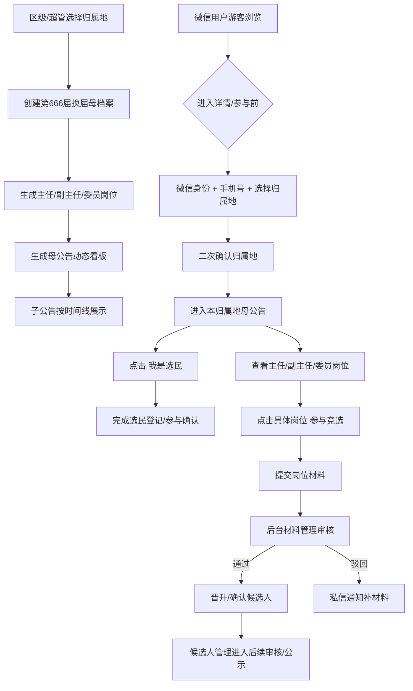

# 一期最小演示闭环

更新时间：2026-07-04

目标：先做一个甲方能看懂、团队能继续接的最小闭环，不铺完整全年系统。

## 一句话

```text
一个村/社区，创建一场换届，自动生成主任/副主任/委员，发布母公告，用户登记并按岗位自荐，后台审核材料并通知用户。
```

## 闭环图



## 演示必须有

- 122 归属地可选。
- 一场换届母档案。
- `POST /position-v2/generate` 生成主任、副主任、委员。
- 母公告看板能表达当前进度和子公告。
- 微信端首次登记：手机号 + 归属地 + 二次确认。
- 具体岗位旁边有“参与竞选”。
- 材料提交后后台能审核。
- 审核结果能通知用户。

## 暂时不做

```text
多商户
复杂权限树
完整岗位树
线上投票计票
完整47材料自动化
党组织/监委/代表/小组长/楼栋长/社工竞选
```

## 下一刀

最稳顺序：

1. 母公告看板结构图。
2. 微信首次登记图。
3. H5/小程序归属地绑定代码。
4. 岗位旁“参与竞选”入口。

已经完成：

- `POST /position-v2/generate`
- 岗位生成自测：`koaLite/scripts/check-position-generate.js`
