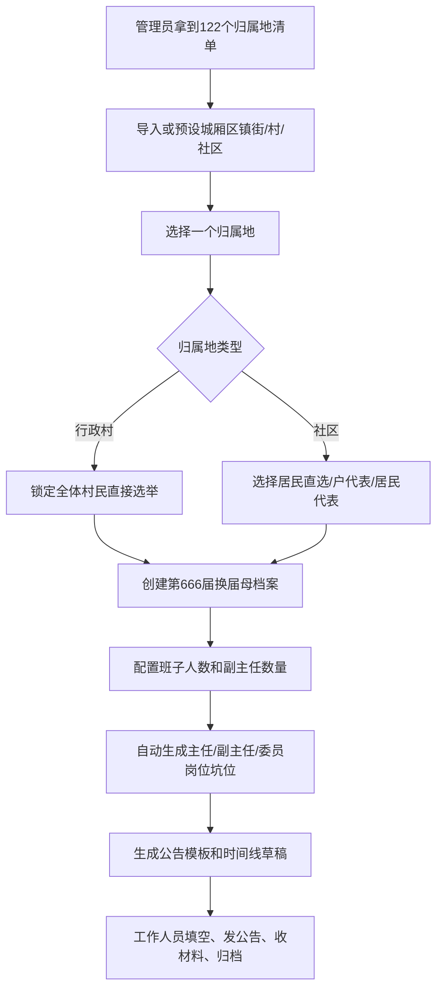

# 业务梳理 - 第666届换届起点

更新时间：2026-07-02

## 这一幕发生了什么

第666届村委会、社区居委会换届选举要开始了。

管理员拿到了本次要换届的村和社区清单。这里工程口径先写成：**122个归属地单位**，包括行政村和社区，避免后面和“户代表选举”里的“户”混淆。

每个归属地都要办一场长线换届活动。村委会要选主任、副主任、委员；社区居委会也要选主任、副主任、委员。但两类单位的规则不同：

- 行政村：只能全体村民直接选举。
- 社区：可以在居民直选、户代表选举、居民代表选举中选择。

每场活动还要提前备案，要按阶段发公告、收材料、留档案、跟进候选人和岗位。现实工作里，统计难、信息传递难、收资料难、存档案乱，工作人员也可能因为没有纪律化的提醒而忘记进场。

同时，每个村/社区现任班子名单还不完整，不能假设系统一开始就知道“现任主任是谁、现任委员是谁”。

所以我们要做的不是一个普通 CRUD 后台，而是一个帮助工作人员把换届工作“分流、填空、提醒、归档”的系统。

## 当前第一原则

```text
先确定归属地，再创建换届母档案。

村居清单不是业务本体。
一场换届母档案才是业务本体。
```

换句话说：

```text
村居 = 这件事发生在哪里
换届 = 这一次要办的长线活动
岗位 = 这场活动里要选的坑位
候选人 = 报某个坑位的人
公告 = 这场活动某个阶段要发的话
材料 = 这场活动某个阶段要收和存的附件
```

## 此时我们怎么办

第一步不是先做复杂组织树，也不是先做多商户，而是把工作拆成一条很稳的路：



## 三类角色怎么走

### 1. 管理员

管理员负责守住全局规则和清单。

他要做的是：

- 维护城厢区的镇街、行政村、社区清单。
- 给某个归属地创建一场换届母档案。
- 按村/社区类型锁定或开放选举方式。
- 查看每场换届的阶段、公告、材料、候选人和缺口。

管理员不应该每天手工造一堆重复流程。系统应该替他把规则预设好。

### 2. 村/社区经办人

经办人负责把真实信息填进去。

他进入系统后最想看到：

- 我负责哪个村/社区。
- 当前有没有正在进行的换届。
- 换届走到哪一步。
- 下一步要发什么公告、收什么材料。
- 哪些内容没填，哪些材料没上传。

经办人需要填写的是真实信息，例如：

- 本次换届名称、年份、届次。
- 具体开始日期、报名日期、公示日期、选举日期。
- 是否设置副主任、副主任数量。
- 候选人姓名、性别、电话、来源。
- 公告里的时间、地点、联系人。
- 上传会议记录、照片、签字表、备案材料。

### 3. 普通村民/居民

普通用户不应该看到后台概念。

他只需要知道：

- 我属于哪个村/社区。
- 当前有没有和我相关的换届。
- 现在进行到哪一步。
- 我能不能报名。
- 我缺什么材料。
- 公告说了什么。
- 结果公示在哪里。

## 微信端首次登记口径

微信小程序端允许游客先浏览公开内容，但一旦进入某个村/社区详情、查看活动详情、报名、提交材料或确认自己参与本次选举，就必须完成身份登记。

这里的一期口径是：

```text
微信身份 wxid/openid = 微信侧唯一身份
手机号 = 用户可联系、可合并的现实身份线索
归属地 = 用户属于哪个镇街、哪个行政村/社区
```

首次进入需要做三件事：

```text
1. 微信授权登录，系统拿到 wxid/openid。
2. 填写手机号。
3. 必须选择归属地：镇街 -> 行政村/社区 -> 具体村/社区。
```

归属地选择必须二次确认：

```text
请确认你的归属地。
归属地会影响你看到的公告、活动和可参与登记的选举。
确认后如需修改，请联系管理员处理。
```

选完归属地后，用户进入自己村/社区的前端母表。这个母表不是静态表，而是随着换届主线动态更新：

```text
当前阶段
母公告
子公告列表
报名/登记入口
材料提交入口
候选人公示
结果公告
```

母公告栏的定位不是“单条公告详情”，而是该选举活动的动态消息大看板。它应该展示：

```text
活动标题
发布单位
总览时间轴
当前进度
阶段公告/子公告列表
文件下载
该阶段需要办理的事项
```

母公告里可以出现两个不同入口，但必须分清责任：

```text
我是选民 = 选民登记 / 确认自己参与本次选举登记
参与竞选 = 报名成为某个岗位的候选人
```

`我是选民` 可以放在母公告详情里，因为它确认的是“我属于这场选举活动的选民”。

`参与竞选` 不应该做成母公告上的泛按钮，而应该放在具体竞选岗位旁边。例如：

```text
主任      [参与竞选]
副主任    [参与竞选]
委员      [参与竞选]
```

用户点击后进入对应岗位的报名/材料提交页面。这样系统才能明确知道用户报名的是主任、副主任还是委员。

首次未完善个人信息的用户，首页需要有明显提醒，例如红色横幅或小红点：

```text
选民请完善个人信息。
请点击活动公告，找到你要参与的选举活动母公告，进入详情后点击“我是选民”完成登记。
```

按钮文案要注意边界。一期如果不做线上投票，建议按钮用：

```text
我是选民
参与登记
确认参与本次选举登记
```

避免直接写成“参与投票”，以免被理解为系统支持线上投票。若甲方坚持使用“参与投票”字样，工程口径也必须注明：这里是选民登记/参与确认，不是线上投票计票。

用户不应该看到：

```text
多商户
组织树配置
接口字段
election_id
village_id
模板变量
岗位规则配置
数据库编号
```

## 系统必须预设的东西

```text
城厢区镇街清单
行政村/社区清单
归属地类型：行政村 / 社区
职位字典：主任、副主任、委员
村委会规则：直选，班子人数 3/5/7
居委会规则：居民直选/户代表/居民代表，班子人数 5/7/9
候选人来源：自荐、10人以上联名推荐、党组织推荐
公告模板骨架
材料目录骨架
```

## 系统必须留给人填的东西

```text
具体换届年份/届次
具体日期
班子总人数
副主任是否设置、设置几名
候选人真实信息
公告空白字段
上传附件
阶段实际完成状态
最终当选结果
```

## 最容易走错的路

这些先不要做，或者不要混进一期：

```text
多商户
复杂组织树
完整全岗位树
党组织换届
村务/居务监督委员会
小组长/楼栋长
镇聘岗位/专职社工
完整47材料自动化
线上投票
```

## 给小agent们的统一引导口径

后续让任何小agent分析、画图、写代码前，先给它这段：

```text
你正在协助城厢区村/社区换届系统一期建设。

这不是多商户 SaaS，也不是复杂组织树系统。
一期只做行政村和社区居委会的换届工作，岗位只包含主任、副主任、委员。

业务第一原则：
先选归属地，再创建换届母档案。
villages 是归属地筛选根，elections 是一场换届的大母档案。
positions、candidates、materials、notices 都必须挂到 election_id 下，不能散挂。

村委会规则：
只能全体村民直接选举，班子人数 3/5/7。

社区居委会规则：
选举方式三选一：居民直选、户代表选举、居民代表选举，班子人数 5/7/9。

副主任是独立竞选岗位，不能从委员里提拔。
妇联、综治、民政、卫健、调解、治安等只是当选后的内部分工，不是竞选岗位。

系统目标：
帮助工作人员分流、填空、提醒、收材料、归档。
不要把一期做成全流程大而全平台。
```

## 下一张图要画什么

建议下一步画四张 Mermaid：

1. 角色入口图：管理员、经办人、普通用户分别怎么进系统。
2. 母档案数据图：elections 下挂哪些东西。
3. 村/社区规则分流图：不同类型如何锁定规则。
4. 后台页面关系图：村居管理、选举管理、岗位、候选人、公告、材料怎么连。
