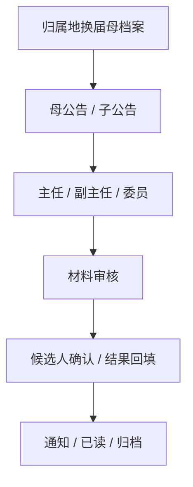

# 副船长的航海接力日志

用途：船长不在时，副船长负责把可交接、可施工、可验证的内容整理成短日志。

## 先看图

```text
当前接力图.md
-> 文件索引.md
-> 资料快照-2026-07-04/
-> 回根目录原件和代码验证
```

## 当前主线



## 开工纪律

```text
先后端契约，后前端形态。
先最小闭环，后完整系统。
先复用已有链路，后新增代码。
能用图不用长文。
```

## 可用小工具

```text
xiaxia-draw                画图图，替代长文字
xiaxia-context-compression 压缩历史上下文
work-mode-conduct          责任表 / 不飘纪律
dispatching-parallel-agents 分片派小 sub
.ctx/ctx.cmd               本项目本地勘探小工具
lean-ctx                   增量读代码和文档
```

本目录不放大段聊天记录，只放能指导施工的接力文件。根目录原件仍是工程真相，本目录快照只负责接力。
