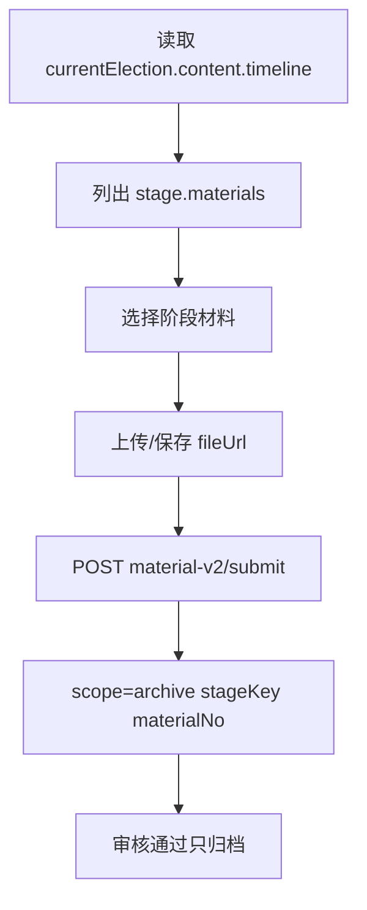

# 上下文保护接力卡 - 2026-07-05

目的：窗口快满时保护主线。下一棒先读本卡，再读 `当前接力图.md`、`文件索引.md`、根目录真相源。

## 2026-07-08 Pearl mini 当前断点

- 当前目标：让页面小闭环真正穿到数据库，先做 `岗位管理页 -> 在岗 -> roster 花名册弹窗 -> 新增 active -> 停用 inactive`。
- 当前未提交劳动成果：`admin/src/views/positions/index.vue`。
- 已写入页面：岗位行新增“在岗”按钮；弹窗展示当前活动、届次、归属地；调用 `getRosters` 读取 active 花名册；调用 `createRoster` 新增在岗人员；调用 `deleteRoster` 停用记录。
- 已完成后端基础：`roster-v2` 的 `list/detail/add/update/delete` 已落，`delete` 只置 `inactive`，不硬删；`admin/src/api/api.ts` 已有 roster API 包装。
- 已补演示数据：`koaLite/scripts/seed-subadmin-roster-demo.js` 幂等创建 `15000000000 / 123456 / 经办`，绑定涧口 `village_id=28`，并给主任/副主任/委员填 active 在岗花名册。
- 已通过验证：`node --check koaLite/api/roster-v2.js`、`node koaLite/scripts/check-roster-v2.js`、`node --check koaLite/scripts/seed-subadmin-roster-demo.js`、Vite 3000 编译 `positions/index.vue`、子管理账号登录/读岗位/读 roster/新增 roster/停用 roster 均通过。
- 下一刀：提交本轮；后续转材料提交/审核/候选人闭环，不要回头重做 roster 主链。

## 当前主线


## 已压实决策

- 本期不做多商户、复杂组织树、复杂数据隔离、复杂权限树。
- 本期不做线上投票计票、完整 45 天自动化、完整 47 材料。
- 本期竞选岗位只认：主任 / 副主任 / 委员。
- 小规模村可以不设副主任；因此 `village 3 => 主任1 + 委员2` 按新决策成立。
- 旧岗位数据不删；历史查看走 `includeAll=1`。
- 导入、材料审核、私信通知、已读记录是已有资产，只能补强，不能删。
- 附件字段诊断后，旧表优先：能复用不新建；代表/小组长/监会只归档隐藏。
- 唯一新增必要关系表：`election_voters`，表达“某人登记参与某届选举”。
- `materials.scope=candidate/archive` 区分候选人材料和阶段归档材料；归档材料审核不生成候选人。
- 本项目禁用 `ctx/lean-ctx/.ctx`；只用 PowerShell、`Get-Content`、`Select-String`、`rg` 做最小读取。
- 长上下文用 `xiaxia-context-compression` 做 L3 接力；反复犯错用 `learn-from-sessions` 只读提案，写入前必须经夏夏批准。

## 刚完成的护航

- 四角色基础权限已最小补齐：
  - 超级管理：全菜单入口已齐；
  - 经办：补 `election-methods/archives/logs`；
  - 运营：补 `archives`；
  - 审核：移除公告菜单，候选人页隐藏新增按钮；
  - 后端：`position/material/notice/notification` 写操作补基础 RBAC。
- `工程责任表-一期P0.md` 已补“页面改动表达格式”，夏夏可以按 `页面/组件/字段/现在/应该/来源/边界` 指具体页面细节。
- 岗位自动生成前后端已接：`generatePositions` + 职位页“一键生成岗位”。
- 村级运营仪表盘已从硬编码 8 段改为优先读取 `getElection(id).content.timeline` 的 11 阶段；无 timeline 时保留旧 8 段兜底。
- `election_id=1` 的 18 条公告已填实，无 `____` / `{{字段}}`。
- `election_id=1` 已写入 11 阶段 `content.timeline`，并把 18 条公告补齐 `notice_no/stage_key/template_key`。
- 表诊断和最小扩展已做，live DB smoke 通过。
- `当前接力图.md` 已补树根层、系统结构树、11阶段下钻图、sub认领图。
- `AGENTS.md` 已写入 Memory Skills 与 Homework Guard；宝妈小sub若 slot 满，由团队长本地执行检查清单。
- `learn-from-sessions` 已试跑只读扫描：发现旧会话里有 `.ctx` 轨迹；本轮不写外部 memory，只保留项目本地 no-ctx 规则。

## 当前断点

- `content.timeline` 和 `notices.stage_key/notice_no/template_key` 已落。
- 基础权限还有后续断点：
  - `archives` 页面仍走 `/admin/archives*` 假接口；
  - `logs` 页面走 `/log-v2/list`，后端未建；
  - `election-methods/admins/roles/settings` 仍是无后端 TODO；
  - `approvals` 页面未接 `election-v2/approve`；
  - 候选人审批状态 `待初审/待终审` 与后端状态需对齐。
- 当前下一刀：archive 材料上传按 `content.timeline[].materials` 选择阶段材料。
- 提交 archive 材料时必须带：`scope=archive + electionId + stageKey + materialNo + fileUrl`。
- archive 材料审核通过只归档，不生成候选人。
- HTTP 详情接口未验证：`127.0.0.1:1116` 当前未启动，拒绝连接。
- subagent slot 当前可能满；宝妈监督规则已落 `AGENTS.md`，不要因此阻塞主线。

## 下一刀



## 当前最小验证

```text
node --check koaLite/scripts/seed-election-timeline.js
node koaLite/scripts/seed-election-timeline.js 1
=> election_id=1 stages=11 notices=18 staged=18 numbered=18 templated=18

git diff --check
=> 无空白错误；只有既有 LF/CRLF 警告
```

## 不要丢

- 我们自己的 style：先图后文、先边界后代码、少即是美、运筹而不是新造。
- 不再新增散 md；需要记录时优先更新 `AGENTS.md`、本卡、`PROJECT_STATE.md`、`ENGINEERING_LOG.md`、`PROJECT_TREE.md`。
- 子任务喊麦格式：
  - 我是；
  - 我接收；
  - 我处理；
  - 我往下交；
  - 我需要谁给我；
  - 我不负责。
