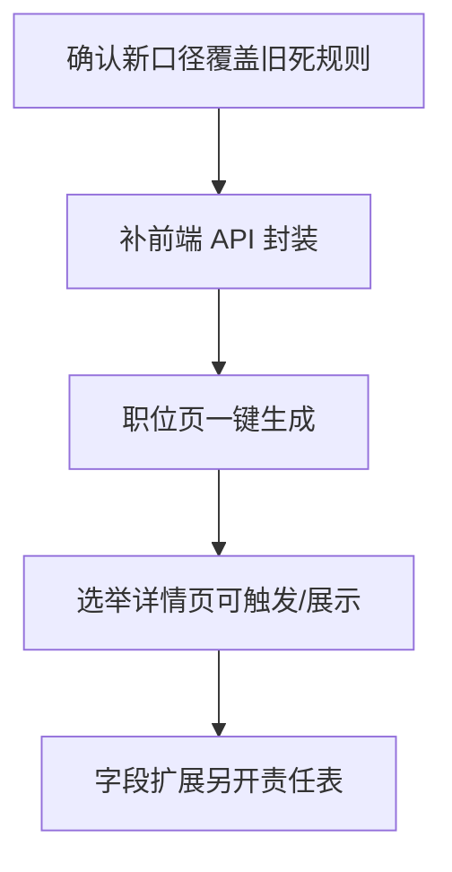

# 岗位自动生成检查 - 2026-07-05

检查对象：`交接单-岗位自动生成-给codex.md`

结论：没完全做完。后端主干已接近可用，前端自动生成入口还没接上。

## 已做

- 后端已有 `POST /position-v2/generate`。
- 路由生成规则覆盖：
  - `/position-v2/generate`
  - `/api/position-v2/generate`
- `position-v2/list` 默认只返回主任 / 副主任 / 委员。
- `includeAll=1` 可查看旧岗位，不删除旧资产。
- 后端重复生成有保护：同一 election 已有三岗位时不重复插入。

## 已验证

```text
node --check koaLite/api/position-v2.js
node koaLite/scripts/check-position-generate.js
node koaLite/scripts/check-router-api-prefix.js
```

自定义验证结果：

```text
village 5 => 主任1 / 副主任1 / 委员3
community 5 => 主任1 / 副主任1 / 委员3
village 3 => 主任1 / 委员2
```

## 部分做 / 风险

- `village, committeeSize=3` 默认不生成副主任，结果是 `主任1 + 委员2`。
- 这和 `交接单-岗位自动生成-给codex.md` 里的旧死规则“主任1、副主任1、其余委员”冲突。
- 但它符合后续夏夏和船长钉下的新业务口径：小规模村可以不设副主任。
- 所以这里不是纯代码 bug，而是“旧交接单需要标注已被新决策覆盖”。

## 未做

- 前端 `admin/src/api/api.ts` 还没有 `generatePosition(s)` 封装。
- 前端职位页/选举详情页没有“一键生成岗位”按钮或自动触发。
- 创建选举后未看到自动调用岗位生成。
- `positions` 表还没有完全落齐交接单列出的扩展字段：
  - `post_category`
  - `can_self_recommend`
  - `on_ballot`
  - `produce_way`
  - `incumbent`
  - `post_status`
  - `incumbent_duty`
  - `incumbent_phone`
  - `is_reelection`

## 证据锚点

- `koaLite/api/position-v2.js`
- `koaLite/scripts/check-position-generate.js`
- `koaLite/scripts/check-router-api-prefix.js`
- `admin/src/api/api.ts`
- `admin/src/views/positions/index.vue`
- `admin/src/views/election/detail.vue`
- `koaLite/db/init_v2.sql`

## 下一刀


