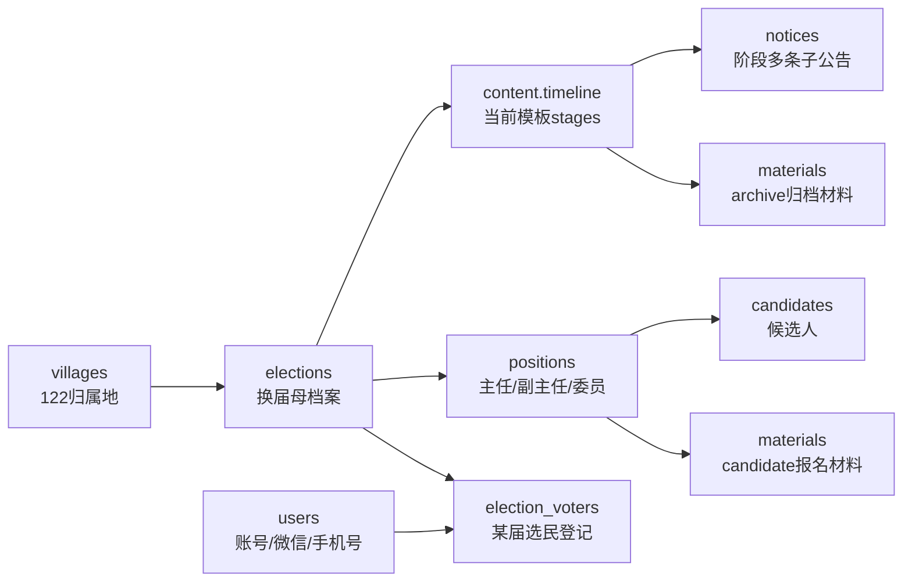
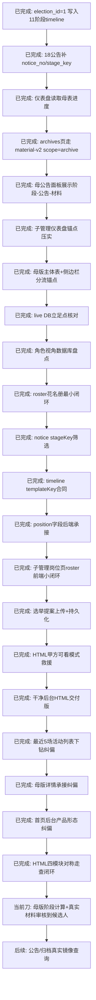
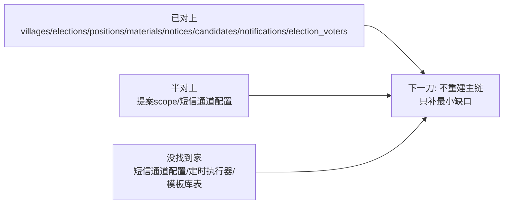
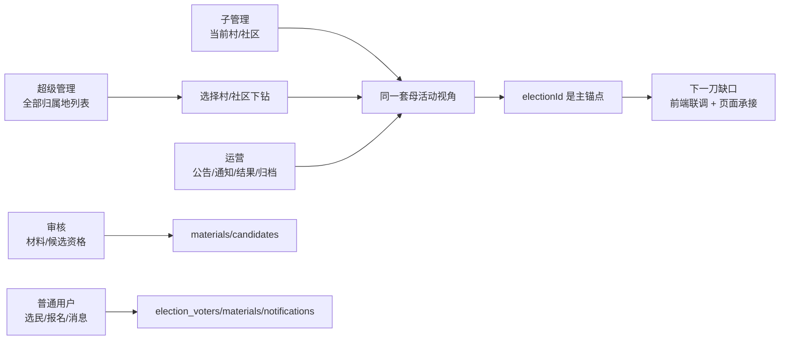
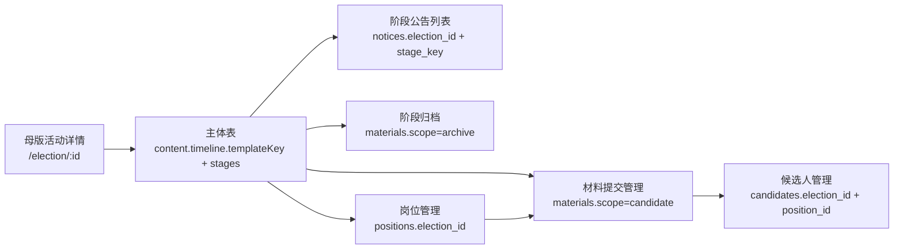
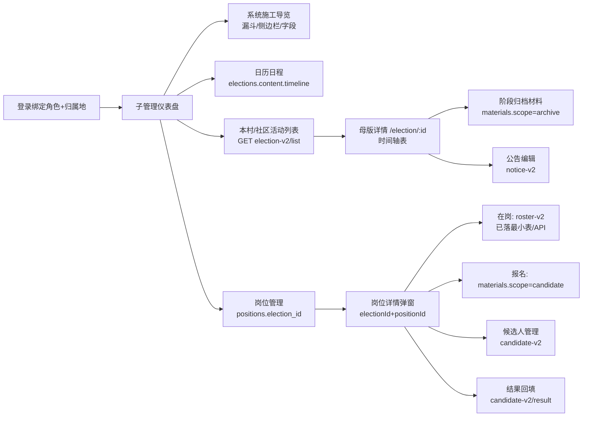

# 当前接力图

> 低 token 入口。只看方向；字段真相看根目录 `工程责任表-一期P0.md`，代码和 live schema 最终裁决。

## 0. Pearl mini 保护点

```text
不能丢从前：timeline、18公告、仪表盘、archive、母公告、UI锚点、live DB盘点、roster后端、stageKey、templateKey、position扩展字段都已经压实过，不能重做或覆盖。
不能丢当前：`admin/src/views/positions/index.vue` 已接岗位页“在岗花名册”弹窗；`koaLite/scripts/seed-subadmin-roster-demo.js` 已填子管理账号和演示 roster。
已验证小闭环：`15000000000 / 123456 / 经办` 登录后只看涧口活动；可读 active roster；可新增再停用，停用后 active 列表消失。
提案已闭环：提案附件走上传，提交后进 `election_proposals`，附件自动移动到 `public/uploads/archives/proposals/{proposalId}-{title}`，刷新列表不丢。
HTML已救援：`换届选举系统-UI优化.html` 默认是甲方可看模式，开发锚点一键展开；默认子管理 `经办 / 涧口社区 / 15000000000`，选民登记单独锚到 `election_voters`。
新增干净交付版：`deliverables/client-admin-html/index.html` 默认就是子管理登录后的首页工作台；旧 HTML 不删，继续作为施工锚点和问题定位稿。
活动列表纠偏：干净交付版“最近 5 场活动列表”已从届次标签+单按钮改为 5 条活动记录；每条点击保存 `selectedActivityId` 并进入对应母版，列表定义不能再退回标签。
母版详情纠偏：`deliverables/client-admin-html/index.html#mother` 已从薄表改成 11 阶段母表主体；固定表头为 `#/阶段名称/开始日期/结束日期/天数/核心工作/关联材料/上传文件/公告编辑`，并承接岗位/材料/候选人/归档入口。
首页形态纠偏：`deliverables/client-admin-html/index.html#dashboard` 已按后台产品形态重做，左侧业务导航常驻，顶部状态卡，中间 11 阶段/45天时间线，右侧最近活动和工作提示；不再是说明稿/模块堆叠。
HTML最低交付闭环：`页面-业务模块.html` 已对称承接材料/候选人/公告/归档；仪表盘四入口已接通，历史届强制只读，候选人按钮可按母版阶段走查，公告/归档只做镜像。
必须记清边界：上述是可点击 HTML 走查原型，尚未接真实 API；下一刀接材料审核→候选人→线下结果回填，不能为公告/归档另造表或第二真相。
```

## 1. 树根主线



## 2. 母版时间轴模板

> 表头固定，阶段行由当前母活动采用的模板决定；旧 11 阶段是村线/演示 seed 的参考，不可硬套所有类型。

```mermaid
flowchart TD
    T[content.timeline<br/>templateKey + stages[]] --> Header[固定表头<br/>阶段/日期/天数/工作/材料/上传/公告]
    T --> V1[村委会<br/>村民直接选举模板]
    T --> C1[社区<br/>居民直接选举模板]
    T --> C2[社区<br/>户代表选举模板]
    T --> C3[社区<br/>居民代表选举模板]
    V1 --> Link[日历/公告列表/归档材料<br/>全部按当前 stages 对齐]
    C1 --> Link
    C2 --> Link
    C3 --> Link
```

## 3. 下一刀



## 4. 数据库立足点核对



## 4.1 角色视角盘点



## 5. 母版主体表到侧边栏



## 6. 子管理 UI 当前回路



## 7. 硬边界

```text
主任/副主任/委员 = 一期竞选主线
代表/小组长/监会/移交 = 归档或二期
candidate材料通过审核才进候选人
archive材料只归档不进候选人
users不是选民登记，election_voters才是某届选民
花名册进一期，但只做 roster 最小表；不扩复杂干部履历
```
