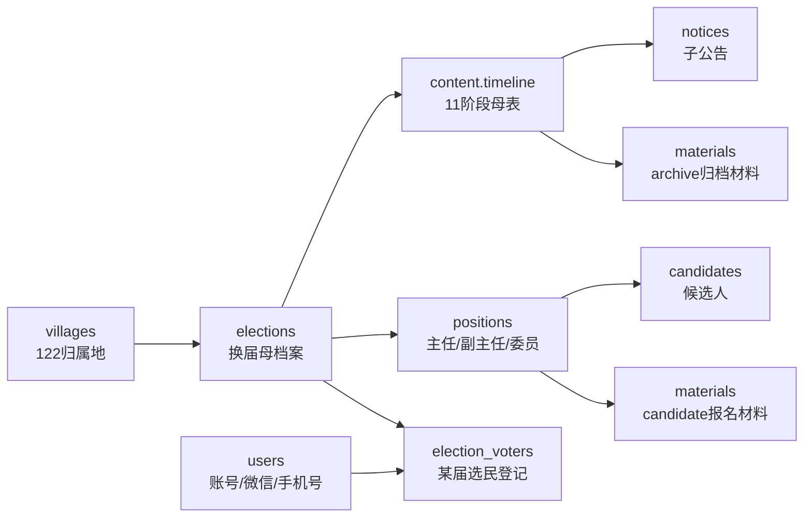
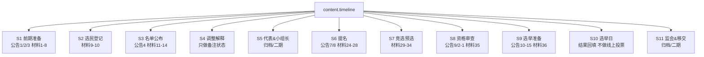
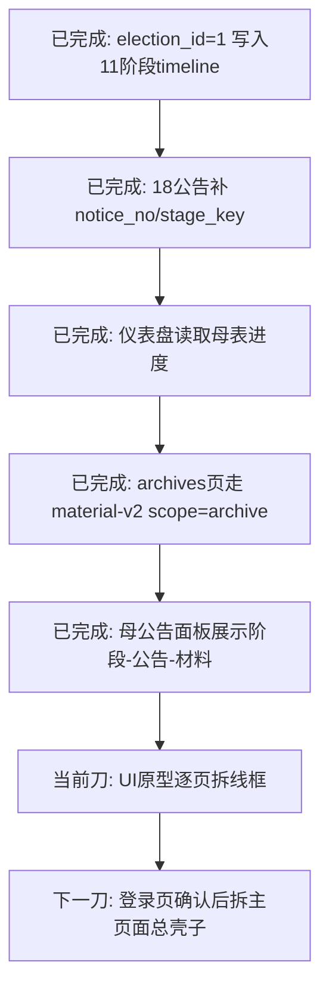

# 当前接力图

> 低 token 入口。只看方向；字段真相看根目录 `工程责任表-一期P0.md`，代码和 live schema 最终裁决。

## 1. 树根主线



## 2. 母表 11 阶段



## 3. 下一刀



## 4. 硬边界

```text
主任/副主任/委员 = 一期竞选主线
代表/小组长/监会/移交 = 归档或二期
candidate材料通过审核才进候选人
archive材料只归档不进候选人
users不是选民登记，election_voters才是某届选民
```
