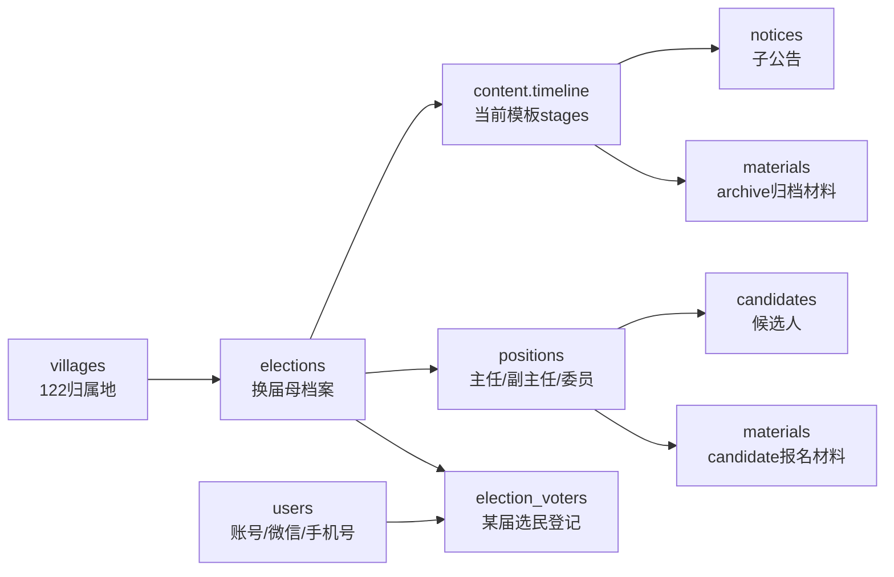
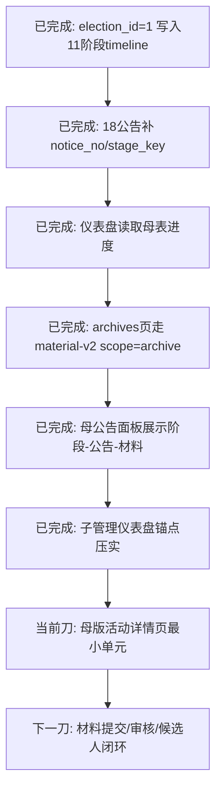
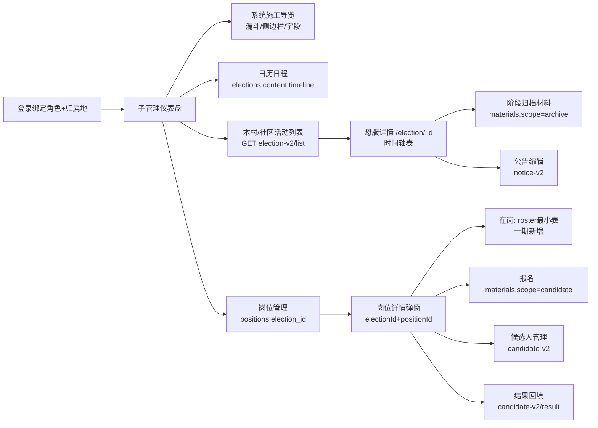

# 当前接力图

> 低 token 入口。只看方向；字段真相看根目录 `工程责任表-一期P0.md`，代码和 live schema 最终裁决。

## 1. 树根主线



## 2. 母版时间轴模板

> 表头固定，阶段行由当前母活动采用的模板决定；旧 11 阶段是村线/演示 seed 的参考，不可硬套所有类型。

```mermaid
flowchart TD
    T[content.timeline<br/>templateKey + stages[]] --> Header[固定表头<br/>阶段/日期/天数/工作/材料/上传/公告]
    T --> V1[村委会<br/>村民直接选举模板]
    T --> C1[社区<br/>居民直接选举模板]
    T --> C2[社区<br/>户代表选举模板]
    T --> C3[社区<br/>居民代表选举模板]
    V1 --> Link[日历/公告/归档材料<br/>全部按当前 stages 对齐]
    C1 --> Link
    C2 --> Link
    C3 --> Link
```

## 3. 下一刀



## 4. 子管理 UI 当前回路



## 5. 硬边界

```text
主任/副主任/委员 = 一期竞选主线
代表/小组长/监会/移交 = 归档或二期
candidate材料通过审核才进候选人
archive材料只归档不进候选人
users不是选民登记，election_voters才是某届选民
花名册进一期，但只做 roster 最小表；不扩复杂干部履历
```
