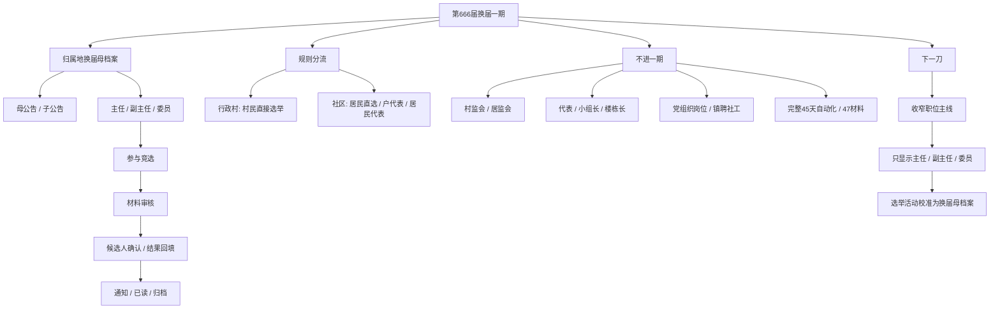

# 当前接力图

更新时间：2026-07-04

> 本图是副船长接力入口。根目录原件仍是工程真相；本目录快照只用于低 token 接力。


```mermaid
flowchart TD
    A[第666届换届一期] --> B[归属地换届母档案]
    B --> C[母公告 / 子公告]
    B --> D[主任 / 副主任 / 委员]
    D --> E[参与竞选]
    E --> F[材料审核]
    F --> G[候选人确认 / 结果回填]
    G --> H[通知 / 已读 / 归档]

    A --> R[规则分流]
    R --> R1[行政村: 村民直接选举]
    R --> R2[社区: 居民直选 / 户代表 / 居民代表]

    A --> X[不进一期]
    X --> X1[村监会 / 居监会]
    X --> X2[代表 / 小组长 / 楼栋长]
    X --> X3[党组织岗位 / 镇聘社工]
    X --> X4[完整45天自动化 / 47材料]

    A --> P[下一刀]
    P --> P1[收窄职位主线]
    P1 --> P2[只显示主任 / 副主任 / 委员]
    P2 --> P3[选举活动校准为换届母档案]
```

## 入口顺序

```text
先看：当前接力图.md
再看：文件索引.md
需要细节：资料快照-2026-07-04/
最终真相：回根目录原件和代码验证
```
