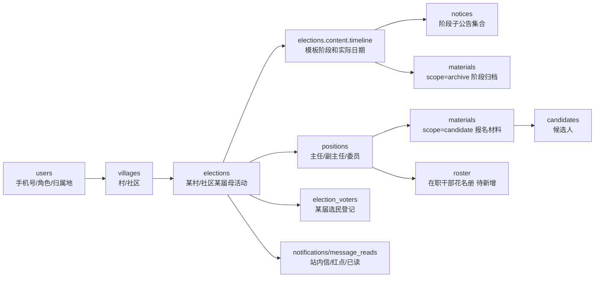

# 数据库角色视角盘点 - 2026-07-08

> 目的：带入不同角色，把 UI、侧边栏、数据库字段、业务漏斗走一遍。本文只做结构核对和下一步计划，不改业务代码。

## 0. 本轮边界

- 当前先压实子管理视角；超级管理只是外层归属地列表和下钻壳。
- 系统不是 SaaS 多租户，不新增 tenant/org 租户表；主链仍是 `villages -> elections -> positions/timeline -> materials/notices/candidates`。
- live schema 已确认主表存在：`users/villages/elections/positions/materials/candidates/notices/notifications/message_reads/election_voters/logs`。
- 当前明确缺口：`roster` 花名册表、短信通道配置表或配置项、通知定时执行器、后台可维护模板库表。
- 一期只补最小缺口，不重建已有 `materials/notices/candidates/notifications` 主链。

## 1. 总漏斗：谁在谁前面

第一判断是 `users.role + users.village_id`，决定进入超级管理外层还是子管理当前村/社区。第二判断是 `villages.type + elections.election_method`，决定选举类型和模板。第三判断是 `elections.id`，后面所有岗位、材料、公告、候选人、通知、归档都必须带着它走。

## 2. 小 mini 1：结构官走角色

| 角色 | 进入方式 | 第一屏看什么 | 下钻到哪里 | 不能混什么 |
|---|---|---|---|---|
| 子管理/经办 | `users.phone/role/village_id` | 当前村/社区仪表盘、日历、活动列表、岗位状态 | `/election/:id` 母活动详情、岗位详情、材料提交、候选人、公告、归档 | 不出现全区总管理文案，不自己选择别村作为主视角 |
| 超级管理 | `users.role=超级管理`，无固定单一村 | 全部村/社区列表、全区活动筛选 | 选择某村/社区后下钻复用子管理视角 | 不复制一套超管版业务页面，不把超管统计混入子管理首屏 |
| 运营 | 角色菜单进入公告、通知、候选结果、归档 | 当前被授权范围内的公告/通知/候选结果列表 | 公告编辑、通知发送、结果回填、归档查看 | 不做材料审核结论，不做系统配置密钥维护之外的业务决定 |
| 审核 | 审核菜单进入待审队列 | `materials.status=待审核`、候选资格状态 | 材料详情、通过/驳回、候选人状态 | 不发布公告，不改岗位，不改系统配置 |
| 普通用户/村民 | 小程序/H5 手机号和归属地 | 公开公告、我是选民、参与竞选入口 | 选民登记、具体岗位报名、我的材料、站内信 | `users` 不是某届选民名册；某届关系必须进 `election_voters` |

结构结论：角色只是入口和可见操作不同，不改变业务主链。所有角色最终都应回到同一组事实：归属地、母活动、阶段、岗位、材料、公告、候选人、通知。

## 3. 小 mini 2：字段官对表

| 场景 | 前端动作 | 需要字段 | 当前表/接口 | 状态 |
|---|---|---|---|---|
| 登录后识别子管理 | 输入手机号登录 | `users.phone/role/village_id` | `users` | 已有家 |
| 子管理显示当前归属地 | 仪表盘身份区 | `villages.id/name/type/street` | `villages` | 已有家 |
| 活动列表最近 5 场 | 查看本村/社区活动 | `elections.id/village_id/name/session_no/election_method/status/content` | `election-v2/list` | 已有家 |
| 母活动详情表 | 点击活动进入 `/election/:id` | `elections.content.timeline[]`，后续统一 `templateKey + stages/timeline` | `elections.content` | 半对上，需统一 JSON 合同 |
| 日历日程 | 按阶段展示事项和日期 | `stageKey/stageName/startDate/endDate/days/work` | `elections.content.timeline[]` | 已有家，UI 不手搓日历 |
| 阶段公告集合 | 公告编辑列进入弹窗 | `notices.election_id/stage_key/notice_no/template_key/title/status` | `notice-v2/list/add/generate/update` | 半对上，list 需补 `stageKey` 查询 |
| 阶段归档上传 | 上传某阶段材料 | `materials.scope=archive/election_id/stage_key/material_no/file_url/status` | `material-v2/submit/list/review` | 已有家 |
| 岗位管理 | 查看/编辑本届岗位 | `positions.election_id/name/quota/material_requirements/post_status/incumbent*` | `position-v2/list/detail/update` | 已有家，但 API 列表输出字段偏薄 |
| 在岗详情 | 岗位状态为在岗时查看干部 | `village_id/session_no/post/name/phone/intro/status` | `roster` | 没家，需新增最小表 |
| 自荐材料审核 | 候选人提交材料后审核 | `materials.scope=candidate/election_id/position_id/applicant_phone/items/status/candidate_id` | `material-v2` | 已有家 |
| 候选人管理 | 审核通过或后台导入 | `candidates.election_id/position_id/phone/name/source/recommend_type/status/elected/votes` | `candidate-v2` | 已有家 |
| 选民登记 | 点击我是选民 | `election_voters.election_id/village_id/user_id/phone/name/status` | 表已有，API 需另核 | 半对上 |
| 站内信通知 | 小铃铛/材料审核结果 | `notifications.title/content/type/target_phones/scheduled_at/status` + `message_reads` | `notifications/message_reads` | 已有家 |
| 短信通道配置 | 选择短信通知 | 短信服务商、签名、模板、密钥引用 | 无正式配置表 | 没家，需补配置边界 |

字段结论：旧表可以承接大多数功能。不要零散修补成很多新表；先把 `elections.content` 合同、`notice-v2/list stageKey`、`roster`、短信配置边界这四件事排队。

## 4. 小 mini 3：UI 官带页面走一遍

### 子管理仪表盘

- 左上日历日程：读当前母活动 `elections.content.timeline[]`，用成熟 UI 日历组件展示，不手搓。事项名称等于阶段名称，日期等于该阶段真实日期。
- 右侧身份区：显示当前归属地名称、今天日期、当前角色、登录手机号。不要再显示泛泛的“总管理”。
- 下方三块小容器：选举方式、参选形式筛选、本村/社区最近活动列表。都不能通栏。
- 选举方式：由 `villages.type + elections.election_method` 决定。村镇只有村民直接选举；社区按当前选举方式展示。
- 参选形式筛选：是伏笔字段，后续影响材料提交管理和候选人管理筛选，必须带 `electionId`。
- 活动列表：点击查看更多跳侧边栏选举活动管理；点击某活动进入母活动详情 `/election/:id`。

### 母活动详情 `/election/:id`

- 主体只看一张表：`#/阶段名称/开始日期/结束日期/天数/核心工作/关联材料/上传文件/公告编辑`。
- 表头固定，阶段行由当前模板决定：村委会全民直选、社区全民直选、社区户代表、社区代表选举不能硬套同一批行。
- 公告编辑列是阶段子公告集合入口，不是单个公告按钮。
- 上传文件列对应 `materials.scope=archive`，只归档，不生成候选人。

### 岗位详情

- 岗位列表和岗位详情必须显示当前 `xxx届选举活动`，并带一个关联选举活动下拉，避免用户以为写死。
- 岗位详情入口必须带 `electionId + positionId`。
- “在岗”点击详情读 `roster`；“报名/提名/审核/公示/结果”点击详情分别回到材料、候选人、公告、审核、结果回填。
- 表格下载是岗位相关资源，不要和阶段归档上传混成同一件事。

UI 结论：首屏是工作台，不是宣传页。所有能点的地方都要能说清楚弹窗或跳转，不把假按钮留给后续猜。

## 5. 小 mini 4：接力官决策矩阵

| 分类 | 对象 | 决策 | 原因 |
|---|---|---|---|
| 保留旧表 | `users/villages/elections/positions/materials/notices/candidates/notifications/message_reads/election_voters/logs` | 保留并补强 | 主链已经能承接当前业务，重建会制造第二套真相 |
| 微调旧表/API | `elections.content` | 统一为兼容合同：保留 `timeline[]`，补 `templateKey`，前端可映射为 `stages` | 不需要为模板阶段单独建表，一期代码配置模板即可 |
| 微调旧表/API | `notice-v2/list` | 增加 `stageKey` 查询参数 | 阶段公告集合弹窗要按阶段查，不应每次拉全量再筛 |
| 微调旧表/API | `position-v2/list/detail` | 列表/详情补齐 live schema 已有字段输出 | UI 要展示岗位状态、产生方式、在任信息、是否换届等 |
| 新增小表 | `roster` | 新增最小花名册表 | `positions.incumbent*` 只能放当前岗位摘要，不能承接届次和花名册列表 |
| 新增小表或配置边界 | `system_configs` 或 `sms_channels` | 二选一，先定敏感值存储规则 | 短信通道配置不能写在通知表里，也不能明文堆在前端 |
| 暂缓不做 | `timeline_stages` 表 | 暂不新增 | 一期阶段模板用代码配置，实际活动结果落 `elections.content` |
| 暂缓不做 | `notice_stage_relations` 表 | 暂不新增 | `notices.stage_key + election_id` 已可表达一对多 |
| 暂缓不做 | `archive_files` 表 | 暂不新增 | `materials.scope=archive` 已能承接阶段归档 |
| 暂缓不做 | 完整模板库表 | 暂不新增 | 后台维护模板库不是一期闭环必需 |

## 6. 从角色走一遍闭环

### 子管理闭环

1. 登录手机号识别角色和归属地：`users.phone/role/village_id`。
2. 仪表盘锁当前村/社区：`villages.id/name/type`。
3. 活动列表只看当前归属地：`elections.village_id`。
4. 点活动进入母表：`elections.id/content.timeline`。
5. 点阶段公告：`notices.election_id + stage_key`。
6. 上传阶段材料：`materials.scope=archive + stage_key`。
7. 点岗位：`positions.election_id`。
8. 岗位在岗详情：新增 `roster.village_id + session_no + post + status`。
9. 报名材料审核：`materials.scope=candidate` 审核通过生成/绑定 `candidates`。
10. 结果回填和通知：`candidates.votes/elected`，`notifications/message_reads`。

### 超级管理闭环

1. 先看 `villages` 总列表和活动筛选。
2. 选择某村/社区后，进入同一套子管理母活动视角。
3. 超管额外能力是跨归属地查看、创建、纠偏，不是复制一套页面。
4. 不需要多商户隔离表；查询层按角色决定是否带 `village_id` 条件。

### 审核闭环

1. 审核只面对待审材料和候选资格，不改公告、不改岗位。
2. `materials.status=待审核` 进入审核队列。
3. 通过 candidate 材料时执行血缘翻转：材料生成/复用候选人并回填 `candidate_id`。
4. archive 材料通过只归档，不生成候选人。
5. 审核结果写 `logs` 和 `notifications`。

### 普通用户闭环

1. 手机号和微信身份进 `users`。
2. 某届选民身份进 `election_voters`，不要塞回 `users`。
3. 参与竞选必须先选具体岗位，提交 `materials.scope=candidate`。
4. 材料状态、审核结果和站内信从 `materials/notifications/message_reads` 回看。

## 7. 下一步计划

1. 先补最小 `roster` 表和只读/增改查 API，用来托住岗位详情“在岗”。
2. 给 `notice-v2/list` 增加 `stageKey` 查询参数，承接阶段公告集合弹窗。
3. 统一 `elections.content` 合同：兼容旧 `timeline[]`，新增 `templateKey`，前端内部可映射成 `stages`。
4. 盘 `position-v2/list/detail` 输出字段，避免 live schema 有字段但 UI 拿不到。
5. 短信通道配置先定方案：一期若只做占位，就明确“站内信可用，短信通道配置未落库”；若要真配置，新增最小 `system_configs` 或 `sms_channels`。

## 8. 最小验收点

- 能从任意页面动作说出 `villageId -> electionId -> stageKey/positionId -> materialId/candidateId/noticeId` 的链路。
- 能区分 `scope=archive` 和 `scope=candidate`，不会把归档材料晋升候选人。
- 能解释超管为何不需要第二套页面和第二套表。
- 能说明花名册为什么必须独立最小表，而不是继续塞进 `positions.incumbent*`。
- 能说明短信功能目前是站内信已落库、短信通道配置待定，不能过度承诺。

