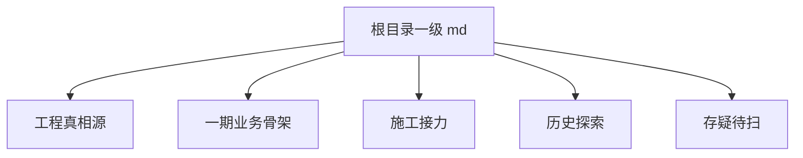
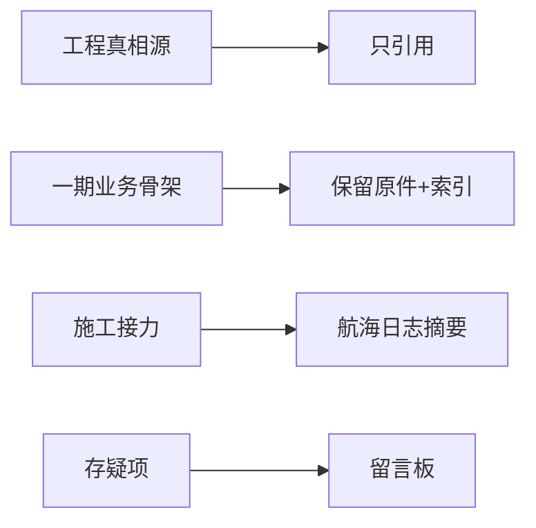

# 根目录 MD 整理清单 - 2026-07-05

范围：只看 `E:\w\0\election-v2` 根目录一级 `*.md`，不递归。

原则：先分类、合并入口、记录存疑；不直接删除原件。

## 分类图

## 工程真相源

这些不合并、不删除，只在航海日志做入口：

- `AGENTS.md`
- `PROJECT_STATE.md`
- `ENGINEERING_LOG.md`
- `DECISIONS.md`
- `PROJECT_TREE.md`

## 一期业务骨架

这些是当前一期施工会用到的文档，保留原件，航海日志只做索引：

- `一期清单压实-接力总表.md`
- `一期最小演示闭环.md`
- `全局快照-前后端契约对照总图.md`
- `选举材料_时间线对照表 ——大招聘动态公告栏-下面小公告按照时间轴走.md`

## 施工接力

这些适合放进航海日志索引或后续抽成摘要：

- `交接单-岗位自动生成-给codex.md`
- `交接单-18公告模板文件.md`
- `搬家进度-主线地图.md`
- `船务动态地图.md`

## 历史探索

这些更像历史探索或辅助认知，暂不删；后续可抽摘要合并进航海日志：

- `前端探索地图.md`
- `后端探索地图.md`
- `权限设计-灵感航海图.md`
- `阿圆与夏夏-历史足迹总览.md`

## 存疑待留言板

- `README.md`：疑似旧模板口径，不应作为当前项目真相源。
- `权限设计-灵感航海图.md`：可能与“不做复杂权限树”的当前边界冲突；以 `DECISIONS.md` 为准。
- `前端探索地图.md`、`后端探索地图.md`、`全局快照-前后端契约对照总图.md`：可能是阶段快照，后续标注“代码验证优先”。
- `阿圆与夏夏-历史足迹总览.md`：偏历史情感/过程记录，是否留根目录待确认。
- `HEADROOM_接力锚点.md` 与 `上下文压缩摘要-2026-07-04.md`：若文件存在，用途接近，后续只选一个做当前低 token 入口，另一个归入历史索引。
- `小Claude船长-下一段施工单.md`：若文件存在，需确认是否已被 `一期清单压实-接力总表.md` 覆盖。

## 安全合并建议

当前只做索引和留言板，不删除、不移动。
