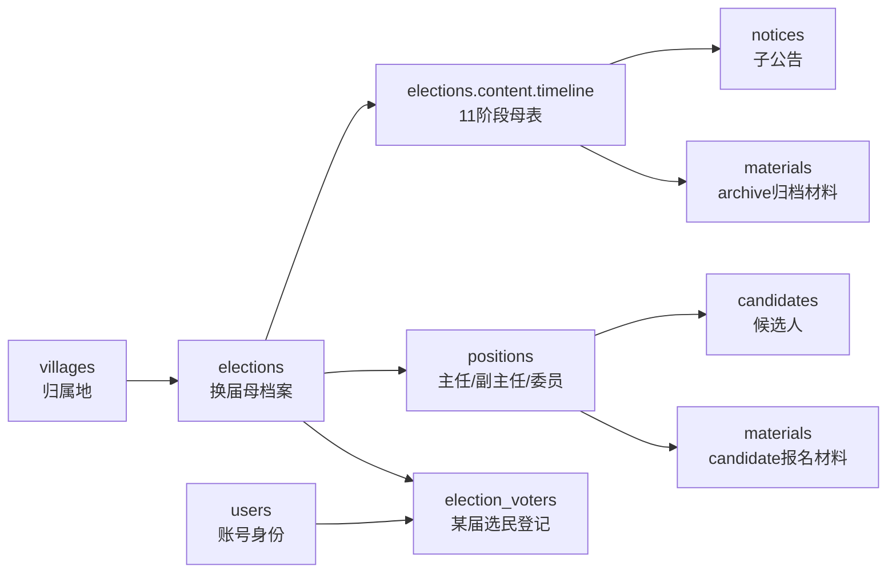

# 工程责任表-一期P0

用途：动代码前的树根责任表。只记录当前一期主线参数，不扩散成需求散文。

## 0. 参数总线图



## 1. 归属地与母档案

| 参数 | 来源 | 去向 | 干嘛 | 关联谁 | 不负责 |
|---|---|---|---|---|---|
| `villageId` | 村居下拉 / 用户归属地 | `elections.village_id` | 把一场换届挂到某村/社区 | `villages.id`、岗位/公告/材料均经 `electionId` 串联 | 不做复杂隔离/权限树 |
| `villages.type` | 122归属地种子 / 后台村居表 | `villages.type` | 区分村委会/居委会 | 选举方式、班子人数规则 | 不等于镇街 |
| `street` | 村居种子 / live `villages.street` | 村居筛选 | 镇街归类 | 归属地列表 | 不决定选举方式 |
| `electionId` | `elections.id` | 全主线外键 | 母档案唯一锚点 | `positions/candidates/materials/notices/election_voters` | 不表达归属地类型 |
| `electionType` | 创建母档案时按村居类型给出 | `elections.election_type` | 记录村委会/居委会选举 | `electionMethod` 合法性 | 不负责岗位生成 |
| `electionMethod` | `/election-v2/methods` + 后台选择 | `elections.election_method` | 记录选举方式 | 村锁定直选，社区三选一 | 不推进流程状态 |
| `sessionNo` | 默认第十五届/后台输入 | `elections.session_no` | 届次标签，公告填空 | 公告标题、母档案标题 | 不决定日期 |
| `committeeSize` | 创建/编辑母档案 | `elections.committee_size` | 班子总人数 | 岗位生成配额 | 不自己落岗位 |
| `deputyCount` | 创建/编辑母档案 | `elections.deputy_count` | 副主任名额 | 岗位生成配额 | 不审核候选人 |
| `electionEndDate` | 母档案日期字段 | `elections.election_end_date` | 选举日/截止点 | 母表时间线 | 不自动完成活动 |
| `content.timeline` | 流程表 + 时间线对照表 | `elections.content` JSON | 母表 11 阶段运输枢纽 | 公告/材料/仪表盘 | 不存公告正文、不存附件 |
| `status` | 后端状态机/审批动作 | `elections.status` | 活动业务状态 | 列表筛选/仪表盘 | 不等于阶段 `status` |
| `approvalStatus` | 审批接口 | `elections.approval_status` | 审批结果标签 | 审批意见/审核人 | 不等于业务进度 |

## 2. 11阶段母表 `content.timeline`

| 参数 | 来源 | 去向 | 干嘛 | 关联谁 | 不负责 |
|---|---|---|---|---|---|
| `stageKey` | 固定 11 阶段，建议 `S1-S11` | `notices.stage_key`、`materials.stage_key` | 阶段锚点 | 子公告、归档材料、仪表盘 | 不当数据库 id |
| `stageName` | 时间线阶段名 | 母公告/工作台 | 给人看懂当前阶段 | `stageKey` | 不参与权限 |
| `startDate/endDate` | 选举日倒推或模板日期 | `content.timeline[]` | 阶段真实日期 | 阶段状态计算 | 不替代顶层报名/公示字段 |
| `days` | 流程表天数 | `content.timeline[]` | 阶段跨度 | `dateRange/dayRange` | 不决定延期 |
| `work` | 时间线“核心动作” | 工作台说明 | 告诉经办该做什么 | 公告/材料节点 | 不生成业务记录 |
| `noticeNos` | 18公告号/流程表 | `notices.notice_no` | 找本阶段子公告 | 公告模板 | 不存正文 |
| `materialNos` | 附件材料编号 | `materials.material_no` | 找本阶段材料 | 附件模板/上传记录 | 不存文件本体 |
| `visible` | P0 配置 | 前台/后台展示 | 控制阶段可见 | 仪表盘 | 不是权限隔离 |
| `archiveOnly` | P0 边界 | `materials.scope='archive'` | 只归档不进候选人 | 材料模块 | 不影响报名材料 |
| `stageStatus` | 今天日期 + 阶段日期推导 | UI 状态 | 未开始/进行中/已完成 | 仪表盘进度 | 不替代 `elections.status` |

### 11阶段锚点

| key | 阶段 | 公告 | 材料 | P0边界 |
|---|---|---|---|---|
| `S1` | 前期准备 | 1/2/3 | 1-8 | 启动、会议、选委会归档 |
| `S2` | 选民登记 | - | 9-10 | 登记入口和照片归档 |
| `S3` | 名单公布 | 4 | 11-14 | 选民名单/统计 |
| `S4` | 调整解释 | - | - | 备注状态，不造新表 |
| `S5` | 代表&小组长 | 5/6/6-1 | 15-23 | 二期/归档，不进竞选岗位 |
| `S6` | 提名 | 7/8 | 24-28 | 主任/副主任/委员候选人主线 |
| `S7` | 竞选预选 | - | 29-34 | 预选/竞选状态 |
| `S8` | 资格审查 | 9/2-1 | 35 | 正式候选人 |
| `S9` | 选举准备 | 10-15 | 36 | 线下准备 |
| `S10` | 选举日 | 村16/社区17 | 37-38 | 结果回填，不做线上投票 |
| `S11` | 监会&移交 | 村17/社区18 | 39-47 | 二期/归档，不进竞选主线 |

## 3. 岗位与候选人

| 参数 | 来源 | 去向 | 干嘛 | 关联谁 | 不负责 |
|---|---|---|---|---|---|
| `positionId` | `positions.id` | `candidates.position_id`、`materials.position_id` | 候选人挂具体岗位 | `electionId`、岗位名 | 不代表阶段归档材料 |
| `positions.name` | 生成/岗位表单 | `positions.name` | 主任/副主任/委员展示 | 候选人、材料 | 不等于候选人姓名 |
| `quota` | `committeeSize - deputyCount - 主任` | `positions.quota` | 岗位名额 | 结果校验/岗位表 | 不代表得票 |
| `postCategory` | 生成规则 `director/deputy/member` | `positions.post_category` | 三岗位机器分类 | 自荐/票面/排序 | 不给 UI 造新岗位 |
| `canSelfRecommend` | P0规则默认 1 | `positions.can_self_recommend` | 控制是否可自荐 | 前台报名入口 | 不校验材料齐全 |
| `onBallot` | P0规则默认 1 | `positions.on_ballot` | 是否独立上票 | 结果回填 | 不做线上投票 |
| `incumbent*` | 现任录入 | `incumbent/incumbent_duty/incumbent_phone` | 当前在任人员 | 岗位一览 | 不等于候选人 |
| `postStatus` | 岗位维护 | `positions.post_status` | 在任/空缺/待换等 | 仪表盘岗位状态 | 不等于候选状态 |
| `materialRequirements` | 岗位编辑 JSON | `positions.material_requirements` | 告诉报名要交什么 | 材料提交 | 不给审核结论 |
| `candidate.name` | 导入/材料申请人 | `candidates.name` | 候选人姓名 | 岗位、材料 | 不等于岗位名 |
| `phone` | 导入/报名手机号 | `candidates.phone` | 联系与去重 | `materials.applicant_phone` | 不完整代表登录身份 |
| `gender` | 导入/材料项“性别” | `candidates.gender` | 展示/女性委员提醒 | 结果校验 | 不做资格审查 |
| `source` | 后端固定 `import/material` | `candidates.source` | 区分导入或材料晋升 | 列表筛选 | 不等于推荐方式 |
| `recommendType` | 自荐/联名/党组织 | `candidates.recommend_type` | 候选人来源口径 | 公告/候选列表 | 不等于 `source` |
| `candidate.status` | 导入/审核/结果接口 | `candidates.status` | 报名/审核/公示状态 | 审核、结果 | 不等于岗位启停 |
| `votes/elected` | 线下结果回填 | `candidates.votes/elected` | 记录得票/当选 | 结果公告 | 不负责投票过程 |

## 4. 材料

| 参数 | 来源 | 去向 | 干嘛 | 关联谁 | 不负责 |
|---|---|---|---|---|---|
| `scope` | 提交参数，默认 `candidate` | `materials.scope` | 分流报名材料/归档材料 | 候选人链或阶段链 | 不做复杂材料系统 |
| `electionId` | 提交/查询参数 | `materials.election_id` | 挂母档案 | `elections.id` | 不做权限隔离 |
| `positionId` | 报名岗位 | `materials.position_id` | 报名材料定岗 | `positions.id` | `archive` 可为空 |
| `applicantPhone` | 报名人手机号 | `materials.applicant_phone` | 报名去重/通知目标 | `users.phone`、`candidates.phone` | 不负责实名 |
| `applicantUserId` | 登录用户 | `materials.applicant_user_id` | 账号血缘 | `users.id` | 不替代手机号 |
| `applicantName` | 表单姓名 | `materials.applicant_name` | 申请人展示 | 候选人姓名 | 不校验真实性 |
| `items` | 表单/附件抽取 JSON | `materials.items` | 材料明细 | 性别抽取、详情页 | 不负责完整47材料校验 |
| `status` | 待审核/通过/驳回 | `materials.status` | 材料审核流转 | 审核页/通知 | 不等于候选当选 |
| `rejectReason` | 审核驳回 | `materials.reject_reason` | 驳回原因 | 申请人通知 | 通过时无意义 |
| `candidateId` | 审核通过后回写 | `materials.candidate_id` | 材料到候选人血缘 | `candidates.id` | `archive` 不生成 |
| `reviewerId` | 审核人 | `materials.reviewer_id` | 审核留痕 | `logs.actor_id` | 不做权限判断 |
| `stageKey` | 母表阶段 | `materials.stage_key` | 阶段归档定位 | `content.timeline` | 不推进状态机 |
| `materialNo` | 附件编号 | `materials.material_no` | 材料编号检索 | 模板/附件 | 不存正文 |
| `fileUrl` | 上传返回地址 | `materials.file_url` | 附件指针 | 上传服务/预览下载 | 不负责存储签名/杀毒 |

## 5. 公告

| 参数 | 来源 | 去向 | 干嘛 | 关联谁 | 不负责 |
|---|---|---|---|---|---|
| `seq` | 模板选择 | `/notice-v2/templates/generate` | 找模板 | `noticeTemplates.TEMPLATES` | 不直接入库 |
| `docNo` | 模板配置 | 生成结果/`notice_no` | 法定公告号 | `seq`、`noticeNo` | 不负责分页排序 |
| `fields` | 抽屉填空字段 | 模板渲染 | 填空生成正文 | `COMMON_FIELDS`、模板字段 | 不单独入库 |
| `orgType` | 抽屉/母档案类型 | 模板用词 | 村/社区字眼切换 | `villages.type` | 不代表登录归属地 |
| `noticeNo` | `docNo` 或手填 | `notices.notice_no` | 公告编号锚点 | `timeline.noticeNos` | 不负责模板选择 |
| `stageKey` | 母表阶段 | `notices.stage_key` | 挂阶段 | `content.timeline` | 不自动判断阶段 |
| `templateKey` | `notice_${seq}` | `notices.template_key` | 追溯模板 | 模板配置 | 不存模板全文 |
| `title/content` | 模板渲染或普通编辑 | `notices.title/content` | 公告本体 | 母公告列表/详情 | 不存结构化字段 |
| `status/isTop/startTime/endTime` | 普通公告编辑 | `notices.*` | 发布/置顶/展示时间 | 公告管理 | 不生成正文 |

## 6. 用户与选民登记

| 参数 | 来源 | 去向 | 干嘛 | 关联谁 | 不负责 |
|---|---|---|---|---|---|
| `userId` | `users.id` | 登录态/通知/未来登记 | 账号身份锚点 | `users` | 不等于某届选民 |
| `phone` | mini 登录/后台用户 | `users.phone` | 手机绑定与弱身份 | 候选人/选民登记可复用 | 不保证实名 |
| `wxOpenid` | 微信授权 | `users.wx_openid` | 微信身份绑定 | 小程序登录 | 不负责归属地 |
| `users.villageId` | 首次选择归属地 | `users.village_id` | 用户默认归属地 | 村居列表 | 不代表某届登记 |
| `isPhoneBound` | mini 登录 | `users.is_phone_bound` | 判断是否填过手机 | 前端提示 | 不代表归属地已绑 |
| `electionVoter.electionId` | “我是选民”登记 | `election_voters.election_id` | 参加哪一届 | `elections.id` | 不归 `users` 管 |
| `electionVoter.villageId` | 登记归属地 | `election_voters.village_id` | 固化本次登记地 | `villages.id` | 不改用户默认归属地 |
| `electionVoter.userId` | 可选线上账号 | `election_voters.user_id` | 线上线下并轨 | `users.id` | 线下登记可为空 |
| `name/gender/birthDate/idCard` | 选民登记表 | `election_voters.*` | 选民名册字段 | 统计/导出 | 不做登录认证 |
| `groupName` | 登记表 | `election_voters.group_name` | 村/居民小组归档 | 名册分组 | 不做组织树 |
| `registerSource/status` | 登记入口/导入 | `election_voters.*` | 来源与有效状态 | 名册管理 | 不等于账号状态 |

## 7. 当前断点

```text
1. 当前 live schema 已有 election_type/session_no/approval_status 等列；若 sub 看到缺列，以本轮复核为准。
2. elections.content.timeline 还没真正落 11 阶段 JSON，这是下一刀。
3. positions 库字段比 API/页面厚：现任、自荐、票面、换届字段已在库，position-v2 还没完整承接。
4. election_voters 只有表，当前 mini 还没有“我是选民”写入 API。
5. archive 材料只能归档，不能晋升候选人；candidate 材料通过审核才晋升候选人。
```

## 8. 当前不负责清单

```text
多商户
复杂组织树
复杂数据隔离
线上投票计票
党组织岗位
监督委员会竞选主线
村民/居民代表竞选主线
小组长/楼栋长竞选主线
镇聘岗位/专职社工
完整47材料自动化
工作移交自动化
```

## 9. 动代码前检查

```text
1. 是否复用本表唯一真相？
2. 是否新增了第二套字段定义？
3. 是否把“不负责什么”偷偷做进去了？
4. 是否能从字段回到来源、去向、关联表？
5. 是否跑了最小验证，而不是未完成就 build？
```

## 10. 页面改动表达格式

```text
页面：页面名 / 路由 / 文件
组件：区块名 / 组件名 / 插槽名
字段：字段名 / 文案 / 按钮 / 列名 / 表单项
现在：当前看到什么
应该：改成什么
来源：对应业务字段或责任表参数
边界：这次不碰什么
```

示例：

| 页面 | 组件 | 字段 | 现在 | 应该 | 来源 | 边界 |
|---|---|---|---|---|---|---|
| 运营工作台 `/dashboard` | 最新公告面板 | 标题/按钮 | 最新公告消息/查看公告 | 母公告与子公告/查看公告台账 | `notices.notice_no/stage_key/title/content` | 不新造公告模型 |
| 候选人管理 `/candidates` | `CrudPage` 工具栏 | 新增按钮 | + 新增候选人 | + 新增主任/副主任/委员候选人 | `positions.name` 只限三岗位 | 不开放编辑/删除 |
| 历史归档 `/archives` | 表格列 | 归档材料字段 | 档案名称/年份/类型 | 阶段/材料编号/附件 | `materials.scope='archive' + stage_key/material_no/file_url` | 归档不晋升候选人 |
