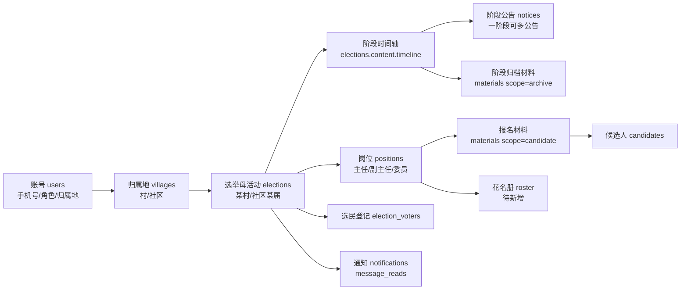

# 阶段性进度与全局认知说明 - 2026-07-08

> 用途：这是一份离线可读、无上下文也能接手的阶段性说明。上半部分给甲方和项目负责人看进度，下半部分给产品、UI、前端、后端、数据库施工者看细节。本文不替代代码和 live schema，代码与数据库仍是最终裁决源。

## 1. 当前一句话结论

本项目当前已经从“页面和功能散点”收束成一条清晰主链：`村/社区归属地 -> 换届选举母活动 -> 阶段时间轴/岗位 -> 公告/材料/候选人/通知/归档`。一期不做多租户、不做复杂权限树、不做线上投票计票，先把村/社区换届选举的后台管理闭环做稳。

## 2. 给甲方的阶段性进度摘要

### 2.1 已经明确的产品方向

| 项目 | 当前结论 | 对甲方意味着什么 |
|---|---|---|
| 系统定位 | 一套后台服务支撑全区村/社区换届工作 | 不按多商户 SaaS 方式拆系统，减少重复建设 |
| 管理口径 | 超级管理看全部，村/社区子管理聚焦本归属地 | 同一套功能可按角色和归属地筛选使用 |
| 核心单位 | 一场换届选举活动是一份“母档案” | 后续公告、材料、岗位、候选人、归档都围绕这场活动管理 |
| 一期岗位 | 只做主任、副主任、委员 | 先覆盖村委会/居委会换届主线，不把二期岗位混入一期 |
| 流程表达 | 以阶段时间轴承接公告、材料、归档 | 客户实际填写日期后，系统日程、公告、材料按同一阶段对齐 |
| 审核逻辑 | 报名材料审核通过后进入候选人链路 | 材料、候选人、审核记录之间有可追溯关系 |
| 通知能力 | 站内信/红点有数据库基础，短信通道配置需后续补齐 | 不能提前承诺短信通道已完成，需作为后续配置能力确认 |

### 2.2 已完成的阶段性成果

| 分类 | 已完成内容 | 当前状态 |
|---|---|---|
| 项目规则 | 已建立 `AGENTS.md`、接力图、状态日志、决策记录 | 新会话可按固定入口接手，不需要从聊天里捞上下文 |
| 后端路由 | 后端自动路由支持原路径与 `/api` 双路径 | 方便后台和小程序/H5 共用接口前缀 |
| 身份入口 | 已有小程序/H5 身份线头：手机号、微信 openid、归属地绑定 | 普通用户入口具备基础承接点 |
| 岗位生成 | 主任/副主任/委员岗位生成主干已做，前端已有一键入口 | 一期岗位主线已收窄到核心三类 |
| 公告模板 | 18 类公告模板配置与生成入口已收口 | 公告可按模板填空生成草稿 |
| 母表时间轴 | 演示活动已写入阶段时间轴，并将公告挂回阶段 | 后台工作台和母活动详情可围绕阶段展示 |
| 仪表盘 | 村/社区运营工作台已从泛统计改成换届工作台 | 已能展示日历、公告、档案入口、岗位一览等方向 |
| 归档材料 | `materials.scope=archive` 已用于阶段归档材料 | 归档材料不会误进入候选人链路 |
| UI 对齐稿 | `换届选举系统-UI优化.html` 已补子管理仪表盘、母活动、岗位、花名册等锚点 | 仍是施工稿，不是最终代码 |
| 数据库核对 | 已从 live schema 核对主链表，列出已对上、半对上、没找到家的点 | 后续不再盲目加表，按缺口补最小承接 |

### 2.3 当前还没有完成的关键项

| 事项 | 当前状态 | 为什么重要 | 下一步 |
|---|---|---|---|
| 花名册 `roster` | live DB 没有正式表 | 岗位详情“在岗”不能只塞在岗位表字段里，需承接届次、任期、姓名、手机号、简介 | 新增最小 `roster` 表和 API |
| 阶段公告按阶段查询 | `notices.stage_key` 有字段，但 `notice-v2/list` 还没有 `stageKey` 查询参数 | 母表某阶段可能有多条子公告，弹窗应只看当前阶段 | 给 `notice-v2/list` 补 `stageKey` 参数 |
| 母表模板合同 | live `elections.content` 当前主要是 `timeline[]`，缺 `templateKey` | 村委会和社区不同选举方式的阶段模板不能硬套同一套 | 兼容旧 `timeline[]`，新增 `templateKey` |
| 岗位输出字段 | live `positions` 字段比 API 列表更丰富 | UI 要显示岗位状态、在任、产生方式、是否换届等 | 盘 `position-v2/list/detail` 输出字段 |
| 短信通道配置 | 通知表可记录目标手机号，但没有短信服务商配置表 | 短信涉及签名、模板、密钥，不能写死或前端明文 | 先决定 `system_configs` 或 `sms_channels` 最小方案 |
| 甲方 122 名单 | live DB 当前 `villages=124`，甲方口径是 122 | 不影响结构，但影响交付数据准确性 | 另核名单源和多出的归属地 |

## 3. 项目主线：不要再散

### 3.1 总漏斗

这条链的关键是 `electionId`。进入某一场选举活动后，岗位、候选人、材料、公告、归档、通知都必须能回到同一个 `elections.id`。

### 3.2 谁决定谁

| 顺序 | 决定项 | 被决定项 | 说明 |
|---|---|---|---|
| 1 | `users.role` | 进入超级管理还是子管理 | 角色决定入口和操作权限，不改变业务事实 |
| 2 | `users.village_id` | 子管理默认归属地 | 子管理只看当前村/社区工作台 |
| 3 | `villages.type` | 村委会或居委会口径 | 决定可用选举方式和模板方向 |
| 4 | `elections.election_method` | 当前选举方式 | 村通常固定直选；社区有直选、户代表、居民代表等 |
| 5 | `elections.id` | 全主链锚点 | 后续所有业务数据围绕这场活动 |
| 6 | `elections.content.timeline[].stageKey` | 阶段公告、阶段归档 | 公告和归档材料挂阶段 |
| 7 | `positions.id` | 报名材料、候选人、岗位详情 | 参与竞选必须挂具体岗位 |
| 8 | `materials.id` | 候选人血缘 | candidate 材料审核通过后生成或绑定候选人 |
| 9 | `candidates.id` | 结果、公示、通知 | 结果回填和公示不能脱离候选人 |

## 4. 角色视角

### 4.1 子管理 / 经办

子管理是当前 UI 和业务的核心复用视角。它登录后不应看到“全区总管理”式首页，而是直接看到当前村/社区的换届工作台。

| 页面动作 | 数据依据 | 备注 |
|---|---|---|
| 登录后识别当前村/社区 | `users.phone/role/village_id` | 后台管理员也以手机号作为登录账号 |
| 显示当前身份区 | `villages.name/type`、当前日期、角色、手机号 | 首屏不再显示泛泛系统标题 |
| 查看日程日历 | `elections.content.timeline[]` | 日程名称必须等于阶段名称，日期必须等于阶段真实日期 |
| 查看最近活动 | `elections.village_id` | 最近 5 场作为工作台入口 |
| 进入母活动详情 | `/election/:id` | 母活动是一场换届的档案单位 |
| 查看岗位状态 | `positions.election_id` | 岗位详情必须带 `electionId + positionId` |
| 处理材料与候选人 | `materials.scope=candidate`、`candidates` | 自荐材料审核通过后进入候选人链路 |
| 管理归档 | `materials.scope=archive` | 阶段归档只归档，不进入候选人 |

### 4.2 超级管理

超级管理不是另一套业务系统。它是外层管理壳：先看全部村/社区，再下钻到某个村/社区后复用子管理视角。

| 能力 | 数据依据 | 不做什么 |
|---|---|---|
| 查看全部归属地 | `villages` | 不新建租户表 |
| 筛选全部活动 | `elections.village_id` | 不复制一套超管版母活动页面 |
| 下钻某村/社区 | `villageId + electionId` | 不把全区统计混入子管理首屏 |
| 做全局纠偏 | 角色权限 + 具体业务表 | 不做复杂组织树和复杂数据隔离 |

### 4.3 运营

运营主要处理公告、通知、结果、归档等流转工作。运营可以看业务输出，但不承担审核结论。

| 模块 | 数据依据 | 边界 |
|---|---|---|
| 公告管理 | `notices.election_id/stage_key/notice_no` | 可发布/编辑公告，不决定材料是否合格 |
| 通知管理 | `notifications/message_reads` | 站内信已可落库；短信通道配置待补 |
| 结果管理 | `candidates.votes/elected` | 记录线下结果，不做线上投票 |
| 归档查看 | `materials.scope=archive` | 归档材料不生成候选人 |

### 4.4 审核

审核角色只看材料和候选资格，不发布公告、不改岗位、不改系统配置。

| 审核动作 | 数据依据 | 结果 |
|---|---|---|
| 查看待审材料 | `materials.status=待审核` | 进入审核队列 |
| 通过报名材料 | `materials.scope=candidate` | 生成或复用候选人，并回填 `candidate_id` |
| 通过归档材料 | `materials.scope=archive` | 只归档，不生成候选人 |
| 驳回材料 | `reject_reason/reviewer_id/reviewed_at` | 通知申请人，保留审核原因 |
| 写日志和通知 | `logs/notifications` | 后续可追溯 |

### 4.5 普通用户 / 村民居民

普通用户侧不是后台管理。它主要参与选民登记、查看公告、报名具体岗位、接收通知。

| 动作 | 数据依据 | 备注 |
|---|---|---|
| 手机号/微信身份 | `users.phone/wx_openid` | `users` 表示账号身份 |
| 绑定归属地 | `users.village_id` | 默认归属地，不等于某届选民登记 |
| 我是选民 | `election_voters` | 某一届参与关系必须落到 `election_voters` |
| 参与竞选 | `materials.scope=candidate + positionId` | 必须选择具体岗位 |
| 查看通知 | `notifications/message_reads` | 站内信和红点承接 |

## 5. 页面与 UI 认知

### 5.1 登录页

登录页要完成身份和归属地的分流。子管理登录后进入本村/社区视角；超级管理进入全区归属地列表和下钻视角。

| UI 单元 | 数据字段 | 备注 |
|---|---|---|
| 手机号 | `users.phone` | 后台管理员也以手机号识别 |
| 角色 | `users.role` | 决定入口和菜单 |
| 归属地 | `users.village_id` | 子管理必须有归属地 |
| 登录后跳转 | 角色 + 归属地 | 不让子管理进入全区总览 |

### 5.2 子管理仪表盘

首屏是工作台，不能做成宣传页，也不能用通栏堆字段。当前认知如下：

| 区块 | UI 规则 | 数据来源 | 交互 |
|---|---|---|---|
| 日历日程 | 高度不超过首屏约 1/4，宽度约 1/2；使用成熟 UI 日历组件 | `elections.content.timeline[]` | 点击阶段进入母活动对应阶段 |
| 身份信息 | 放日历旁边，显示归属地、日期、角色、手机号 | `villages` + `users` | 只展示当前登录上下文 |
| 选举方式 | 小卡片/小容器，不通栏 | `villages.type + elections.election_method` | 村固定村民直接选举；社区按活动方法展示 |
| 参选形式筛选 | 小容器，作为后续筛选伏笔 | `electionId + method/template` | 后续影响材料提交和候选人管理 |
| 本村/社区活动列表 | 小容器，最近 5 场 | `elections.village_id` | 点击进入 `/election/:id`，查看更多跳活动列表 |
| 岗位状态 | 小容器，约 1/3 宽度 | `positions.election_id` | 点击岗位进入岗位详情弹窗 |

### 5.3 母活动详情页 `/election/:id`

母活动详情页是整套系统最核心的档案页。一场活动走完后，它应该能解释这一场选举做了哪些阶段、每个阶段有什么公告、上传了什么材料、后续如何归档。

| 表格列 | 数据来源 | 备注 |
|---|---|---|
| `#` | 阶段序号 | UI 展示序号，不是数据库 id |
| 阶段名称 | `stageName` | 不同模板阶段不同，不能硬套 11 阶段 |
| 开始日期 | `startDate` | 客户填写或模板推导后的真实日期 |
| 结束日期 | `endDate` | 日历和进度以此为准 |
| 天数 | `days` | 阶段跨度 |
| 核心工作 | `work` | 告诉经办当前阶段要做什么 |
| 关联材料 | `materialNos/materials` | 模板材料或资源说明 |
| 上传文件 | `materials.scope=archive + stage_key` | 归档材料上传入口 |
| 公告编辑 | `notices.election_id + stage_key` | 阶段子公告集合，可多条，可新增 |

母活动阶段模板的口径：

| 类型 | 模板口径 | 备注 |
|---|---|---|
| 村委会 | 村民委员会，村民直接选举 | 当前默认村线模板 |
| 社区直选 | 居民委员会，居民直接选举 | 社区类型之一 |
| 社区户代表 | 居民委员会，户代表选举 | 阶段和材料可能不同 |
| 社区代表 | 居民委员会，居民代表选举 | 当前 live 样本为该类型 |

### 5.4 岗位详情

岗位详情必须带当前活动上下文。所有编辑、下载、报名、候选、结果都必须知道自己属于哪一届哪一场哪一个岗位。

| 单元 | 数据来源 | 备注 |
|---|---|---|
| 选举活动下拉 | `elections.id/name/session_no` | 防止用户以为岗位是写死的 |
| 岗位基础 | `positions.id/election_id/name/quota/duty` | 主任、副主任、委员 |
| 岗位需求 | `positions.material_requirements` | 报名材料依据 |
| 当前在任 | 近期先读 `positions.incumbent*`，最终应接 `roster` | `roster` 用于完整花名册 |
| 岗位状态 | `positions.post_status` | 在任、待换届、报名中、审核中、已完成等 |
| 表格下载 | 岗位资源配置 | 不等于阶段归档上传 |
| 报名材料 | `materials.scope=candidate` | 候选人链路入口 |
| 候选人 | `candidates.position_id` | 资格、入围、竞选、结果 |

## 6. 侧边栏目录与数据承接

| 菜单 | 主要用途 | 数据基础 | 当前判断 |
|---|---|---|---|
| 村居管理 | 管理村/社区基础信息和人员配置 | `villages/users` | 已有主表，人员配置还需按角色细化 |
| 选举提案审批 | 各村/社区编辑申请、提交审批、审批/驳回 | 当前有 `materials.scope=proposal` 口径但不干净 | 是否纳入一期需再定，避免污染主链 |
| 选举活动管理 | 全部母活动列表，进入母活动详情 | `elections` | 主入口之一 |
| 阶段子公告 | 某活动某阶段下的多条公告 | `notices.election_id + stage_key` | 需要补后端 `stageKey` 查询 |
| 岗位管理 | 当前岗位、历史在任、岗位详情 | `positions` + 待新增 `roster` | 岗位主表已有，花名册缺口明确 |
| 材料提交管理 | 查看自荐/报名材料，审核齐全后进入候选人 | `materials.scope=candidate` | 已有主链 |
| 候选人管理 | 材料审核通过 + 后台导入形成候选人池 | `candidates` | 已有主链 |
| 审核管理 | 材料、候选资格、审批流 | `materials/candidates/logs` | 审核范围要保持收窄 |
| 通知管理 | 系统消息、站内信、短信待发送 | `notifications/message_reads` | 站内信基础有，短信配置缺口明确 |
| 归档管理 | 阶段材料、活动文件、下载归档 | `materials.scope=archive` | 归档不进入候选人 |

## 7. 数据库现状与缺口

### 7.1 已有主表

| 表 | 用途 | 当前状态 |
|---|---|---|
| `users` | 后台账号、普通用户账号、手机号、角色、归属地 | 已有 |
| `villages` | 村/社区归属地 | 已有，live 数量 124，甲方 122 需另核 |
| `elections` | 一场换届母活动 | 已有 |
| `positions` | 主任/副主任/委员等岗位 | 已有，字段比 API 输出更厚 |
| `materials` | 报名材料和阶段归档材料 | 已有，通过 `scope` 分流 |
| `candidates` | 候选人 | 已有 |
| `notices` | 公告和阶段子公告 | 已有，支持 `stage_key` 字段 |
| `notifications` | 通知和站内信 | 已有 |
| `message_reads` | 已读记录 | 已有 |
| `election_voters` | 某届选民登记 | 已有 |
| `logs` | 操作、审核、登录日志 | 已有，需核接口写入范围 |

### 7.2 需要微调的旧表/API

| 对象 | 需要调整 | 原因 |
|---|---|---|
| `elections.content` | 兼容旧 `timeline[]`，新增 `templateKey` | 支撑不同选举类型的阶段模板 |
| `notice-v2/list` | 增加 `stageKey` 查询参数 | 阶段公告集合弹窗需要按阶段查询 |
| `position-v2/list/detail` | 输出 live schema 中已有的岗位状态、在任、产生方式等字段 | UI 要展示岗位状态和详情 |
| `notifications` 枚举 | 明确预告通知、消息通知、逾期提示等类型映射 | 通知弹窗需要固定语义 |

### 7.3 需要新增的最小表或配置

| 对象 | 建议 | 不扩展什么 |
|---|---|---|
| `roster` | 新增最小花名册表：`id/village_id/session_no/year_start/year_end/post/name/phone/intro/status/created_by/created_at/updated_at` | 不做复杂干部履历 |
| `system_configs` 或 `sms_channels` | 先定短信通道配置位置和敏感值规则 | 不把短信密钥写前端或明文记录进普通文档 |

### 7.4 暂缓不做

| 对象 | 暂缓原因 |
|---|---|
| `timeline_stages` 独立表 | 一期阶段模板可用代码配置，活动实际结果落 `elections.content` |
| `notice_stage_relations` | `notices.election_id + stage_key` 已能承接一阶段多公告 |
| `archive_files` | `materials.scope=archive` 已能承接阶段归档 |
| 完整模板库表 | 后台维护模板库不是一期必须闭环 |
| 多租户表 | 本项目明确不是 SaaS 多商户 |

## 8. 材料、候选人、归档的铁律

| 项 | 规则 |
|---|---|
| candidate 材料 | `materials.scope=candidate`，必须有 `electionId + positionId + applicantPhone` |
| archive 材料 | `materials.scope=archive`，挂 `electionId + stageKey + materialNo + fileUrl` |
| 候选人生成 | candidate 材料审核通过后生成或复用 `candidates`，并回填 `materials.candidate_id` |
| 归档材料 | archive 材料审核通过只归档，不生成候选人 |
| 一人一场一岗位 | 同一 `electionId` 下，一个手机号不能报名多个岗位 |
| 参与竞选 | 必须在具体岗位旁边，不放母公告泛入口 |
| 我是选民 | 属于选民登记/参与确认，落 `election_voters`，不是 `users` |

## 9. 当前已验证过的事实

| 验证项 | 结果 |
|---|---|
| 后端双路径路由 | `/xxx/yyy` 与 `/api/xxx/yyy` 双路径已验证过 |
| 岗位生成 | `POST /position-v2/generate` 已能生成主任/副主任/委员 |
| 岗位生成自检 | `check-position-generate.js` 已覆盖副主任、小村不设副主任、班子人数边界 |
| Vite build | 曾通过 `npx vite build`，但完整 `npm run build` 受 Node 24 与 `vue-tsc` 兼容影响，不作为页面失败判断 |
| 母表时间轴 seed | 演示活动已写入 11 阶段，公告已补 `notice_no/stage_key/template_key` |
| live schema 核对 | 主链表已读取确认，缺 `roster` |
| 文档锚点 | 关键盘点文档已可用 `rg` 搜索 |

## 10. 当前风险与不要误报的点

| 风险 | 说明 | 对外口径 |
|---|---|---|
| 村/社区数量 | live DB 是 124，甲方口径是 122 | 结构不受影响，名单需另核 |
| 短信通道 | 目前只有通知表基础，没有正式短信通道配置表 | 可说“通知能力有基础，短信通道配置待补” |
| 花名册 | 需求已明确进入一期，但 DB 表未落 | 可说“已确认设计和字段，待进入施工” |
| 时间轴模板 | 当前已有 timeline，但不同选举类型模板合同还要统一 | 可说“阶段模型已确定，模板兼容正在收口” |
| 选举提案审批 | 当前借 `materials.scope=proposal` 口径不够干净 | 不建议作为一期主链已完成能力对外承诺 |
| UI demo | HTML 是施工稿和锚点稿，不是最终产品代码 | 对外只说“原型和交互已梳理”，不要说“页面已全部上线” |

## 11. 下一步实施计划

### 11.1 第一优先级：补缺口最小闭环

| 顺序 | 任务 | 验收 |
|---|---|---|
| 1 | 新增 `roster` 最小表和 API | 岗位详情“在岗”能按 `village_id + session_no + post + status` 查到干部 |
| 2 | `notice-v2/list` 增加 `stageKey` 查询 | 母活动某阶段公告弹窗只返回当前阶段公告 |
| 3 | `elections.content` 合同兼容 | 活动内容含 `templateKey`，旧 `timeline[]` 仍可读 |
| 4 | `position-v2/list/detail` 字段补齐 | 岗位状态、在任、产生方式、是否换届等字段可供 UI 使用 |

### 11.2 第二优先级：母活动详情页施工

| 任务 | 验收 |
|---|---|
| 母表主体表落到 Vue 页面 | 表头固定，阶段行按模板，日期和材料来自 `elections.content` |
| 公告集合弹窗 | 带 `electionId + stageKey`，支持列表和新增 |
| 阶段归档上传 | 提交 `scope=archive + stageKey + materialNo + fileUrl` |
| 活动列表下钻 | 子管理活动列表点击进入 `/election/:id` |

### 11.3 第三优先级：候选人和审核闭环

| 任务 | 验收 |
|---|---|
| 材料提交管理筛选 | 支持村/社区 -> 活动 -> 岗位三级筛选 |
| 材料审核 | candidate 材料通过进入候选人，archive 材料不进入候选人 |
| 候选人管理 | 支持自荐材料晋升和后台导入来源区分 |
| 结果回填 | 支持线下结果录入，不做线上投票 |

## 12. 给甲方可直接摘用的进度表述

当前已完成系统一期主线梳理和技术底座核对：系统采用“一套后台 + 分级管理”的方式支撑全区村/社区换届工作，不按多商户拆分。已明确以“村/社区归属地、选举母活动、阶段时间轴、岗位、材料、公告、候选人、通知、归档”为主线，其中主任、副主任、委员为一期核心岗位。后台已有岗位生成、公告模板、阶段时间轴、材料审核、候选人、通知、选民登记等主要数据基础。当前正在收口子管理工作台、母活动详情页、阶段公告、阶段归档和岗位花名册之间的关联。下一阶段将重点补齐花名册表、阶段公告筛选、不同选举类型的阶段模板合同，并进入母活动详情页和岗位详情的前后端施工。

## 13. 给后续施工者的接手清单

1. 开工先读：`AGENTS.md`、`副船长的航海接力日志/当前接力图.md`、`PROJECT_STATE.md`、`DECISIONS.md`、本文。
2. 不要重建主链表：优先复用 `users/villages/elections/positions/materials/notices/candidates/notifications/message_reads/election_voters/logs`。
3. 动代码前先回答：这次改动落在哪个 `electionId`，是否涉及 `stageKey` 或 `positionId`，是否会误把 archive 材料推进候选人。
4. 只做最小验证：开发中不要反复跑完整 build；改 API 跑对应脚本或最小 HTTP/DB 检查。
5. 所有新页面按钮都要有落点：弹窗、跳转、API、字段、失败态必须能说清楚。
6. 记录完整才算完成：更新 `PROJECT_STATE.md`、`ENGINEERING_LOG.md`、必要时更新 `DECISIONS.md`、`PROJECT_TREE.md` 和接力图。

## 14. 本文依据

- `工程责任表-一期P0.md`
- `PROJECT_STATE.md`
- `DECISIONS.md`
- `副船长的航海接力日志/当前接力图.md`
- `副船长的航海接力日志/数据库立足点核对-2026-07-08.md`
- `副船长的航海接力日志/数据库角色视角盘点-2026-07-08.md`
- `cebianlan.md`
- live schema 只读核对结果
